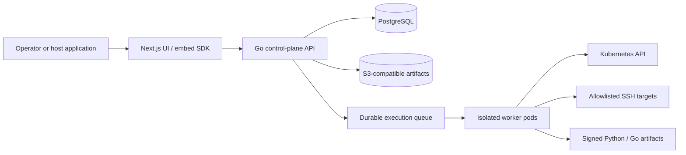

# Architecture

**Runtime honesty:** the diagram below is the control-plane / worker model. `apps/api/cmd/runner` claims jobs in-process and calls the kubernetes, ssh, script, and http engines when production-locked. Compose’s local worker (`cmd/worker`) still evaluates six core nodes only and refuses provider steps. `deploy/k8s` default-deny does not open provider egress. Script steps create isolated Jobs from `deploy/kubernetes/script-runner-deployment.yaml` (`ghcr.io/bbengt1/flowforge-script-runner`, built in this repo) only when `CONTROL_PLANE_API_CIDR` (or a same-namespace Service) is set and the live script NetworkPolicy allows DNS plus that destination. Missing config refuses the Job. Read [Implemented vs Specified](architecture/implemented-vs-specified.md) before treating a dial as live.

Hard lines stay: YAML is source of truth; drafts never run; vault chrome is display-name + UUID only; ADV-021 / ADV-024; fail-closed authorization.

## Deployment shape

Specified target — `deploy/k8s` runs the API, the web UI, and the production runner at `replicas: 2`, with a PodDisruptionBudget, HorizontalPodAutoscaler, preferred pod anti-affinity, and graceful drain (G.2.6). One API replica holds the scheduler lease. HMAC keys are the shared Secret, not a per-pod key. The compose worker is not in `deploy/k8s`. Provider network egress stays closed until an operator adds a CIDR:

## Boundaries

The control plane owns workflow validation, workspace RBAC, credential authorization, versioning, idempotency, audit events, and dispatch. The production runner (`apps/api/cmd/runner`) executes one claimed step at a time: it mints and re-parses an HMAC job ticket, heartbeats the fencing token, then calls the existing engine package. The pod is non-root, read-only, and default-deny. Scoped credentials are unlocked in-process and wiped. Compose/dev stays on `apps/api/cmd/worker`, which refuses every provider node.

Most control-plane boundaries fail closed: the API authenticates and authorizes server-derived workspace context, and webhook ingress verifies a replay-resistant signature before parsing. The production runner revalidates the job's version, digest, and expiry before a provider call. Drafts never run. `JOB_BINDING_SECRET` and `SCRIPT_SIGNING_KEY` are required at boot (missing or malformed fails closed; no per-process random default). Live kubernetes, ssh, and http dials still fail at the network until an operator opens an allowlisted egress; that failure is an engine code, not the compose local-worker sentence. The [security model](reference/security-model.md) defines the required controls and negative tests. Production-gate review of those existing controls: [E12.3 threat-model review](reference/e12-threat-model-review.md). Operator runbooks: [release and operations](operations/index.md).

PostgreSQL is the durable source of truth for workspace-scoped configuration, canonical workflow YAML, immutable versions, encrypted credential payload metadata, policy snapshots, durable job leases, redacted execution state, and audit **metadata**. See the [database specification](reference/database.md). Artifact **payloads** are envelope-encrypted and stored in a configurable S3-compatible bucket (compose: MinIO). Object keys are `{tenant}/{workspace}/{ref}` (three UUIDs) with no caller prefix or object metadata. A production-locked process refuses to start on filesystem or memory storage and does not fall back to a directory when the bucket or credentials are missing. Draft executions cannot attach run artifacts. Queue rows, leases, execution rows, and audit events in PostgreSQL do.

Workers that exist claim leased jobs and heartbeat while working; lease loss permits safe recovery only after fencing and idempotency checks. Workflow versions are immutable once run. The API process runs a leader-elected scheduler (advisory lock `881726402`) that calls schedule dispatch, lease recovery, and retention purge on an interval. Only the leader ticks. Losing the lock cancels the in-flight hook and stops further ticks until the replica holds the lock again. SIGTERM resigns that lock on a live database context before HTTP drain, so another replica can campaign while this pod finishes requests. `POST /api/v1/schedules/dispatch`, `POST /api/v1/jobs/recover`, and `POST /api/v1/retention/purge` remain for an operator. Encrypted backups are the `flowforge-db-backup` CronJob in `deploy/k8s` (logical RPO 24h, PITR RPO 300s when WAL archiving is sealing; see [retention and backup](operations/retention-backup.md)).

The first **specified** worker capability is the Kubernetes API engine. It is a controlled workflow node, not a general-purpose `kubectl` proxy: policy validation precedes server-side dry-run, server-side apply, and optional rollout observation. The production runner calls that library. Live dials still fail until an operator opens API egress. See the [Kubernetes engine reference](reference/kubernetes-engine.md).

SSH and script engines use the same specified control-plane/worker split. SSH is specified to run against a target and approved command profile, never a free-form terminal. Python and Go source is validated and packaged into an immutable signed artifact at publish time. The production runner creates an isolated Job from the script-runner template for that package. Drafts never run. See the [SSH engine](reference/ssh-engine.md) and [script engine](reference/script-engine.md).

## Standalone and embedded UI

The web UI is the canonical product surface. An embed SDK mounts the same UI in a host application and receives a short-lived, signed, single-use context containing host audience, user identity, workspace identity, permitted capabilities, and expiration. The API independently validates signature, issuer, audience, time bounds, token identity, and workspace authorization; host-supplied IDs never bypass FlowForge authorization.

Workflow definitions have one canonical representation: versioned YAML. The UI parses that YAML into its canvas model and serializes edits back to canonical YAML before save. The API validates, normalizes, stores, and versions that same document; no UI-only workflow format is persisted. Execution uses that YAML after publish — **core nodes only** on the compose worker; provider nodes do not run.

The [frontend UI specification](reference/frontend-ui.md) defines the visual canvas, action wizard, credential vault, validation, and accessible operator workflows.

The YAML document is a typed directed graph. Provider actions are composable node objects with explicit input/output ports; execution plans use only declared edges and preserve each node's policy boundary. This prevents a Kubernetes, SSH, or script node from receiving unrelated prior results or credentials by accident.

The host uses a stable route or mount point and communicates through a versioned embed contract (`embed.v1`, `/embed/v1` prefix). Deep links remain valid in standalone mode. The host never receives workflow credentials or raw runner logs containing secrets. See the [embed SDK](reference/embed-sdk.md).

## CP Ops Portal add-in

CP Ops Portal already has a protected workflow workspace and workflow catalog/run/health API surface. FlowForge should replace or adapt that workspace behind a versioned adapter contract, rather than share its database or executor directly.

Portal navigation and RBAC decide whether a user can enter the add-in. On entry, the portal backend exchanges its authenticated session for a short-lived FlowForge assertion containing the subject, permitted capabilities, tenant, workbench, audience, and expiry. FlowForge validates it independently and enforces its own workspace authorization. This avoids brittle iframe/SameSite-cookie coupling. The FlowForge-side contract, capability map, and host wiring live in the [Portal adapter](reference/portal-adapter.md) (`GET /api/v1/portal/adapter`). Portal never shares the FlowForge database or executor.

Each embedded instance is scoped by `(tenant_id, workbench_key)`. That identity travels through UI route state, API authorization, credential lookup, queues, workers, caches, history, and audit events. A host-provided tenant value is context, never authorization by itself. Workspace-scoped **realtime channels** are specified on the API; the operator UI **polls** execution status (SSE/WebSocket are not used).

## Safety defaults

- Workspace isolation is enforced in API, database queries, queue payloads, worker claims, caches, and audit records. Specified realtime subscriptions, if used, are workspace-scoped; the UI does not consume them today.
- Kubernetes credentials are per-workspace with narrow RBAC and namespace allowlists.
- SSH is key-only, known-host verified, target/command allowlisted, and time-bounded.
- Python and Go artifacts are approved/signed. The production runner creates one isolated Job per script step (no arbitrary dependency installation, no service-account token on the Job). `go test` does not start the pod.
- Privileged nodes require explicit policy/approval before dispatch. Dispatch is not execution.

Standalone identity is local Login (`POST /api/v1/login`) or OIDC Authorization Code + PKCE (`POST /api/v1/oidc/start`, `POST /api/v1/oidc/callback`). Both mint `ff_session` / `ff_csrf`. Embed stays `POST /embed/exchange` (ADV-021). OIDC is opt-in and fail-closed when unset. TOTP MFA gates `platform.administer` and `credential.*` on local-login and OIDC sessions only. Machine, trusted-dev, and embed are not that gate. SCIM 2.0 (`/scim/v2`, dedicated bearer) provisions those same users and workspace roles. Failed passwords lock the account in Postgres (`auth_lockouts`) for Local Login and OIDC. First-run bootstrap (including TLS **Skip for now**) is standalone only. Explorer chrome on `/workflows` is landed organizer UI, not a provider runtime.

## Successor rewrite (charter)

The shipped product on `main` is E1–E12 plus epic canvas-first chrome, with the runtime gaps in [Implemented vs Specified](architecture/implemented-vs-specified.md). Enterprise readiness work is epic G. The UX program is a **FlowForge rewrite aimed at n8n-class UX and feature coverage**, not a clone: [flowforge-rewrite-n8n-class-parity.md](architecture/flowforge-rewrite-n8n-class-parity.md). YAML, publish-then-run, vault credentials, and ADV/tenancy invariants stay unless that charter records an explicit safer replacement.

Post-R1–R7 chrome polish (Laws of UX, selective; docs-only): [flowforge-ux-laws.md](architecture/flowforge-ux-laws.md).

Workflows home folder hierarchy (nested, server-backed, per workspace; F.1 API landed, chrome F.2+): [flowforge-workflow-folders.md](architecture/flowforge-workflow-folders.md).

First-run operator wizard (standalone only; B.1–B.8): [flowforge-first-run-bootstrap.md](architecture/flowforge-first-run-bootstrap.md).

Visual + IA north star (docs-only until the visual direction is accepted; chrome rebuild after): [flowforge-visual-ia-north-star.md](architecture/flowforge-visual-ia-north-star.md).
