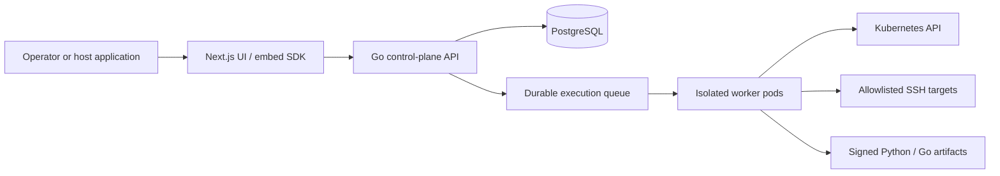

# Architecture

**Runtime honesty:** the diagram and engine split below are the **specified** control-plane / worker model. They are **not** a live production deployment. No shipped worker calls Kubernetes, SSH, scripts, or HTTP. Compose’s local worker evaluates six core nodes only and refuses provider steps. Read [Implemented vs Specified](architecture/implemented-vs-specified.md) before treating any provider path as running. Gap SoT: [docs/internal/claude-code-gap-analysis.md](internal/claude-code-gap-analysis.md) (epic [G](https://github.com/bbengt1/flowforge/issues/401) / [G.0](https://github.com/bbengt1/flowforge/issues/402)).

Hard lines stay: YAML is source of truth; drafts never run; vault chrome is display-name + UUID only; ADV-021 / ADV-024; fail-closed authorization.

## Deployment shape

Specified target — **not** what `deploy/k8s` runs today (`replicas: 1` API only; no web or production worker Deployment):

## Boundaries

The control plane owns workflow validation, workspace RBAC, credential authorization, versioning, idempotency, audit events, and dispatch. **Specified** workers execute one step at a time in short-lived isolated pods/containers with a non-root UID, read-only filesystem, CPU/memory/time limits, default-deny egress, and ephemeral scoped credentials. **Today:** the only worker binary is compose/dev (`apps/api/cmd/worker`). It claims jobs with the same lease / HMAC ticket / fencing checks, then **fails closed** on every provider node. Isolated production workers are not implemented.

Most control-plane boundaries fail closed: the API authenticates and authorizes server-derived workspace context, and webhook ingress verifies a replay-resistant signature before parsing. **Specified** workers revalidate an authenticated job's version/policy/lease before calling a provider; **no provider is called at runtime** until a production worker ships. Two HMAC secrets (`JOB_BINDING_SECRET`, `SCRIPT_SIGNING_KEY`) still default to per-process random values — a known fail-open (gap B1). The [security model](reference/security-model.md) defines the required controls and negative tests. Production-gate review of those existing controls: [E12.3 threat-model review](reference/e12-threat-model-review.md). Operator runbooks: [release and operations](operations/index.md).

PostgreSQL is the durable source of truth for workspace-scoped configuration, canonical workflow YAML, immutable versions, encrypted credential payload metadata, policy snapshots, durable job leases, redacted execution state, and audit **metadata**. See the [database specification](reference/database.md). Artifact **payloads** today live on `tmpfs` or in-process memory and do **not** survive pod loss (gap B3). Queue rows, leases, execution rows, and audit events in PostgreSQL do.

Workers that exist claim leased jobs and heartbeat while working; lease loss permits safe recovery only after fencing and idempotency checks. Workflow versions are immutable once run. `POST /api/v1/jobs/recover` exists but this repo ships **no scheduler** to call it (same for `POST /api/v1/schedules/dispatch` and `POST /api/v1/retention/purge`).

The first **specified** worker capability is the Kubernetes API engine. It is a controlled workflow node, not a general-purpose `kubectl` proxy: policy validation precedes server-side dry-run, server-side apply, and optional rollout observation. **The engine is a library with no production caller.** See the [Kubernetes engine reference](reference/kubernetes-engine.md).

SSH and script engines use the same specified control-plane/worker split. SSH is specified to run against a target and approved command profile, never a free-form terminal. Python and Go source is validated and packaged into an immutable signed artifact at publish time; **running** that artifact in an isolated short-lived worker is specified, not shipped (`script-runner` manifest is `replicas: 0`). See the [SSH engine](reference/ssh-engine.md) and [script engine](reference/script-engine.md).

## Standalone and embedded UI

The web UI is the canonical product surface. An embed SDK mounts the same UI in a host application and receives a short-lived, signed, single-use context containing host audience, user identity, workspace identity, permitted capabilities, and expiration. The API independently validates signature, issuer, audience, time bounds, token identity, and workspace authorization; host-supplied IDs never bypass FlowForge authorization.

Workflow definitions have one canonical representation: versioned YAML. The UI parses that YAML into its canvas model and serializes edits back to canonical YAML before save. The API validates, normalizes, stores, and versions that same document; no UI-only workflow format is persisted. Execution uses that YAML after publish — **core nodes only** on the compose worker; provider nodes do not run.

The [frontend UI specification](reference/frontend-ui.md) defines the visual canvas, action wizard, credential vault, validation, and accessible operator workflows.

The YAML document is a typed directed graph. Provider actions are composable node objects with explicit input/output ports; execution plans use only declared edges and preserve each node's policy boundary. This prevents a Kubernetes, SSH, or script node from receiving unrelated prior results or credentials by accident.

The host uses a stable route or mount point and communicates through a versioned embed contract (`embed.v1`, `/embed/v1` prefix). Deep links remain valid in standalone mode. The host never receives workflow credentials or raw runner logs containing secrets. See the [embed SDK](reference/embed-sdk.md).

## CP Ops Portal add-in

CP Ops Portal already has a protected workflow workspace and workflow catalog/run/health API surface. FlowForge should replace or adapt that workspace behind a versioned adapter contract, rather than share its database or executor directly.

Portal navigation and RBAC decide whether a user can enter the add-in. On entry, the portal backend exchanges its authenticated session for a short-lived FlowForge assertion containing the subject, permitted capabilities, tenant, workbench, audience, and expiry. FlowForge validates it independently and enforces its own workspace authorization. This avoids brittle iframe/SameSite-cookie coupling. The FlowForge-side contract, capability map, and host wiring live in the [Portal adapter](reference/portal-adapter.md) (`GET /api/v1/portal/adapter`). Portal never shares the FlowForge database or executor.

Each embedded instance is scoped by `(tenant_id, workbench_key)`. That identity travels through UI route state, API authorization, credential lookup, queues, workers, caches, history, and audit events. A host-provided tenant value is context, never authorization by itself. Workspace-scoped **realtime channels** are specified on the API; the operator UI **polls** execution status (SSE/WebSocket are not used).

## Safety defaults

- Workspace isolation is enforced in API, database queries, queue payloads, worker claims, caches, and audit records. Specified realtime subscriptions, if used, are workspace-scoped; the UI does not consume them today.
- Kubernetes credentials are per-workspace with narrow RBAC and namespace allowlists.
- SSH is key-only, known-host verified, target/command allowlisted, and time-bounded.
- Python and Go artifacts are approved/signed; **when a production runner exists** they run without arbitrary dependency installation. Signing and isolation contracts exist; the runner does not.
- Privileged nodes require explicit policy/approval before dispatch. Dispatch is not execution.

Standalone identity is local Login (`POST /api/v1/login`). Embed stays `POST /embed/exchange` (ADV-021). **OIDC Authorization Code + PKCE is deferred (V.0c).** First-run bootstrap (including TLS **Skip for now**) is standalone only. Explorer chrome on `/workflows` is landed organizer UI, not a provider runtime.

## Successor rewrite (charter)

The shipped product on `main` is E1–E12 plus epic #195 canvas-first chrome, with the runtime gaps in [Implemented vs Specified](architecture/implemented-vs-specified.md). Enterprise readiness work is epic [G](https://github.com/bbengt1/flowforge/issues/401). The UX program is a **FlowForge rewrite aimed at n8n-class UX and feature coverage**, not a clone: [flowforge-rewrite-n8n-class-parity.md](architecture/flowforge-rewrite-n8n-class-parity.md). YAML, publish-then-run, vault credentials, and ADV/tenancy invariants stay unless that charter records an explicit safer replacement.

Post-R1–R7 chrome polish (Laws of UX, selective; docs-only): [flowforge-ux-laws.md](architecture/flowforge-ux-laws.md).

Workflows home folder hierarchy (nested, server-backed, per workspace; F.1 API landed, chrome F.2+): [flowforge-workflow-folders.md](architecture/flowforge-workflow-folders.md).

First-run operator wizard (standalone only; B.1–B.8): [flowforge-first-run-bootstrap.md](architecture/flowforge-first-run-bootstrap.md).

Visual + IA north star (docs-only until Brent yes; chrome rebuild after): [flowforge-visual-ia-north-star.md](architecture/flowforge-visual-ia-north-star.md).
