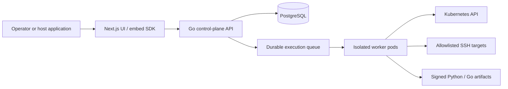

# Architecture

## Deployment shape

## Boundaries

The control plane owns workflow validation, workspace RBAC, credential authorization, versioning, idempotency, audit events, and dispatch. Workers execute one step at a time in short-lived isolated pods/containers with a non-root UID, read-only filesystem, CPU/memory/time limits, default-deny egress, and ephemeral scoped credentials.

Every boundary fails closed: the API authenticates and authorizes server-derived workspace context, webhook ingress verifies a replay-resistant signature before parsing, and workers revalidate an authenticated job's version/policy/lease before calling a provider. The [security model](reference/security-model.md) defines the required controls and negative tests.

PostgreSQL is the durable source of truth for workspace-scoped configuration, canonical workflow YAML, immutable versions, encrypted credential payload metadata, policy snapshots, durable job leases, redacted execution state, and audit events. See the [database specification](reference/database.md).

Execution state is durable. Workers claim leased jobs and heartbeat while working; lease loss permits safe recovery only after fencing and idempotency checks. Workflow versions are immutable once run.

The first worker capability is the Kubernetes API engine. It is a controlled workflow node, not a general-purpose `kubectl` proxy: policy validation precedes server-side dry-run, server-side apply, and optional rollout observation. See the [Kubernetes engine reference](reference/kubernetes-engine.md).

SSH and script engines use the same control-plane/worker split. SSH runs against a target and approved command profile, never a free-form terminal. Python and Go source is validated and packaged into an immutable signed artifact at publish time, then runs in an isolated short-lived worker. See the [SSH engine](reference/ssh-engine.md) and [script engine](reference/script-engine.md).

## Standalone and embedded UI

The web UI is the canonical product surface. An embed SDK mounts the same UI in a host application and receives a short-lived, signed, single-use context containing host audience, user identity, workspace identity, permitted capabilities, and expiration. The API independently validates signature, issuer, audience, time bounds, token identity, and workspace authorization; host-supplied IDs never bypass FlowForge authorization.

Workflow definitions have one canonical representation: versioned YAML. The UI parses that YAML into its canvas model and serializes edits back to canonical YAML before save. The API validates, normalizes, stores, versions, and executes that same document; no UI-only workflow format is persisted.

The [frontend UI specification](reference/frontend-ui.md) defines the visual canvas, action wizard, credential vault, validation, and accessible operator workflows.

The YAML document is a typed directed graph. Provider actions are composable node objects with explicit input/output ports; execution plans use only declared edges and preserve each node's policy boundary. This prevents a Kubernetes, SSH, or script node from receiving unrelated prior results or credentials by accident.

The host uses a stable route or mount point and communicates through a versioned embed contract. Deep links remain valid in standalone mode. The host never receives workflow credentials or raw runner logs containing secrets.

## CP Ops Portal add-in

CP Ops Portal already has a protected workflow workspace and workflow catalog/run/health API surface. FlowForge should replace or adapt that workspace behind a versioned adapter contract, rather than share its database or executor directly.

Portal navigation and RBAC decide whether a user can enter the add-in. On entry, the portal backend exchanges its authenticated session for a short-lived FlowForge assertion containing the subject, permitted capabilities, tenant, workbench, audience, and expiry. FlowForge validates it independently and enforces its own workspace authorization. This avoids brittle iframe/SameSite-cookie coupling.

Each embedded instance is scoped by `(tenant_id, workbench_key)`. That identity travels through UI route state, API authorization, credential lookup, queues, workers, caches, realtime state, history, and audit events. A host-provided tenant value is context, never authorization by itself.

## Safety defaults

- Workspace isolation is enforced in API, database queries, queue payloads, worker claims, realtime channels, caches, and audit records.
- Kubernetes credentials are per-workspace with narrow RBAC and namespace allowlists.
- SSH is key-only, known-host verified, target/command allowlisted, and time-bounded.
- Python and Go artifacts are approved/signed and run without arbitrary dependency installation.
- Privileged nodes require explicit policy/approval before dispatch.
