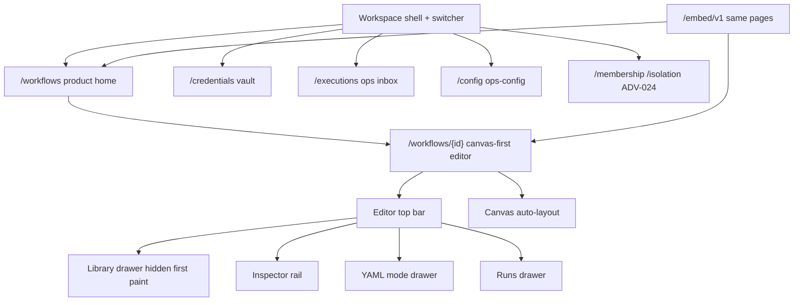
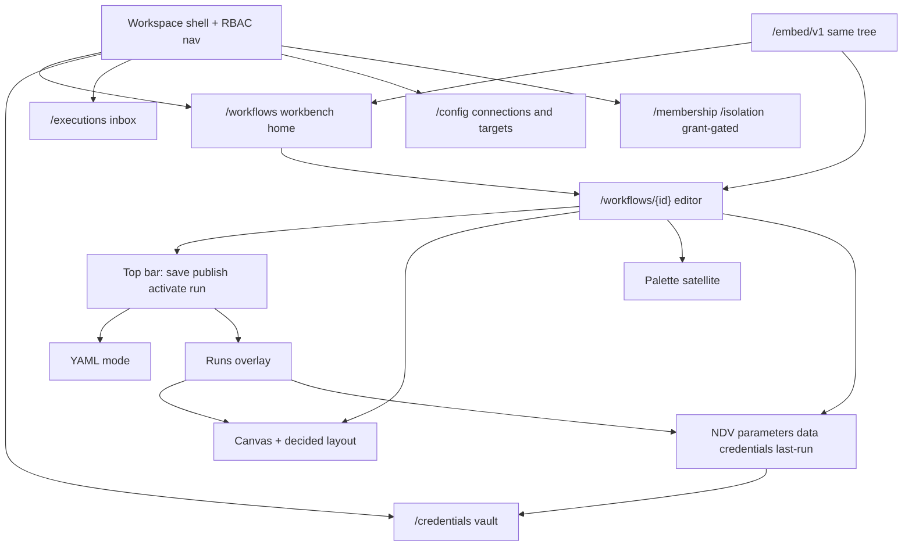

# FlowForge rewrite: n8n-class parity (not a clone)

Status: **charter draft** for product / architecture review. This document does not change application code, contracts, or shipped behavior. It is the successor program after E1–E12 and epic #195. Do **not** treat it as a replacement of the [master implementation plan](../master-implementation-plan.md) until Arie/Gracie open epics from the phases below.

**Parity reference only:** [n8n-io/n8n](https://github.com/n8n-io/n8n). Use n8n as a *behavior and feature-coverage* reference (home → canvas → palette → node detail → executions → credentials → activations). Do not copy n8n code, assets, branding, trademarks, colors, CSS, icons, or pixel-for-pixel layout.

Owners for fold-in: **Chloe** (UI surfaces + operator migration), **jonny** (control-plane / execution / credential gaps). Product calls: **Brent**. Issue creation later: **Arie / Gracie**. This PR does not open GitHub issues.

---

## 1. Executive summary

We are rewriting the FlowForge *product experience* so an operator who knows an n8n-class workbench can land, author, inspect, run, and operate automations without learning a stacked-operator tool. The rewrite is aimed at **n8n-class UX and feature coverage**, expressed as an independent FlowForge product.

We are **not** cloning n8n. FlowForge stays a YAML-backed, publish-then-run, vault-credential, multi-tenant workbench with fail-closed ADV/RBAC and a signed embed/Portal boundary. Those invariants are the product, not leftovers.

Epic #195 (UX.1–UX.12) already moved `/workflows/{id}` to canvas-first chrome on `main`. That is the **current baseline to migrate from**, not the end state. The canvas is now the primary surface, but the interaction model is still a FlowForge operator shell with drawers you must discover: hidden-on-first-paint library/YAML/runs, auto-layout-only graph, form-rail inspector rather than a node-detail conversation, and “publish + start published + trigger admin” instead of a single activation mental model.

**Decision already taken (do not reopen unless Brent explicitly reverses it):** parity of interaction and coverage; independence of implementation, visual language, and legal identity.

**Decision reserved for Brent (see [§10](#10-open-questions)):** how far to take canvas spatial memory, whether “test this node” may mint an implicit test version, and whether trigger *placement* stays workflow-level.

---

## 2. Goals and non-goals

### Goals

- **n8n-class interaction model** on FlowForge surfaces: product home, canvas editor, node palette, node detail view (NDV / inspector), executions, credentials, activations/triggers.
- **n8n-class feature coverage** for what FlowForge already executes on `main` (core graph, Kubernetes / SSH / script engines, manual / webhook / schedule, approvals, vault, embed/Portal) — presented as first-class product, not operator exercises.
- **One product tree.** Standalone and `/embed/v1` remain the same UI. No parallel studio app.
- **Preserve security and product invariants** unless this document (or a later Brent decision recorded here) replaces one with a safer equivalent and a migration.
- **Epic-ready phases** so Arie/Gracie can open issues from [§9](#9-phased-rewrite-plan) without inventing scope.
- **Fold-in without restructure.** Chloe and jonny paste drafts into [§11](#11-fold-in-stubs) only.

### Non-goals

- A literal or pixel-for-pixel clone of n8n (layout, chrome, color, iconography, copy, or information scent).
- Copying n8n source, assets, CSS, trademarks, or branding. Independent FlowForge visual language.
- Weakening ADV gates, embed `session.embed`, grant-gated membership/isolation, CHIPS/CSRF, or fail-closed feature flags in order to “feel more like n8n.”
- Executing drafts, unsaved buffers, or guessed invalid graphs.
- Persisting a UI-only workflow format that can diverge from `flowforge/v1` YAML.
- Putting trigger types on the canvas as graph nodes (current contract). Revisit only as an explicit Brent decision with a YAML migration.
- Enabling catalog entries marked **Next** / **Provider** (including `workflow.call`) or a connector marketplace as part of this rewrite. Those still need their own approved epic, contract, threat review, and release gate ([master plan](../master-implementation-plan.md)).
- Arbitrary shells, free-form Kubernetes proxying, package install, or shared tenant instances filtered only in the UI.
- Rewriting the Go control plane, workers, or PostgreSQL model “for UX.” Contract gaps are additive and listed; they are not a greenfield API.
- Creating GitHub issues from this PR.
- This document changing `apps/web` or `apps/api`.

### IP / legal non-goals (binding)

| Do not | Why |
| --- | --- |
| Copy n8n code, fixtures, icons, CSS, screenshots, or docs into this repo | Copyright and license risk |
| Use n8n names, logos, or trademarks in product chrome | Trademark; FlowForge is an independent product |
| Match n8n pixel-for-pixel or ship a “familiar n8n skin” | Creates a derivative-look claim and trains the team to clone |
| Scrape or vendor n8n as a submodule for “parity checks” in product builds | Unnecessary legal surface; behavior notes belong in this doc |

n8n may be cited in **internal** docs as a behavior reference with a link to the public repository. Product UI, marketing, and embed chrome say FlowForge.

---

## 3. Current baseline

Shipped on `main` at the time of this charter: **E1–E12** (platform through production readiness) plus **ADV** (epic #130 family) plus **epic #195** canvas-first chrome (UX.1–UX.12, including the UX.12 doc/walkthrough update). Normative current-state docs:

| Layer | Authority |
| --- | --- |
| Boundaries, embed, Portal | [Architecture](../architecture.md) |
| MVP backlog (historical, still true for shipped gates) | [Master implementation plan](../master-implementation-plan.md) |
| YAML + graph | [Workflow YAML schema](../reference/workflow-yaml-schema.md), [workflow model](../reference/workflow-model.md) |
| UI chrome and IA | [Frontend UI](../reference/frontend-ui.md) |
| Operator walkthrough | [Operator / admin UI](../guides/operator-admin.md) |
| Security / ADV | [Security model](../reference/security-model.md) |
| Control-plane routes | [Backend API map](../reference/backend-api-map.md) |
| Embed / Portal | [Embed SDK](../reference/embed-sdk.md), [Portal adapter](../reference/portal-adapter.md) |
| Local seed | [Deployment — local default tenant seed](../deployment.md#local-default-tenant-seed) |

### What is already true

- Deployable Go / Next.js / PostgreSQL control plane with durable leased execution, RLS tenancy, and fail-closed identity.
- Canonical workflow document `apiVersion: flowforge/v1`. Canvas is a projection. Invalid YAML never guesses a graph.
- Drafts save and publish; **drafts never execute**. Start requires a published `workflowVersionId`, idempotency key, and (for manual) typed input.
- Vault credentials: display name + UUID refs; plaintext never in YAML, browser persistence, logs, or UI chrome after submit.
- Multi-tenant workbench: unique `(tenant_id, workbench_key)`, server-derived workspace scope, RBAC deny-by-default.
- ADV: embed chrome from `GET /session` `session.embed` (ADV-021); membership/isolation grant-gated (ADV-024); CHIPS embed cookies; host-issuer bind; fail-closed flags (`TRUSTED_DEV_IDENTITY_HEADERS`, `SEED_LOCAL_DEFAULTS`, empty allowlists).
- Epic #195 landed: `/workflows` product home; `/workflows/{id}` viewport canvas + sticky top bar; library / YAML / runs as drawers; inspector node/`with`/pins/credentials + workflow tabs Triggers / Versions / Pins; last-run overlay on the **same** canvas; nav collapses to an icon-rail on the editor.

### What still feels wrong versus n8n-class UX

These are product gaps, not invitations to clone n8n chrome.

1. **Discoverability.** Library, YAML, and runs are hidden on first paint. An n8n-class editor makes palette and node detail *available without hunting*. FlowForge can do that with its own persistent/satellite layout — it does not need n8n’s exact columns.
2. **No spatial memory.** Positions are auto-layout only and are not a persisted UI format. Operators cannot arrange a graph and find it again. That is the largest canvas-parity hole. Fixing it requires an explicit layout contract (see [§8](#8-data--contract-strategy) and [D1](#d1--canvas-layout-persistence)).
3. **Missing graph primitives.** Fit-to-workflow, snap-to-grid, minimap, multi-select, alignment, undo/redo are documented as aspirational in [frontend-ui](../reference/frontend-ui.md). n8n-class authoring assumes most of these.
4. **Inspector ≠ NDV.** The right rail edits fields. An NDV owns the node conversation: parameters, typed port mapping, credential pick-by-display-name, redacted last-run I/O, validation, policy impact — without sending the operator to `/credentials` or `/executions` for the common path.
5. **Activation is split.** Mental model today: save draft → publish → start a published version, plus home query drawers for webhooks/schedules. n8n-class “this workflow is active” is one control. FlowForge can map that to **enable a published version’s triggers** without executing drafts. Mapping is a Brent call ([D2](#d2--activation-model)).
6. **Home is an ops list.** UX.8 correctly made `/workflows` the product home. It still reads as inventory (filters, cards, foundation leftovers) rather than a workbench (activation state, last run, broken/waiting, create-from-template as the default empty state).
7. **Foundation surfaces leak.** Membership/isolation are grant-gated (correct) but remain exercise-shaped. Trusted-dev header fallback and developer fixtures still sit near product chrome. Settings still *links* to admin surfaces the nav hides.
8. **Config is a second admin app.** Cluster targets, SSH targets, profiles, connections, templates live under `/config`. n8n-class operators meet connections at the credential/NDV boundary, not a separate ops-config product.
9. **No first-class “try this node”** that stays inside publish-then-run. n8n’s execute-unsaved is **not** the target. The missing FlowForge move is a one-gesture **publish test version → run** (or a Brent-approved safer equivalent).
10. **Narrow/touch is a breakpoint**, not an inspector-first editor (`touch-inspector-first` in frontend-ui).
11. **Control-plane density gaps** (jonny; not blocking E6): no execution-vs-execution compare route; no replay projection endpoint; client stitches version YAML + steps. Catalog metadata is complete for core/K8s/SSH/script/HTTP on `main`; UI still has contract-fallback paths.
12. **Coverage vs marketplace.** FlowForge’s engines are operational (K8s/SSH/script) rather than a connector store. n8n-class *coverage* here means those engines plus HTTP/notification are as operable as n8n’s HTTP node — not that we ship n8n’s catalog.

---

## 4. Target product vision

Express n8n-class *surfaces* as FlowForge capabilities. Names below are FlowForge names. Do not import n8n product terms into chrome.

### Product home

`/workflows` remains the only home (standalone `/` with `workflow.view` lands here; embed uses the same list).

- Search, folders/tags, owner, trigger, environment, status, last run, last modified — already specified; make **activation**, **waiting/approval**, and **indeterminate last run** first-class columns.
- Create draft, import YAML, duplicate, template → draft, export **published** YAML.
- Row actions: open editor, start published, manage webhook/schedule (role-gated), open last run.
- Empty state: create, import, or pick a reviewed template. Templates never execute.
- Health / OpenAPI stay under Settings. Home is not a metrics dashboard.

### Canvas editor

`/workflows/{id}` (same page at `/embed/v1/workflows/{id}`).

- Graph is the viewport. Top bar: identity, unsaved/saved, save draft, publish, activation (once [D2](#d2--activation-model) is decided), start published, palette / NDV / YAML / runs toggles.
- Palette available without a scavenger hunt (persistent satellite or one-click that stays open across node adds — Chloe specifies the FlowForge pattern in [§11](#111-chloe--ui-surfaces--operator-migration-notes)).
- Canvas: pan, zoom, select, connect compatible ports, insert from palette/wizard. Invalid YAML still never draws a guessed graph. State is icon + text, never color-only.
- Spatial layout: see [D1](#d1--canvas-layout-persistence). Until decided, keep auto-layout and do not persist a side-channel format.
- Graph primitives (phase R2): undo/redo, multi-select, fit, snap; minimap/alignment if they do not steal viewport. Keyboard remains the MVP path.

### Node palette

Enabled catalog only (`GET /workflows/catalog` plus engine catalogs). Triggers stay **workflow-level** unless Brent reverses [D3](#d3--trigger-placement). Categories are FlowForge families (control flow, data, Kubernetes, SSH, scripts, HTTP/notifications). Cards show safe name, ports, required permissions, policy hints. Drag inserts defaults; **Add action** remains the guided path for target/credential/policy review.

`/actions` stays a catalog reference, not a third app.

### NDV / inspector

The selected-node surface is the FlowForge NDV:

| Panel | Content | Forbidden |
| --- | --- | --- |
| Parameters | `name`, bounded `with`, pins | Secret fields, kubeconfig paste |
| Data | Typed port map, upstream preview redacted | Implicit “all prior results” |
| Credentials | Display name + UUID under the hood; add via masked wizard | Plaintext, rotate-in-rail |
| Last run | Redacted input/output/logs for this node | Second replay graph |
| Validation / policy | Linked errors, `POST /policy/evaluate` when a published version is in play | Enable toggles for disabled catalog |

Nothing selected: workflow tabs **Triggers / Versions / Pins** (already landed). Edge selected: port compatibility.

### Executions

- **In-editor runs:** scoped to the open workflow; overlay step status on the **same** canvas; NDV shows last-run I/O. Deep link **Open execution** → `/executions/{id}`.
- **Workspace inbox:** `/executions` + `/executions/{id}` remain the ops replay. Do not invent `/replay`.
- Cancel, retry (only when policy/`result.retry.allowed`), emergency-stop (script policy), unmistakable `indeterminate`, approval decide via `POST /approvals/{id}/decide`.
- Compare stays redacted. Server compare is a jonny gap, not a UI invention.

### Credentials

`/credentials`, `/credentials/new`, `/credentials/{id}` remain the vault. NDV create reuses the masked wizard (return-to-editor). Types stay `kubernetes`, `ssh_private_key`, `token`, `webhook_secret`, `provider`. Metadata only after submit. Unexpected secret keys on responses stay stripped and are a contract bug.

### Activations / triggers

n8n-class “active workflow” maps to FlowForge **published version + enabled trigger**, never to “the draft is live.”

| Trigger | FlowForge capability |
| --- | --- |
| Manual | Start published with schema-bound input + idempotency key |
| Webhook | Opaque `publicId`, vault `webhook_secret`, admin rotate/disable, public `POST /hooks/{publicId}` |
| Schedule | IANA timezone, overlap/misfire policy, version pin |

YAML may declare trigger *type and safe schema* only. Secrets, HMAC, rate limits, and field mapping stay admin/API config ([workflow YAML schema](../reference/workflow-yaml-schema.md)). Activation chrome is the missing product layer ([D2](#d2--activation-model)).

---

## 5. Information architecture

### Today (migrate-from)

Landed #195 IA. Authoring path: **home → editor top bar → palette → inspector → YAML mode → runs drawer.**

Same editor page under `/embed/v1/workflows/{id}`. Portal demo remains `/portal/workflows` → iframe `/embed/v1`.

### Proposed (n8n-class FlowForge shell)

Routes stay stable unless Chloe’s fold-in proves a rename is cheaper than teaching the old paths. **Prefer migrate in place** over a greenfield UI package.

| Surface | Today | Proposed | Migrate vs greenfield |
| --- | --- | --- | --- |
| Home | `/workflows` list/cards | Same route; workbench density (activation, waiting, last run) | **Migrate** |
| Editor | `/workflows/{id}` drawers | Same route; palette + NDV as satellites, not hidden-by-default | **Migrate** chrome; canvas engine upgrade only if Chloe cannot land primitives on the current graph |
| Palette | Left drawer, hidden first paint | Same catalog; available without hunting | **Reshape** |
| NDV | Inspector rail + tabs | Same rail/id; conversation model | **Reshape** |
| YAML | Drawer mode | Stay a mode; never the persist format | **Keep** |
| Runs | Overlay drawer | Stay overlay on same canvas | **Reshape** density |
| Vault | `/credentials/*` | Keep dedicated routes; NDV add stays modal/return | **Keep** routes, **reshape** entry from NDV |
| Executions | `/executions`, `/{id}` | Keep inbox + replay; no `/replay` | **Keep** |
| Config | `/config/{kind}` | Keep; meet connections from NDV | **Reshape** IA, do not fork a Targets app |
| Approvals / alerts / audit | Existing routes | Keep; surface waiting on home + NDV | **Keep** |
| Membership / isolation | ADV-024 | Keep grant-gated; stop looking like the product | **Reshape** copy/placement, **do not** retire the grant |
| Embed / Portal | `/embed/v1`, `/portal/workflows` | Same mounts, `session.embed` | **Keep** contracts; **migrate** chrome with standalone |
| Actions / templates / settings | Shell destinations | Keep | **Keep** |
| New studio origin or `/studio` | — | **Do not add** | Greenfield UI only if R2 spike fails (Brent + Chloe) |

**Migrate vs greenfield (architect recommendation):** migrate `apps/web` App Router in place. Epic #195 already forbade a second embed tree. A greenfield canvas package is in scope **only** as an R2 spike outcome if the current graph cannot do undo, multi-select, and decided layout without a rewrite. That spike is Chloe-owned and must not fork routes or contracts.

---

## 6. Keep / reshape / replace / retire

Against current `main`. “Replace” means replace the *surface or implementation*, not the invariant.

| Area | Current `main` | Disposition | Notes |
| --- | --- | --- | --- |
| Canvas-first editor (#195) | Viewport canvas, top bar, drawers | **Reshape** | Baseline to migrate *from*. Palette/NDV availability and graph primitives are the rewrite, not another chrome epic numbered UX.13+. |
| YAML `flowforge/v1` | Only persisted definition | **Keep** | Canvas stays a projection. Replacement only via [D4](#d4--yaml-replacement) (default: no). |
| Draft / publish / run | Save draft; publish last saved; start published only | **Keep** | One-gesture test-run may mint a **published test version** ([D5](#d5--one-gesture-test-run)). Drafts still never execute. |
| Vault | Display name + UUID; encrypted; masked wizard | **Keep** (contract) / **reshape** (NDV entry) | Secrets never in YAML or chrome. |
| Executions | Inbox + editor overlay + redacted I/O | **Reshape** | Density and filters; same routes and redaction. |
| Embed / Portal | `session.embed`, CHIPS, host-issuer, Portal adapter | **Keep** | Chrome migrates with standalone. No second tree. |
| Membership / isolation | ADV-024 grant; exercise UX | **Reshape** | Keep fail-closed grant and negative tests; retire “this is the product” framing. |
| Local seed (#191) | `local` / `default` + demo vault in non-prod | **Keep** | Production boot-fail if forced on. Rewrite must not copy seed into k8s. |
| Ops surfaces | `/config`, OpenAPI, incident/retention docs | **Keep** | jonny authority. Not a product home. |
| Action wizard | Guided add | **Reshape** | Keep policy/credential review; NDV becomes the everyday edit. |
| Auto-layout-only positions | Not persisted | **Replace** if D1 = persist; else **keep** until decided | Do not silently add a UI format. |
| Hidden-first-paint drawers | Library / YAML / runs | **Replace** the hide-by-default habit | YAML/runs may stay modes; palette/NDV should not. |
| Foundation header fallback | Trusted-dev identity headers | **Retire** from product chrome when embed/OIDC is the only subject path | API flag stays local-only. |
| Developer starter/invalid fixtures | Settings / developer disclosure | **Keep** off primary chrome (UX.2 already moved them) | |
| Pre-#195 stacked operator page | Gone as product IA | **Retired** | Do not restore. PR #194 inventory is historical. |
| `/replay` or second replay graph | Not present | **Do not add** | |
| Connector marketplace / `workflow.call` | Registry-disabled | **Keep disabled** | Separate epic if Brent wants coverage later. |
| n8n look, assets, terms in chrome | Not present | **Do not add** | |

---

## 7. Security and tenancy invariants

Must-keep unless a numbered decision below replaces the control with a **safer equivalent** and a migration. Safer means: fail-closed, server-enforced, secret-free at the old boundary, and covered by the E12.1 suite (or an additive successor).

### Must-keep

1. **YAML `flowforge/v1` is the persisted workflow definition** (or D4 replacement). No UI-only graph store that can run.
2. **Drafts never execute.** Publish, then run a pinned version/digest.
3. **Vault credentials:** display name in UI; UUID refs in YAML/config; plaintext only on create/rotate submit; never returned; never in logs, URLs, analytics, or snapshots.
4. **Server-derived workspace scope** on every workspace-owned read/write, credential lookup, job, cache key, realtime channel, artifact, and audit. Host tenant/workbench is context, never authorization.
5. **RBAC deny-by-default.** Nav and search never flash ungated capabilities. Membership/isolation chrome only with `workspace.administer` or `platform.administer` (ADV-024).
6. **Embed:** signed, single-use, audience-bound assertion; `GET /session` `session.embed` drives chrome (ADV-021); CHIPS cookies; host-issuer bind (ADV-023); empty allowlists fail closed; production https issuers (ADV-018).
7. **Fail-closed flags:** `TRUSTED_DEV_IDENTITY_HEADERS`, `SEED_LOCAL_DEFAULTS`, empty `PLATFORM_ADMINS`, empty embed/Portal issuer lists. Production-locked `APP_ENV` or `REQUIRE_TLS=true` refuses leftover local flags.
8. **Invalid YAML never renders a guessed graph.**
9. **Triggers cannot override** workspace, version, target policy, credentials, approval, or node configuration.
10. **Workers re-authorize** job version/policy/lease. Uncertain side effects are `indeterminate`. Lost leases do not assume a safe retry.
11. **Portal does not share** the FlowForge database or executor.
12. **No secret in a trigger URL.** Webhook HMAC stays in the vault.
13. **E12 evidence stays green.** Rewrite stories that touch a trust boundary update the security model and the named harness.

### Explicit decisions (risk called out)

| ID | Proposal | Default | Risk if reversed |
| --- | --- | --- | --- |
| D1 | Persist canvas positions | **Undecided — Brent.** Architect lean: optional non-authoritative `metadata.ui.layout` (or equivalent) ignored by the executor | A second source of truth; invalid layout must never invent nodes/edges |
| D2 | Single “active” control | **Undecided — Brent.** Architect lean: activate = enable triggers on a **published** version | Operators confuse active with “draft is live” |
| D3 | Triggers as canvas nodes | **No.** Keep workflow-level | YAML + catalog + palette rewrite; easy to leak trigger secrets onto the graph |
| D4 | Replace `flowforge/v1` | **No.** Additive v1 fields only | Migration of every draft/version/export; dual-run risk |
| D5 | One-gesture test run | **Undecided — Brent.** Architect lean: shortcut that **publishes an immutable test version** then starts it | Any path that runs the unsaved buffer breaks the draft invariant |
| D6 | Greenfield UI package | **No**, unless R2 spike fails | Second embed tree, split a11y/ADV chrome, duplicate proxies |
| D7 | Client-side workspace filter as tenancy | **No** | Cross-workspace leak; RLS is backstop, not the control |
| D8 | Show plaintext to “help debug” | **No** | Vault invariant; use fingerprints, redacted I/O, correlation IDs |

Recording a reversal: update this table, the security model, and the E12 suite in the same change set. Do not “just ship the UX.”

---

## 8. Data and contract strategy

### `flowforge/v1` YAML

- **Stay.** `apiVersion: flowforge/v1` remains the portable document. UI parse → edit → normalize → save is unchanged in kind: `POST /workflows/validate`, `POST /workflows/normalize`, `PUT /workflows/{id}/draft`, replace buffer with API YAML + digest.
- **Additive only** inside v1 (optional fields, ignored by older executors). Unsupported versions still fail validation.
- **If D1 = persist layout:** add an optional, non-authoritative layout object that the API stores and returns but **does not** use for dispatch, policy, or port typing. Missing/invalid layout → auto-layout; never a guessed graph. jonny specifies the field in [§11.2](#112-jonny--control-plane--execution--credential-parity-gaps).
- **If D4 = replace (not recommended):** new `apiVersion`, dual-read, export/import migration, and a versioned epic. Out of scope until Brent writes it here.

### Publish model

Unchanged: one mutable draft per workflow; publish copies normalized YAML into an immutable version; executions pin version + digest + policy/profile/artifact revisions. Restore-as-new-draft stays. Publish of script nodes still packages/signs **outside** user-editable YAML.

D5, if accepted, is a **publish flavor** (test note, maybe shorter retention), not a run-draft flag.

### Execution APIs

Prefer existing E5/E10 routes:

- `POST /workflows/{id}/executions` `{workflowVersionId, idempotencyKey, input}` + `Idempotency-Key`
- `GET /executions`, `GET /executions/{id}`, step logs, cancel, retry, emergency-stop
- `POST /approvals/{id}/decide` for wait/resume
- `POST /policy/evaluate`

**Additive gaps (jonny; do not invent UI routes):**

- Execution-vs-execution compare
- Optional replay projection (version YAML + steps as one payload)
- Activation read/write if D2 needs a first-class resource rather than composing trigger `status` + version pin
- Layout field on draft/version if D1 lands

Workers, leases, fencing, redaction, and `indeterminate` stay as specified.

### Credentials

No contract change required for parity UX. NDV continues to select by display name and persist UUID refs (`credentialId` on targets/connections; vault ids in usage). Create/rotate still send `secret` once and drop it. Isolation hook `POST /workspace/credentials/{id}/use` is **not** the product vault.

### Existing workspaces — migration stance

| Object | Stance |
| --- | --- |
| Drafts / published versions | Keep; no rewrite migration job. Additive fields default empty. |
| Executions | Keep; overlay/replay must read historical pins. |
| Credentials / targets / profiles | Keep UUIDs and ciphertext. No re-encrypt for UX. |
| Webhook `publicId` / schedules | Keep; activation chrome points at existing rows. |
| Embed sessions | Keep; rewrite UI must still exchange and bind `(tenant_id, workbench_key)`. |
| Local seed | Keep local-only; demo credentials stay placeholders. |
| Operator bookmarks | Keep `/workflows`, `/workflows/{id}`, `/embed/v1/…`. Redirects if Chloe renames anything. |

Rollback for each UI phase is “leave the previous chrome behind a flag or revert the App Router files.” The API does not need a rewrite flag unless D1/D2 add columns.

---

## 9. Phased rewrite plan

High-level phases only. **Arie/Gracie open epics later** from these rows. Do not create issues in this PR. Each phase is one epic: one outcome, explicit in/out, Chloe and/or jonny owner, no hidden “also rewrite the API.”

Depends-on is sequential for operator-visible coherence, not a hard merge lock. R5 and R6 may overlap R3/R4 after R1 decisions are recorded.

| Epic | Outcome | Boundaries | Owner | Depends on |
| --- | --- | --- | --- | --- |
| **R1 — Charter freeze** | Brent decisions D1–D6 recorded in this doc; Chloe/jonny stubs filled; this file is the rewrite source of truth | Docs + decision log only. No `apps/*`. No issues until this epic is accepted | Brent + Chloe + jonny; Arie tracks | This PR |
| **R2 — Editor interaction** | Opening a workflow feels like an n8n-class graph tool: palette and NDV available, graph primitives (undo/redo, multi-select, fit/snap), same `/workflows/{id}` + embed page | `apps/web` editor chrome/graph only. No draft execute. No YAML replacement. Layout persist **only** if D1 is yes and jonny’s field exists. Greenfield canvas package only if a written spike fails | Chloe; jonny if D1 | R1 |
| **R3 — NDV and mapping** | Selected node is a FlowForge NDV: parameters, typed ports, credential pick/add, redacted last-run, validation/policy. Wizard remains the guided add | Inspector/wizard/adapters. Catalog fallback removal only when catalogs are complete. No vault plaintext. No new credential types | Chloe; jonny catalog gaps | R2 |
| **R4 — Executions density** | Workspace inbox + in-editor overlay match n8n-class operate-a-run: filter, overlay, NDV I/O, cancel/retry/stop, `indeterminate`, waiting → decide | Existing execution/approval routes. No `/replay`. Compare uses existing client diff until jonny ships a compare route | Chloe; jonny optional compare/replay projection | R3 (overlay/NDV), E5/E10 already on main |
| **R5 — Credentials in the workbench** | Vault is the credential store operators expect: find by display name, test/rotate/usage, NDV add without leaving the graph | `/credentials/*` + NDV wizard. No KEK in the browser. No `/config` merge unless Brent asks | Chloe | R3 |
| **R6 — Activations and triggers** | Home + editor expose “this published version is active” for webhook/schedule (and manual start) without teaching three drawers | Trigger admin APIs already on main. New activation resource **only** if D2 requires it (jonny). Drafts still never run | Chloe; jonny if D2 needs API | R1 D2, E10 on main |
| **R7 — Embed, tenancy, operator migration** | Rewrite chrome ships on `/embed/v1` with `session.embed`, ADV-024, CHIPS; operators leave exercise-shaped membership/isolation; local seed and ops docs still correct; E12.3 a11y contract extended | No ADV weakening. No Portal DB share. Membership/isolation stay grant-gated. jonny: docs/harness if a boundary moved (it should not) | Chloe; jonny standby | R2–R6 landed enough to mount |

**Out of this program (do not sneak into R2–R7):** marketplace connectors, `workflow.call`, OIDC login productization (unless Brent adds D9), mobile app, screen-reader graph rewrite, replacing PostgreSQL or the worker model.

**Epic definition of ready (for Arie/Gracie):** copy the row, then add: operator outcome, in/out, parent (this doc §9), API/YAML/UI impact, authz/abuse, acceptance, tests, docs, rollback, telemetry. Use the [master plan](../master-implementation-plan.md) definition-of-ready checklist.

---

## 10. Open questions

### Brent (product calls)

- **D1.** Persist canvas layout in YAML metadata (non-authoritative) or keep auto-layout?
- **D2.** What does “active” mean? Enable published webhook/schedule vs a new activation resource vs keep publish + start + trigger admin?
- **D3.** Confirm triggers stay workflow-level (recommended).
- **D4.** Confirm `flowforge/v1` stays (recommended).
- **D5.** May “test this workflow/node” mint a published test version in one gesture?
- **D6.** Confirm migrate-in-place unless R2 spike fails.
- How much n8n-class *coverage* beyond engines already on `main` (HTTP/notification are gated by `INTEGRATION_ACTIONS_ENABLED`)? Marketplace remains out.
- Is CP Ops Portal the primary production shell, or standalone `/workflows`? Embed contracts stay either way.

### Chloe (UI / migration)

- Can the current canvas implement undo/redo, multi-select, and (if D1) layout without a new graph engine?
- Palette/NDV: persistent satellites vs remembered-open drawers — pick a FlowForge pattern, not an n8n column match.
- Operator migration: what do we say on membership/isolation/settings so foundation exercises stop looking like the product?
- Embed: which rewrite chrome is iframe-safe at `/embed/v1` without a second tree?
- A11y: extend UX.10 (Esc, focus return, no nested `<main>`, icon+text) to NDV and palette; still no SR graph rewrite unless Brent files it.
- Touch/narrow: keep breakpoint vs a real inspector-first path (`touch-inspector-first`).

### jonny (contracts)

- D1 field shape, validation, and “layout ignored by executor” tests, if Brent says yes.
- D2: is trigger `status` + version pin enough, or is an activation resource required?
- Execution compare and/or replay projection: ship or keep client-side?
- Catalog fallback: when can Chloe delete `contract-fallback` for K8s/SSH/script/HTTP?
- Any execution/credential list/filter the NDV or home will need that `/executions` and `/credentials` do not already provide?
- Confirm no API change is required for “NDV add credential” beyond existing vault routes.

---

## 11. Fold-in stubs

Paste drafts **under the matching heading**. Do not rename sections, do not move §1–§10, do not add a second IA. Link out to issues only after Arie/Gracie create them.

### 11.1 Chloe — UI surfaces + operator migration notes

<!-- CHLOE: UI surfaces + operator migration notes -->

_Stub._ Chloe: replace this paragraph with UI-surface notes (home, editor, palette, NDV, runs, vault, activations, embed) and operator migration (what we tell people who learned the #195 drawers and the E2–E5 foundation pages). Call out any disagreement with migrate-vs-greenfield or with D1–D6 defaults. Keep ADV-021/024, draft-never-runs, and “not an n8n clone” intact. If a sentence in §3–§6 is wrong about landed chrome, correct it here and patch the table in the same PR.

### 11.2 jonny — control-plane / execution / credential parity gaps

<!-- JONNY: control-plane / execution / credential parity gaps -->

_Stub._ jonny: replace this paragraph with control-plane, execution, and credential gaps versus n8n-class *behavior* (not n8n APIs). List additive routes/fields only; mark each as required-for-R# or defer. Confirm YAML/publish/vault invariants. If D1/D2 need schema, propose the contract here before writing migrations. Do not weaken fail-closed flags or embed exchange.

---

## Related documents

- [Architecture](../architecture.md)
- [Frontend UI](../reference/frontend-ui.md) — current #195 baseline
- [Operator / admin UI](../guides/operator-admin.md)
- [Master implementation plan](../master-implementation-plan.md) — shipped E1–E12
- [Workflow YAML schema](../reference/workflow-yaml-schema.md)
- [Security model](../reference/security-model.md)
- [Backend API map](../reference/backend-api-map.md)
- [Embed SDK](../reference/embed-sdk.md)
- [Release and operations](../operations/index.md)
