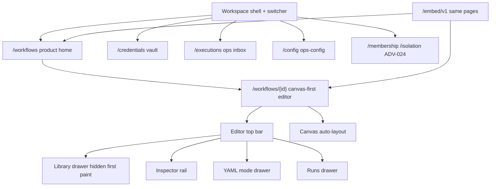
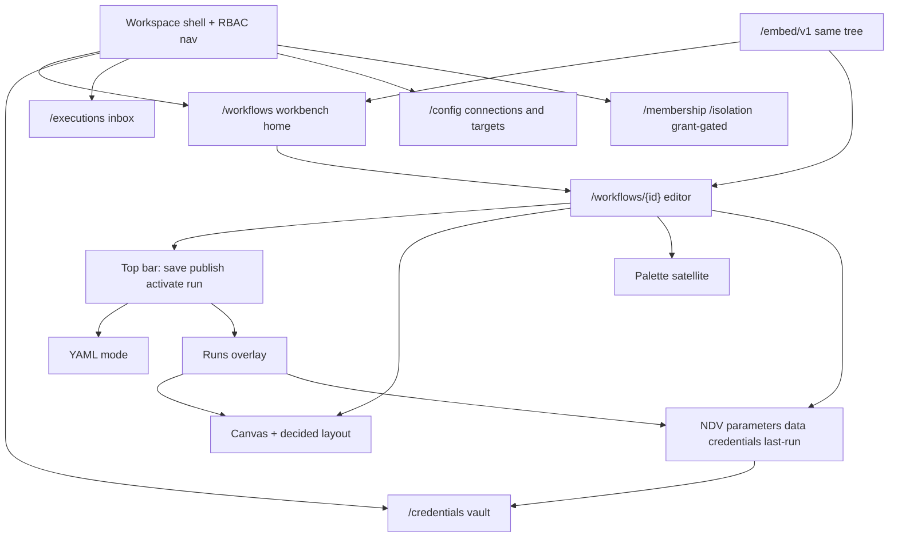

# FlowForge rewrite: n8n-class parity (not a clone)

Status: **charter frozen (D1–D6 locked)**. This document does not change application code, contracts, or shipped behavior. It is the successor program after E1–E12 and epic #195. R1–R7 epics are #227–#233. Do **not** treat it as a replacement of the [master implementation plan](../master-implementation-plan.md) for shipped E1–E12 work.

**Parity reference only:** [n8n-io/n8n](https://github.com/n8n-io/n8n). Use n8n as a *behavior and feature-coverage* reference (home → canvas → palette → node detail → executions → credentials → activations). Do not copy n8n code, assets, branding, trademarks, colors, CSS, icons, or pixel-for-pixel layout.

Owners for fold-in: **Chloe** (UI surfaces + operator migration), **jonny** (control-plane / execution / credential gaps). Product calls: **Brent**. Epics: **Arie / Gracie** (#227–#233). This PR does not open GitHub issues.

---

## 1. Executive summary

We are rewriting the FlowForge *product experience* so an operator who knows an n8n-class workbench can land, author, inspect, run, and operate automations without learning a stacked-operator tool. The rewrite is aimed at **n8n-class UX and feature coverage**, expressed as an independent FlowForge product.

We are **not** cloning n8n. FlowForge stays a YAML-backed, publish-then-run, vault-credential, multi-tenant workbench with fail-closed ADV/RBAC and a signed embed/Portal boundary. Those invariants are the product, not leftovers.

Epic #195 (UX.1–UX.12) already moved `/workflows/{id}` to canvas-first chrome on `main`. That is the **current baseline to migrate from**, not the end state. The canvas is now the primary surface, but the interaction model is still a FlowForge operator shell with drawers you must discover: hidden-on-first-paint library/YAML/runs, auto-layout-only graph, form-rail inspector rather than a node-detail conversation, and “publish + start published + trigger admin” instead of a single activation mental model.

**Decision already taken (do not reopen unless Brent explicitly reverses it):** parity of interaction and coverage; independence of implementation, visual language, and legal identity.

**Decisions locked (see [§10](#10-open-questions)):** persist canvas layout as optional non-authoritative `metadata.ui.layout`; “active” = enable triggers on a published version; triggers stay workflow-level; keep `flowforge/v1` (additive only); one-gesture test-run mints a published test version then starts it; migrate the UI in place.

---

## 2. Goals and non-goals

### Goals

- **n8n-class interaction model** on FlowForge surfaces: product home, canvas editor, node palette, node detail view (NDV / inspector), executions, credentials, activations/triggers.
- **n8n-class feature coverage** for what FlowForge already executes on `main` (core graph, Kubernetes / SSH / script engines, manual / webhook / schedule, approvals, vault, embed/Portal) — presented as first-class product, not operator exercises.
- **One product tree.** Standalone and `/embed/v1` remain the same UI. No parallel studio app.
- **Preserve security and product invariants** unless this document (or a later Brent decision recorded here) replaces one with a safer equivalent and a migration.
- **Epic-ready phases** so Arie/Gracie can open issues from [§9](#9-phased-rewrite-plan) without inventing scope.
- **Fold-in without restructure.** Chloe and jonny paste drafts into [§11](#11-fold-in-stubs) only.

### Non-goals

- A literal or pixel-for-pixel clone of n8n (layout, chrome, color, iconography, copy, or information scent).
- Copying n8n source, assets, CSS, trademarks, or branding. Independent FlowForge visual language.
- Weakening ADV gates, embed `session.embed`, grant-gated membership/isolation, CHIPS/CSRF, or fail-closed feature flags in order to “feel more like n8n.”
- Executing drafts, unsaved buffers, or guessed invalid graphs.
- Persisting a UI-only workflow format that can diverge from `flowforge/v1` YAML.
- Putting trigger types on the canvas as graph nodes ([D3](#d3--trigger-placement) locked: workflow-level). Revisit only as an explicit Brent reversal with a YAML migration.
- Enabling catalog entries marked **Next** / **Provider** (including `workflow.call`) or a connector marketplace as part of this rewrite. Those still need their own approved epic, contract, threat review, and release gate ([master plan](../master-implementation-plan.md)).
- Arbitrary shells, free-form Kubernetes proxying, package install, or shared tenant instances filtered only in the UI.
- Rewriting the Go control plane, workers, or PostgreSQL model “for UX.” Contract gaps are additive and listed; they are not a greenfield API.
- Creating GitHub issues from this PR.
- This document changing `apps/web` or `apps/api`.

### IP / legal non-goals (binding)

| Do not | Why |
| --- | --- |
| Copy n8n code, fixtures, icons, CSS, screenshots, or docs into this repo | Copyright and license risk |
| Use n8n names, logos, or trademarks in product chrome | Trademark; FlowForge is an independent product |
| Match n8n pixel-for-pixel or ship a “familiar n8n skin” | Creates a derivative-look claim and trains the team to clone |
| Scrape or vendor n8n as a submodule for “parity checks” in product builds | Unnecessary legal surface; behavior notes belong in this doc |

n8n may be cited in **internal** docs as a behavior reference with a link to the public repository. Product UI, marketing, and embed chrome say FlowForge.

---

## 3. Current baseline

Shipped on `main` at the time of this charter: **E1–E12** (platform through production readiness) plus **ADV** (epic #130 family) plus **epic #195** canvas-first chrome (UX.1–UX.12, including the UX.12 doc/walkthrough update). Normative current-state docs:

| Layer | Authority |
| --- | --- |
| Boundaries, embed, Portal | [Architecture](../architecture.md) |
| MVP backlog (historical, still true for shipped gates) | [Master implementation plan](../master-implementation-plan.md) |
| YAML + graph | [Workflow YAML schema](../reference/workflow-yaml-schema.md), [workflow model](../reference/workflow-model.md) |
| UI chrome and IA | [Frontend UI](../reference/frontend-ui.md) |
| Operator walkthrough | [Operator / admin UI](../guides/operator-admin.md) |
| Security / ADV | [Security model](../reference/security-model.md) |
| Control-plane routes | [Backend API map](../reference/backend-api-map.md) |
| Embed / Portal | [Embed SDK](../reference/embed-sdk.md), [Portal adapter](../reference/portal-adapter.md) |
| Local seed | [Deployment — local default tenant seed](../deployment.md#local-default-tenant-seed) |

### What is already true

- Deployable Go / Next.js / PostgreSQL control plane with durable leased execution, RLS tenancy, and fail-closed identity.
- Canonical workflow document `apiVersion: flowforge/v1`. Canvas is a projection. Invalid YAML never guesses a graph.
- Drafts save and publish; **drafts never execute**. Start requires a published `workflowVersionId`, idempotency key, and (for manual) typed input.
- Vault credentials: display name + UUID refs; plaintext never in YAML, browser persistence, logs, or UI chrome after submit.
- Multi-tenant workbench: unique `(tenant_id, workbench_key)`, server-derived workspace scope, RBAC deny-by-default.
- ADV: embed chrome from `GET /session` `session.embed` (ADV-021); membership/isolation grant-gated (ADV-024); CHIPS embed cookies; host-issuer bind; fail-closed flags (`TRUSTED_DEV_IDENTITY_HEADERS`, `SEED_LOCAL_DEFAULTS`, empty allowlists).
- Epic #195 landed: `/workflows` product home; `/workflows/{id}` viewport canvas + sticky top bar; library / YAML / runs as drawers; inspector node/`with`/pins/credentials + workflow tabs Triggers / Versions / Pins; last-run overlay on the **same** canvas; nav collapses to an icon-rail on the editor.

### What still feels wrong versus n8n-class UX

These are product gaps, not invitations to clone n8n chrome.

1. **Discoverability.** YAML stays hidden on first paint. R2.1 makes the palette a remembered-open satellite; R2.2 (#235) does the same for the NDV-style inspector shell; R4.2 (#255) does the same for the Runs overlay so those surfaces are *available without hunting*. Typed mapping depth still follows in R3. FlowForge uses its own persistent/satellite layout — it does not need n8n’s exact columns.
2. **No spatial memory.** Positions are auto-layout only and are not a persisted UI format. Operators cannot arrange a graph and find it again. That is the largest canvas-parity hole. Fixing it requires an explicit layout contract (see [§8](#8-data--contract-strategy) and [D1](#d1--canvas-layout-persistence)).
3. **Missing graph primitives.** Undo/redo for canvas graph edits landed in R2.3 (#236). Multi-select, fit-to-view, and snap-to-grid landed in R2.4 (#237 — **keep #237 open**). Minimap and alignment remain aspirational in [frontend-ui](../reference/frontend-ui.md). n8n-class authoring assumes most of these.
4. **Inspector shell vs mapping depth.** R2.2 makes the selected-node conversation (parameters / `with` / pins / credential display-name) a remembered-open satellite. Typed port mapping, richer validation/policy, and catalog-complete adapters remain R3 — without sending the operator to `/credentials` or `/executions` for the common path.
5. **Activation is split.** Mental model today: save draft → publish → start a published version, plus home query drawers for webhooks/schedules. n8n-class “this workflow is active” is one control. [D2](#d2--activation-model) locked: map that to **enable a published version’s triggers** without executing drafts.
6. **Home is an ops list.** UX.8 correctly made `/workflows` the product home. It still reads as inventory (filters, cards, foundation leftovers) rather than a workbench (activation state, last run, broken/waiting, create-from-template as the default empty state).
7. **Foundation surfaces leak.** Membership/isolation are grant-gated (correct) but remain exercise-shaped. Trusted-dev header fallback and developer fixtures still sit near product chrome. Settings still *links* to admin surfaces the nav hides.
8. **Config is a second admin app.** Cluster targets, SSH targets, profiles, connections, templates live under `/config`. n8n-class operators meet connections at the credential/NDV boundary, not a separate ops-config product.
9. **No first-class “try this node”** that stays inside publish-then-run. n8n’s execute-unsaved is **not** the target. The missing FlowForge move is a one-gesture **publish test version → run** (or a Brent-approved safer equivalent).
10. **Narrow/touch is a breakpoint**, not an inspector-first editor (`touch-inspector-first` in frontend-ui).
11. **Control-plane density gaps** (jonny; not blocking E6): no execution-vs-execution compare route; no replay projection endpoint; client stitches version YAML + steps. Catalog metadata is complete for core/K8s/SSH/script/HTTP on `main`; UI still has contract-fallback paths. Fold-in and R# marks: [§11.2](#112-jonny--control-plane--execution--credential-parity-gaps).
12. **Coverage vs marketplace.** FlowForge’s engines are operational (K8s/SSH/script) rather than a connector store. n8n-class *coverage* here means those engines plus HTTP/notification are as operable as n8n’s HTTP node — not that we ship n8n’s catalog.

---

## 4. Target product vision

Express n8n-class *surfaces* as FlowForge capabilities. Names below are FlowForge names. Do not import n8n product terms into chrome.

### Product home

`/workflows` remains the only home (standalone `/` with `workflow.view` lands here; embed uses the same list).

- Search, folders/tags, owner, trigger, environment, status, last run, last modified — already specified; make **activation**, **waiting/approval**, and **indeterminate last run** first-class columns.
- Create draft, import YAML, duplicate, template → draft, export **published** YAML.
- Row actions: open editor, start published, manage webhook/schedule (role-gated), open last run.
- Empty state: create, import, or pick a reviewed template. Templates never execute.
- Health / OpenAPI stay under Settings. Home is not a metrics dashboard.

### Canvas editor

`/workflows/{id}` (same page at `/embed/v1/workflows/{id}`).

- Graph is the viewport. Top bar: identity, unsaved/saved, save draft, publish, activation ([D2](#d2--activation-model) locked: enable triggers on a published version), start published, palette / NDV / YAML / runs toggles.
- Palette available without a scavenger hunt (persistent satellite or one-click that stays open across node adds — Chloe specifies the FlowForge pattern in [§11](#111-chloe--ui-surfaces--operator-migration-notes)).
- Canvas: pan, zoom, select, drag nodes, connect compatible ports, insert from palette/wizard. Undo/redo for graph edits before save (Ctrl+Z / Ctrl+Shift+Z). Invalid YAML still never draws a guessed graph. State is icon + text, never color-only.
- Spatial layout: see [D1](#d1--canvas-layout-persistence). Persist optional non-authoritative `metadata.ui.layout` (API stores/returns; executor ignores). Invalid or missing layout → auto-layout. Never invent nodes or edges. Never a second canvas file. Chloe wires the canvas on #238.
- Graph primitives (phase R2): undo/redo landed (R2.3 / #236); multi-select, fit, snap landed (R2.4 / #237 — **keep #237 open**); minimap/alignment if they do not steal viewport. Keyboard remains the MVP path.

### Node palette

Enabled catalog only (`GET /workflows/catalog` plus engine catalogs). Triggers stay **workflow-level** unless Brent reverses [D3](#d3--trigger-placement). Categories are FlowForge families (control flow, data, Kubernetes, SSH, scripts, HTTP/notifications). Cards show safe name, ports, required permissions, policy hints. Drag inserts defaults; **Add action** remains the guided path for target/credential/policy review.

`/actions` stays a catalog reference, not a third app.

### NDV / inspector

The selected-node surface is the FlowForge NDV:

| Panel | Content | Forbidden |
| --- | --- | --- |
| Parameters | `name`, bounded `with`, pins | Secret fields, kubeconfig paste |
| Data | Typed port map, upstream preview redacted | Implicit “all prior results” |
| Credentials | Display name + UUID under the hood; add via masked wizard | Plaintext, rotate-in-rail |
| Last run | Redacted input/output/logs for this node | Second replay graph |
| Validation / policy | Linked errors, `POST /policy/evaluate` when a published version is in play | Enable toggles for disabled catalog |

Nothing selected: workflow tabs **Triggers / Versions / Pins** (already landed). Edge selected: port compatibility.

### Executions

- **In-editor runs:** scoped to the open workflow; overlay step status on the **same** canvas; NDV shows last-run I/O. Deep link **Open execution** → `/executions/{id}`.
- **Workspace inbox:** `/executions` + `/executions/{id}` remain the ops replay. Do not invent `/replay`.
- Cancel, retry (only when policy/`result.retry.allowed`), emergency-stop (script policy), unmistakable `indeterminate`, approval decide via `POST /approvals/{id}/decide`.
- Compare stays redacted. Server compare is a jonny gap, not a UI invention.

**R4 guardrails (Gracie — inherit on R4.1–R4.5):**

1. **One operate path.** Either the in-editor overlay **or** `/executions/{id}` detail as the dense operate surface — not both graphs duplicating chrome. R4.1 (#254 — **keep #254 open**) is list/filters that open existing detail; no inbox replay graph. R4.2 (#255 — **keep #255 open**) densifies the editor overlay only (remembered-open satellite + same-canvas highlight). R4.3 (#256 — **keep #256 open**) NDV I/O stays on the editor inspector.
2. **Loud `indeterminate`.** Never silent success when uncertain. R4.4 (#257 — **keep #257 open**) densifies cancel/retry/stop on inbox rows and the overlay; do not regress existing loud treatment on inbox or detail.
3. **Drafts never run.** Published `workflowVersionId` only.
4. **Compare is client-side** (`compareRedactedExecutions`). Ping jonny only if a new projection is required. No `/replay` product route. R4.5 (#258 — **keep #258 open**) waiting → `POST /approvals/{id}/decide` on inbox rows and the overlay; requester cannot self-approve; no invented resume.

### Credentials

`/credentials`, `/credentials/new`, `/credentials/{id}` remain the vault. R5.1 (#264 — **keep #264 open**) densifies `/credentials` find-by-display-name (search/filter, useful columns, open existing detail). R5.2 (#265 — **keep #265 open**) densifies `/{id}` test / rotate / usage / deletion-impact at operate density on existing vault routes. R5.3 (#266 — **keep #266 open**) densifies selected-node NDV add via the masked wizard without abandoning the graph (return-to-editor): picker selects the new display name; YAML stores UUID only. Types stay `kubernetes`, `ssh_private_key`, `token`, `webhook_secret`, `provider`. Metadata only after submit.

**R5 security line (Gracie — bake on R5.1; inherit on R5.2 / #265 and R5.3 / #266):**

1. **No KEK in the browser.** `CREDENTIAL_KEK` is server-only. The UI never reads or sends it.
2. **Display-name + UUID only** after submit. YAML stores UUID refs; chrome finds by display name.
3. **Secrets never in YAML / search / analytics.** Find, global search, and notifications index metadata only.
4. **Unexpected plaintext on responses is a contract bug (strip + stop).** Do not paste leaked material into chrome.

### Activations / triggers

n8n-class “active workflow” maps to FlowForge **published version + enabled trigger**, never to “the draft is live.”

| Trigger | FlowForge capability |
| --- | --- |
| Manual | Start published with schema-bound input + idempotency key |
| Webhook | Opaque `publicId`, vault `webhook_secret`, admin rotate/disable, public `POST /hooks/{publicId}` |
| Schedule | IANA timezone, overlap/misfire policy, version pin |

YAML may declare trigger *type and safe schema* only. Secrets, HMAC, rate limits, and field mapping stay admin/API config ([workflow YAML schema](../reference/workflow-yaml-schema.md)). Activation chrome is the missing product layer ([D2](#d2--activation-model)).

---

## 5. Information architecture

### Today (migrate-from)

Landed #195 IA. Authoring path: **home → editor top bar → palette → inspector → YAML mode → runs drawer.**



Same editor page under `/embed/v1/workflows/{id}`. Portal demo remains `/portal/workflows` → iframe `/embed/v1`.

### Proposed (n8n-class FlowForge shell)

Routes stay stable unless Chloe’s fold-in proves a rename is cheaper than teaching the old paths. **Prefer migrate in place** over a greenfield UI package.



| Surface | Today | Proposed | Migrate vs greenfield |
| --- | --- | --- | --- |
| Home | `/workflows` list/cards | Same route; workbench density (activation, waiting, last run) | **Migrate** |
| Editor | `/workflows/{id}` drawers | Same route; palette + NDV as satellites, not hidden-by-default | **Migrate** chrome; canvas engine upgrade only if Chloe cannot land primitives on the current graph |
| Palette | Left drawer, remembered-open satellite | Same catalog; available without hunting | **Reshape** |
| NDV | Inspector satellite + conversation shell | Same rail/id; mapping depth is R3 | **Reshape** |
| YAML | Drawer mode | Stay a mode; never the persist format | **Keep** |
| Runs | Overlay drawer | Stay overlay on same canvas | **Reshape** density |
| Vault | `/credentials/*` | Keep dedicated routes; NDV add stays modal/return | **Keep** routes, **reshape** entry from NDV |
| Executions | `/executions`, `/{id}` | Keep inbox + replay; no `/replay` | **Keep** |
| Config | `/config/{kind}` | Keep; meet connections from NDV | **Reshape** IA, do not fork a Targets app |
| Approvals / alerts / audit | Existing routes | Keep; surface waiting on home + NDV | **Keep** |
| Membership / isolation | ADV-024 | Keep grant-gated; stop looking like the product | **Reshape** copy/placement, **do not** retire the grant |
| Embed / Portal | `/embed/v1`, `/portal/workflows` | Same mounts, `session.embed` | **Keep** contracts; **migrate** chrome with standalone |
| Actions / templates / settings | Shell destinations | Keep | **Keep** |
| New studio origin or `/studio` | — | **Do not add** | Greenfield UI only if R2 spike fails (Brent + Chloe) |

**Migrate vs greenfield ([D6](#d6--greenfield-ui-package) locked):** migrate `apps/web` App Router in place. Epic #195 already forbade a second embed tree. A greenfield canvas package is in scope **only** as an R2 spike outcome if the current graph cannot do undo, multi-select, and decided layout without a rewrite. That spike is Chloe-owned and must not fork routes or contracts.

---

## 6. Keep / reshape / replace / retire

Against current `main`. “Replace” means replace the *surface or implementation*, not the invariant.

| Area | Current `main` | Disposition | Notes |
| --- | --- | --- | --- |
| Canvas-first editor (#195) | Viewport canvas, top bar, drawers | **Reshape** | Baseline to migrate *from*. Palette/NDV availability and graph primitives are the rewrite, not another chrome epic numbered UX.13+. |
| YAML `flowforge/v1` | Only persisted definition | **Keep** | Canvas stays a projection. [D4](#d4--yaml-replacement) locked: additive fields only; no replacement. |
| Draft / publish / run | Save draft; publish last saved; start published only | **Keep** | One-gesture test-run mints a **published test version** then starts it ([D5](#d5--one-gesture-test-run)). Drafts still never execute. |
| Vault | Display name + UUID; encrypted; masked wizard | **Keep** (contract) / **reshape** (NDV entry) | Secrets never in YAML or chrome. |
| Executions | Inbox + editor overlay + redacted I/O | **Reshape** | Density and filters; same routes and redaction. |
| Embed / Portal | `session.embed`, CHIPS, host-issuer, Portal adapter | **Keep** | Chrome migrates with standalone. No second tree. |
| Membership / isolation | ADV-024 grant; exercise UX | **Reshape** | Keep fail-closed grant and negative tests; retire “this is the product” framing. |
| Local seed (#191) | `local` / `default` + demo vault in non-prod | **Keep** | Production boot-fail if forced on. Rewrite must not copy seed into k8s. |
| Ops surfaces | `/config`, OpenAPI, incident/retention docs | **Keep** | jonny authority. Not a product home. |
| Action wizard | Guided add | **Reshape** | Keep policy/credential review; NDV becomes the everyday edit. |
| Auto-layout-only positions | Not persisted | **Replace** ([D1](#d1--canvas-layout-persistence) locked; API landed, Chloe #238) | Persist optional non-authoritative `metadata.ui.layout`. Executor ignores it. Invalid/missing → auto-layout; never invent nodes/edges. |
| Hidden-first-paint drawers | YAML / runs (library is R2.1; inspector is R2.2 remembered-open) | **Replace** remaining hide-by-default habit | YAML/runs may stay modes; palette/NDV should not. |
| Foundation header fallback | Trusted-dev identity headers | **Retire** from product chrome when embed/OIDC is the only subject path | API flag stays local-only. |
| Developer starter/invalid fixtures | Settings / developer disclosure | **Keep** off primary chrome (UX.2 already moved them) | |
| Pre-#195 stacked operator page | Gone as product IA | **Retired** | Do not restore. PR #194 inventory is historical. |
| `/replay` or second replay graph | Not present | **Do not add** | |
| Connector marketplace / `workflow.call` | Registry-disabled | **Keep disabled** | Separate epic if Brent wants coverage later. |
| n8n look, assets, terms in chrome | Not present | **Do not add** | |

---

## 7. Security and tenancy invariants

Must-keep unless a numbered decision below replaces the control with a **safer equivalent** and a migration. Safer means: fail-closed, server-enforced, secret-free at the old boundary, and covered by the E12.1 suite (or an additive successor).

### Must-keep

1. **YAML `flowforge/v1` is the persisted workflow definition** ([D4](#d4--yaml-replacement) locked: no replacement). No UI-only graph store that can run.
2. **Drafts never execute.** Publish, then run a pinned version/digest.
3. **Vault credentials:** display name in UI; UUID refs in YAML/config; plaintext only on create/rotate submit; never returned; never in logs, URLs, analytics, or snapshots.
4. **Server-derived workspace scope** on every workspace-owned read/write, credential lookup, job, cache key, realtime channel, artifact, and audit. Host tenant/workbench is context, never authorization.
5. **RBAC deny-by-default.** Nav and search never flash ungated capabilities. Membership/isolation chrome only with `workspace.administer` or `platform.administer` (ADV-024).
6. **Embed:** signed, single-use, audience-bound assertion; `GET /session` `session.embed` drives chrome (ADV-021); CHIPS cookies; host-issuer bind (ADV-023); empty allowlists fail closed; production https issuers (ADV-018).
7. **Fail-closed flags:** `TRUSTED_DEV_IDENTITY_HEADERS`, `SEED_LOCAL_DEFAULTS`, empty `PLATFORM_ADMINS`, empty embed/Portal issuer lists. Production-locked `APP_ENV` or `REQUIRE_TLS=true` refuses leftover local flags.
8. **Invalid YAML never renders a guessed graph.**
9. **Triggers cannot override** workspace, version, target policy, credentials, approval, or node configuration.
10. **Workers re-authorize** job version/policy/lease. Uncertain side effects are `indeterminate`. Lost leases do not assume a safe retry.
11. **Portal does not share** the FlowForge database or executor.
12. **No secret in a trigger URL.** Webhook HMAC stays in the vault.
13. **E12 evidence stays green.** Rewrite stories that touch a trust boundary update the security model and the named harness.

### Explicit decisions (risk called out)

| ID | Proposal | Default | Risk if reversed |
| --- | --- | --- | --- |
| D1 | Persist canvas positions | **Locked.** Optional non-authoritative `metadata.ui.layout` (executor ignores; invalid/missing → auto-layout; never invent nodes/edges). Schema/API landed; Chloe still wires UI on #238. | A second source of truth; invalid layout must never invent nodes/edges |
| D2 | Single “active” control | **Locked.** “Active” = enable triggers on a **published** version | Operators confuse active with “draft is live” |
| D3 | Triggers as canvas nodes | **Locked.** Triggers stay **workflow-level** (not canvas nodes) | YAML + catalog + palette rewrite; easy to leak trigger secrets onto the graph |
| D4 | Replace `flowforge/v1` | **Locked.** Keep `flowforge/v1` — additive fields only; no replacement | Migration of every draft/version/export; dual-run risk |
| D5 | One-gesture test run | **Locked.** One-gesture test-run = mint **published test version** then start (drafts still never run) | Any path that runs the unsaved buffer breaks the draft invariant |
| D6 | Greenfield UI package | **Locked.** Migrate UI in place — no greenfield package unless a written R2 spike fails | Second embed tree, split a11y/ADV chrome, duplicate proxies |
| D7 | Client-side workspace filter as tenancy | **No** | Cross-workspace leak; RLS is backstop, not the control |
| D8 | Show plaintext to “help debug” | **No** | Vault invariant; use fingerprints, redacted I/O, correlation IDs |

Recording a reversal: update this table, the security model, and the E12 suite in the same change set. Do not “just ship the UX.”

---

## 8. Data and contract strategy

### `flowforge/v1` YAML

- **Stay.** `apiVersion: flowforge/v1` remains the portable document. UI parse → edit → normalize → save is unchanged in kind: `POST /workflows/validate`, `POST /workflows/normalize`, `PUT /workflows/{id}/draft`, replace buffer with API YAML + digest.
- **Additive only** inside v1 (optional fields, ignored by older executors). Unsupported versions still fail validation.
- **D1 locked — persist layout:** optional, non-authoritative `metadata.ui.layout` is stored and returned but **is not** used for dispatch, policy, or port typing. Missing/invalid layout → auto-layout; never a guessed graph. Field spec: [§11.2](#112-jonny--control-plane--execution--credential-parity-gaps). Schema/API landed; Chloe consumes it on #238.
- **D4 locked — do not replace:** stay on `flowforge/v1`. A new `apiVersion`, dual-read, export/import migration, and a versioned epic are out of scope unless Brent records a reversal here.

### Publish model

Unchanged: one mutable draft per workflow; publish copies normalized YAML into an immutable version; executions pin version + digest + policy/profile/artifact revisions. Restore-as-new-draft stays. Publish of script nodes still packages/signs **outside** user-editable YAML.

D5 is locked as a **publish flavor** (test note, maybe shorter retention), not a run-draft flag.

### Execution APIs

Prefer existing E5/E10 routes:

- `POST /workflows/{id}/executions` `{workflowVersionId, idempotencyKey, input}` + `Idempotency-Key`
- `GET /executions`, `GET /executions/{id}`, step logs, cancel, retry, emergency-stop
- `POST /approvals/{id}/decide` for wait/resume
- `POST /policy/evaluate`

**Additive gaps (jonny; do not invent UI routes):** see [§11.2](#112-jonny--control-plane--execution--credential-parity-gaps) for required-for-R# vs defer. Headline list:

- Execution-vs-execution compare
- Optional replay projection (version YAML + steps as one payload)
- Activation chrome composes trigger `status` + version pin ([D2](#d2--activation-model) locked; no new activation aggregate)
- Layout field on draft/version ([D1](#d1--canvas-layout-persistence) locked; schema/API landed: `metadata.ui.layout`)

Workers, leases, fencing, redaction, and `indeterminate` stay as specified.

### Credentials

No contract change required for parity UX. NDV continues to select by display name and persist UUID refs (`credentialId` on targets/connections; vault ids in usage). Create/rotate still send `secret` once and drop it. Isolation hook `POST /workspace/credentials/{id}/use` is **not** the product vault.

### Existing workspaces — migration stance

| Object | Stance |
| --- | --- |
| Drafts / published versions | Keep; no rewrite migration job. Additive fields default empty. |
| Executions | Keep; overlay/replay must read historical pins. |
| Credentials / targets / profiles | Keep UUIDs and ciphertext. No re-encrypt for UX. |
| Webhook `publicId` / schedules | Keep; activation chrome points at existing rows. |
| Embed sessions | Keep; rewrite UI must still exchange and bind `(tenant_id, workbench_key)`. |
| Local seed | Keep local-only; demo credentials stay placeholders. |
| Operator bookmarks | Keep `/workflows`, `/workflows/{id}`, `/embed/v1/…`. Redirects if Chloe renames anything. |

Rollback for each UI phase is “leave the previous chrome behind a flag or revert the App Router files.” The API does not need a rewrite flag except the additive [D1](#d1--canvas-layout-persistence) layout field (no new [D2](#d2--activation-model) columns).

---

## 9. Phased rewrite plan

High-level phases only. **Arie/Gracie open epics later** from these rows. Do not create issues in this PR. Each phase is one epic: one outcome, explicit in/out, Chloe and/or jonny owner, no hidden “also rewrite the API.”

Depends-on is sequential for operator-visible coherence, not a hard merge lock. R5 and R6 may overlap R3/R4 after R1 decisions are recorded.

| Epic | Outcome | Boundaries | Owner | Depends on |
| --- | --- | --- | --- | --- |
| **R1 — Charter freeze** | Brent decisions D1–D6 recorded in this doc; Chloe/jonny stubs filled; this file is the rewrite source of truth | Docs + decision log only. No `apps/*`. R1 can close when this D1–D6 lock lands | Brent + Chloe + jonny; Arie tracks | Charter PR #222; this lock |
| **R2 — Editor interaction** | Opening a workflow feels like an n8n-class graph tool: palette and NDV available, graph primitives (undo/redo, multi-select, fit/snap), same `/workflows/{id}` + embed page | `apps/web` editor chrome/graph only. No draft execute. No YAML replacement. Layout persist via [D1](#d1--canvas-layout-persistence) `metadata.ui.layout` (schema/API landed). Greenfield canvas package only if a written spike fails ([D6](#d6--greenfield-ui-package)) | Chloe; jonny D1 field landed | R1 |
| **R3 — NDV and mapping** | Selected node is a FlowForge NDV: parameters, typed ports, credential pick/add, redacted last-run, validation/policy. Wizard remains the guided add | Inspector/wizard/adapters. Catalog fallback removal only when catalogs are complete. No vault plaintext. No new credential types | Chloe; jonny catalog gaps | R2 |
| **R4 — Executions density** | Workspace inbox + in-editor overlay match n8n-class operate-a-run: filter, overlay, NDV I/O, cancel/retry/stop, `indeterminate`, waiting → decide | Existing execution/approval routes. No `/replay`. Compare uses existing client diff until jonny ships a compare route | Chloe; jonny optional compare/replay projection | R3 (overlay/NDV), E5/E10 already on main |
| **R5 — Credentials in the workbench** | Vault is the credential store operators expect: find by display name, test/rotate/usage, NDV add without leaving the graph | `/credentials/*` + NDV wizard. No KEK in the browser. No `/config` merge unless Brent asks | Chloe | R3 |
| **R6 — Activations and triggers** | Home + editor expose “this published version is active” for webhook/schedule (and manual start) without teaching three drawers | Trigger admin APIs already on main. **Gracie + jonny confirmation** baked on R6.1 / #270 (inherit on #271 / #272): [D2](#d2--activation-model) compose enable + version pin, no new resource/aggregate; [D3](#d3--trigger-placement) workflow-level; drafts never run / never look live. jonny only if a real read-model gap — document, do not invent | Chloe; jonny compose/read-model only | R1 D2, E10 on main |
| **R7 — Embed, tenancy, operator migration** | Rewrite chrome ships on `/embed/v1` with `session.embed`, ADV-024, CHIPS; operators leave exercise-shaped membership/isolation; local seed and ops docs still correct; E12.3 a11y contract extended | No ADV weakening. No Portal DB share. Membership/isolation stay grant-gated. jonny: docs/harness if a boundary moved (it should not) | Chloe; jonny standby | R2–R6 landed enough to mount |

**Out of this program (do not sneak into R2–R7):** marketplace connectors, `workflow.call`, OIDC login productization (unless Brent adds D9), mobile app, screen-reader graph rewrite, replacing PostgreSQL or the worker model.

**Epic definition of ready (for Arie/Gracie):** copy the row, then add: operator outcome, in/out, parent (this doc §9), API/YAML/UI impact, authz/abuse, acceptance, tests, docs, rollback, telemetry. Use the [master plan](../master-implementation-plan.md) definition-of-ready checklist.

---

## 10. Open questions

### Decision log

Locked 2026-09-11 by Brent (via Arie in Flowforge development group); charter PR #222; epics #227–#233; R1 can close when this lands.

### Brent (product calls)

| ID | Decision | Status |
| --- | --- | --- |
| [D1](#d1--canvas-layout-persistence) | Persist canvas layout as optional non-authoritative `metadata.ui.layout` (executor ignores; invalid/missing → auto-layout; never invent nodes/edges). Schema/API landed; #238 stays open for Chloe UI. | **Locked** |
| [D2](#d2--activation-model) | “Active” = enable triggers on a **published** version | **Locked** |
| [D3](#d3--trigger-placement) | Triggers stay **workflow-level** (not canvas nodes) | **Locked** |
| [D4](#d4--yaml-replacement) | Keep `flowforge/v1` — additive fields only; no replacement | **Locked** |
| [D5](#d5--one-gesture-test-run) | One-gesture test-run = mint **published test version** then start (drafts still never run) | **Locked** |
| [D6](#d6--greenfield-ui-package) | Migrate UI in place — no greenfield package unless a written R2 spike fails | **Locked** |

#### D1 — Canvas layout persistence

**Locked.** Persist canvas layout as optional non-authoritative `metadata.ui.layout` (executor ignores; invalid/missing → auto-layout; never invent nodes/edges). Schema/API landed; Chloe wires the canvas on #238.

#### D2 — Activation model

**Locked.** “Active” = enable triggers on a **published** version.

#### D3 — Trigger placement

**Locked.** Triggers stay **workflow-level** (not canvas nodes).

#### D4 — YAML replacement

**Locked.** Keep `flowforge/v1` — additive fields only; no replacement.

#### D5 — One-gesture test-run

**Locked.** One-gesture test-run = mint **published test version** then start (drafts still never run).

**Gracie D5 hard line (R6.3 / #272):** one gesture may mint a published test version then start it — **never** run the unsaved/draft buffer. No draft execute path. No silent “test the open editor YAML.”

#### D6 — Greenfield UI package

**Locked.** Migrate UI in place — no greenfield package unless a written R2 spike fails.

Still open (not D1–D6):
- How much n8n-class *coverage* beyond engines already on `main` (HTTP/notification are gated by `INTEGRATION_ACTIONS_ENABLED`)? Marketplace remains out.
- Is CP Ops Portal the primary production shell, or standalone `/workflows`? Embed contracts stay either way.

### Chloe (UI / migration)

Answered in [§11.1](#111-chloe--ui-surfaces--operator-migration-notes). Summary:

- Graph engine: try the current canvas in R2; greenfield only if a written spike fails ([D6](#d6--greenfield-ui-package) locked).
- Palette/NDV: FlowForge satellites that stay available — not an n8n column match and not hide-by-default.
- Foundation copy: Settings keeps session/health; Membership/Isolation stay grant-gated; Example context stays labeled and local-only.
- Embed: same `/embed/v1` tree + `session.embed`. No second tree.
- A11y: extend UX.10 to NDV and palette; still no SR graph rewrite unless Brent files it.
- Touch/narrow: keep the inspector-first breakpoint (`touch-inspector-first`).

### jonny (contracts)

Answered in [§11.2](#112-jonny--control-plane--execution--credential-parity-gaps). Summary:

- D1 locked: field shape, validation, and “layout ignored by executor” tests for `metadata.ui.layout` (schema/API landed); executor/policy/ports ignore it. Chloe: #238 UI.
- D2 locked: compose existing enable + version pin; no new activation aggregate.
- Execution compare and/or replay projection: ship or keep client-side? → keep client-side through R4; optional additive routes, not a UI invention.
- Catalog fallback: when can Chloe delete `contract-fallback` for K8s/SSH/script/HTTP? → R3, when she ships against live catalogs only; those catalogs are already complete on `main`.
- Any execution/credential list/filter the NDV or home will need that `/executions` and `/credentials` do not already provide? → R4/home can start on existing params; cursor/time/trigger/actor are additive later.
- Confirm no API change is required for “NDV add credential” beyond existing vault routes. → confirmed.

---

## 11. Fold-in stubs

Paste drafts **under the matching heading**. Do not rename sections, do not move §1–§10, do not add a second IA. Link out to issues only after Arie/Gracie create them.

### 11.1 Chloe — UI surfaces + operator migration notes

<!-- CHLOE: UI surfaces + operator migration notes -->

Fold-in of the standalone UI-surface draft (`docs/reference/rewrite-ui-surfaces.md`, PR #221). **This subsection is the charter authority** for UI surfaces and operator migration. The standalone page is the expanded surface map — do not keep a second competing IA. Consume [§11.2](#112-jonny--control-plane--execution--credential-parity-gaps) contracts; do not invent routes.

Docs-only. No `apps/web` change. **Do not open epics or issues from this fold-in.** Do not weaken ADV, E12, or the UX.10 a11y contract.

n8n is a *behavior* reference only. Do not copy n8n chrome, assets, or product terms into the UI. “NDV” below is a parity *reference* for a focused node inspector — not a branded modal.

§3–§6 already match landed #195 chrome (home, canvas-first editor, YAML/runs drawers, inspector tabs, same-canvas overlay, vault by display name). R2.1 (#234) replaces hide-by-default library with a remembered-open satellite. R2.2 (#235 — **keep #235 open**) does the same for the NDV-style inspector shell. R2.3 (#236 — **keep #236 open**) adds labeled undo/redo for canvas graph edits. No table patch.

#### Locked (D1–D6)

Matches Gracie’s [§7](#7-security-and-tenancy-invariants) / [§8](#8-data-and-contract-strategy) and jonny’s [§11.2](#112-jonny--control-plane--execution--credential-parity-gaps). **No conflict to record.** Recorded in [§10](#10-open-questions).

| ID | Locked (UI; no conflict) | Consequence |
| --- | --- | --- |
| **D1** | Optional non-authoritative `metadata.ui.layout` | Persist only via jonny’s `metadata.ui.layout` (API landed). Missing/invalid → auto-layout. Never a second canvas file. Never invent nodes/edges. Executor ignores layout. Chloe #238 wires the canvas. |
| **D2** | “Active” = enable triggers on a **published** version | Home/editor *label* that compose. Never imply the draft is live. |
| **D3** | **Triggers stay workflow-level** (not canvas nodes) | Keep `spec.triggers`, inspector **Triggers** tab, and home `?webhooks=` / `?schedules=` / `?start=1`. Do **not** place `manual` / `webhook` / `schedule` on the canvas. |
| **D4** | Keep `flowforge/v1` — additive fields only; no replacement | Canvas remains a projection. YAML mode stays a mode, not the persist format. |
| **D5** | One-gesture test-run = mint **published test version** then start | Same Start-published chrome. Drafts still never run. |
| **D6** | **Migrate UI in place** — no greenfield package unless a written R2 spike fails | Same App Router routes and `/embed/v1` tree. Palette + NDV as satellites on `/workflows/{id}`. **No `/studio`.** A written R2 spike that fails may introduce a package; that spike must not fork routes or contracts. |

#### Surface map summary

Behavior targets, not a visual spec. Full rows: [rewrite-ui-surfaces.md](../reference/rewrite-ui-surfaces.md).

| Surface | On `main` after #195 | Rewrite still needs (FlowForge chrome) |
| --- | --- | --- |
| **Home** | `/workflows` list/cards; client folder-prefix filters; first-class activation column (R6.2 / #271 — **keep #271 open**); create/import/duplicate/template all POST a **draft**; `?start=` / `?webhooks=` / `?schedules=` still work | Waiting / last-run density leftovers. First-class folder/tag UX only when an API exists. Empty state: create / template / import — no developer fixtures. |
| **Editor / canvas** | `/workflows/{id}` viewport; invalid YAML never guesses a graph; undo/redo (R2.3 / #236); multi-select / fit / snap (R2.4 / #237); optional `metadata.ui.layout` on draft save/load (R2.5 / #238 — keep #238 open) | Minimap/alignment if they do not steal viewport. Touch stays a breakpoint, not a mobile app. |
| **Palette** | Left drawer, remembered-open satellite (R2.1 / #234); enabled catalog; **Add action** wizard; `/actions` is reference | Stronger category / recommended-from-upstream UX on the **same** enabled catalog. No marketplace. No disabled next/provider types. Triggers excluded (`rules.triggersAreWorkflowLevel`). |
| **NDV / inspector** | Right rail, remembered-open satellite (R2.2 / #235): type-specific parameters / `with` for cataloged core / Kubernetes / SSH / script / HTTP (R3.1 / #246 — keep #246 open); typed field-path mapping between ports (R3.2 / #247 — keep #247 open); pins / display-name credentials; workflow tabs Triggers / Versions / Pins; redacted last-run I/O at operate density when a run/step is in context (overlay or latest; R4.3 / #256 — **keep #256 open**; failures jump to the node); validation/policy density for the selected node (R3.3 / #248 — keep #248 open) | Catalog fallback removal (R3.4 / #249). No expression language. No `SecretField` in the rail. No branded NDV modal. |
| **Runs** | Remembered-open satellite (R4.2 / #255 — **keep #255 open**); overlay on **this** canvas; filter/list this workflow’s runs; skip-to-failed / skip-to-indeterminate; cancel / retry / emergency stop on inbox rows and the overlay (R4.4 / #257 — **keep #257 open**; Retry gated by `result.retry.allowed`; loud `indeterminate`); waiting → decide on inbox rows and the overlay (R4.5 / #258 — **keep #258 open**; `POST /approvals/{id}/decide`; no self-approval; no invented resume); **Open execution** → `/executions/{id}`. Workspace `/executions` inbox density (R4.1 / #254 — keep #254 open) on existing `status` / `workflowId` / `limit`. One operate path (Gracie): inbox is not a second graph; overlay does not mount `ExecutionReplay`. NDV I/O (R4.3 / #256 — **keep #256 open**) stays on the editor inspector. | No `/replay`. Client compare only. |
| **Vault** | `/credentials/*` workbench find by display name (R5.1 / #264 — **keep #264 open**); detail test/rotate/usage/deletion-impact at operate density (R5.2 / #265 — **keep #265 open**); selected-node NDV add via masked wizard without leaving the graph (R5.3 / #266 — **keep #266 open**; return-to-editor; picker selects display name; YAML stores UUID) | Usage/deletion-impact without a secret surface in the inspector. Keep rotate/disable/test on vault routes. |
| **Activations** | Editor top bar + Triggers tab (R6.1 / #270 — **keep #270 open**) and `/workflows` home column (R6.2 / #271 — **keep #271 open**) compose “this published version is active” from enable + version pin. Home drawers still work. Drafts never look live. One-gesture **Test run** (R6.3 / #272 — **keep #272 open**) mints a published test version then starts it (D5 hard line: never the unsaved/draft buffer; no silent test of the open editor YAML). | No new activation resource. Drafts still never run. |
| **Embed / settings** | Same pages at `/embed/v1`; R7.1 (#276 / Part of #233 — **keep #276 open**) mounts R2–R6 rewrite chrome after `GET /session` `session.embed` (Commands + Search on embed chrome; product children are the canonical pages). Settings holds session/health/OpenAPI + disclosed Developer samples | Migrate chrome with standalone. No second embed tree. Membership/isolation stay grant-gated and stop looking like the product (R7.2). |

**Satellites to preserve (do not re-home into a cloned IA):** workspace shell + Commands; `/actions`; `/templates` (always POST a draft); `/config`; `/executions` inbox; `/approvals/{id}/decide`; `/alerts` / `/audit`; ADV-024 `/membership` / `/isolation`; `/embed/v1` + `/portal/workflows`.

#### Keep / replace / retire (UI only)

Contracts stay. This table is chrome.

| Disposition | Items |
| --- | --- |
| **Keep** | `flowforge/v1` as the only persisted definition; drafts never execute; vault display-name + UUID; ADV-021 / ADV-024 / host-issuer / CHIPS; RBAC fail-closed nav/search/Commands; workflow-level triggers; invalid YAML never guesses a graph; `/executions` inbox + editor overlay; approval resume = `POST /approvals/{id}/decide`; `/actions` as reference; labeled **Example context** + local seed path; icon+text status; skip link `#main-content` / single `<main>`; home query drawers and editor deep links |
| **Replace (chrome)** | Hidden-first-paint library → available-without-hunting palette (same catalog). Inspector rail → focused NDV (not a branded modal). Auto-layout-only → primitives + [D1](#d1--canvas-layout-persistence) `metadata.ui.layout` hints. Prefix-encoded folders / client-only filters → first-class UX when the API exists. Settings-as-foundation-dump → session + health + disclosed Developer samples |
| **Retire from primary chrome** | Pre-#195 stacked operator page; starter/invalid YAML as primary buttons; Normalize as a Save peer; health/OpenAPI as `/` home; second replay graph / `/replay`; host query as workspace identity; unlabeled header-only login; color-only status / nested `<main>` / cloned icons; Membership/Isolation in embed nav without ADV-024; connector marketplace / disabled catalog types |

Do **not** retire vault routes, the executions inbox, approvals decide, `/embed/v1` mounts, the Portal adapter boundary, or the YAML round-trip.

#### Operator migration notes

Migration is from **today’s #195 canvas-first chrome**, not from the pre-makeover stacked page.

**Stays familiar:** `/workflows` home; `/workflows/{id}` and `/embed/v1/workflows/{id}`; Save draft / Publish / Start published / Test run; Library / Inspector / YAML / Runs as satellites (default-open and density may change; no second studio); Ctrl+Shift+K; home `?start=` / `?webhooks=` / `?schedules=` / `?import=1`; `/credentials/*` with return-to-editor; `/executions` as the workspace inbox; skip link `#main-content`.

**Already changed in #195 — do not regress:** YAML is a mode; library is a drawer (not a permanent 18rem column); fixtures live under Settings → Developer; nav collapses on the editor; trigger/version/pin stacks are inspector tabs; health/OpenAPI left `/`. Putting YAML, fixtures, or foundation probes back into primary authoring chrome is a regression, not parity.

**Warn operators (not shipped):** home density may grow activation/waiting columns; empty-canvas **+** / Add action stay the add path (never send people to `/actions` to place a node); last-run I/O stays in the NDV; “Open execution” still leaves for `/executions/{id}`; Membership / Isolation stay grant-gated — isolation success is still a **denial**.

#### Must not regress

| Constraint | Operator-visible rule |
| --- | --- |
| **YAML source of truth** | Canvas edits save as normalized `flowforge/v1`. Invalid YAML never guesses a graph. |
| **Drafts never run** | Start / replay / overlay require a published `workflowVersionId`. |
| **One R4 operate path** | Inbox opens `/executions/{id}`. Overlay stays on the editor canvas. Do not ship both graphs with the same chrome. No `/replay`. Loud `indeterminate`. |
| **Vault** | Selectors show display names; YAML stores UUIDs. Unexpected plaintext is a contract bug — stop; do not paste it. |
| **ADV / RBAC / embed / CHIPS** | Nav/search/Commands omit inaccessible capabilities. Chrome waits for `GET /session` `session.embed` (ADV-021). Membership/isolation only with the ADV-024 grant. Embed cookies stay `SameSite=None; Secure; Partitioned`. Host `?tenant=` / `?workbench=` is never authorization. No second embed tree. |
| **Seed Example context** | Keep the labeled **Example context** (today on `/membership`) for issuer `https://idp.example`, subject `admin-1`, tenant `local`, workbench `default`. Do not promote it into production Settings copy. Do not treat header fallback as a rewrite login. Procedure: [deployment — local default tenant seed](../deployment.md#local-default-tenant-seed). |
| **Catalog / mapping** | Disabled / next / provider types stay hidden. Mapping is field paths + `allowedWith` only — no expression language. |
| **Approvals** | Requester cannot self-approve. Resume is decide. |

#### Answers to [§10](#10-open-questions) Chloe questions

1. **Graph engine** — try undo/redo, multi-select, and [D1](#d1--canvas-layout-persistence) `metadata.ui.layout` on the current canvas in R2. Greenfield package only after a written spike fails; no route or contract fork ([D6](#d6--greenfield-ui-package)).
2. **Palette / NDV pattern** — FlowForge satellites that stay available (remembered-open or persistent), not an n8n column match and not a hide-by-default hunt.
3. **Foundation copy** — Settings keeps session/health/OpenAPI + disclosed Developer samples. Membership/Isolation stay grant-gated and exercise-shaped-off-primary. Example context stays labeled and local-only.
4. **Embed** — R7.1 (#276 — **keep #276 open**) mounts R2–R6 rewrite chrome on the existing `/embed/v1` tree with `session.embed`. No Portal-specific cookie. No host-query authz. No second tree. **Gracie + jonny R7 hard line** is baked on #276 (`R7_HARD_LINE` in `apps/web/src/lib/rewrite-embed-mount.ts`) and **inherited on #277 / #278 / #279** — do not weaken: ADV-021 `session.embed` only (fail closed on `/embed/v1` without it); ADV-024 grant stays (reshape is R7.2); host `?tenant=` / `?workbench=` display-only; same `/embed/v1` mounts; issuer / frame-ancestor fail-closed stay; jonny only if a boundary actually moves (it should not).
5. **A11y** — extend UX.10 (Esc, focus return, no nested `<main>`, icon+text) to NDV and palette. Still no screen-reader graph rewrite unless Brent files it.
6. **Touch** — keep the `max-width: 767px` inspector-first breakpoint (`touch-inspector-first`); not a mobile app.

Full tables (landed mermaid, satellite list, embed must-keep rows): [rewrite-ui-surfaces.md](../reference/rewrite-ui-surfaces.md).

### 11.2 jonny — control-plane / execution / credential parity gaps

<!-- JONNY: control-plane / execution / credential parity gaps -->

Fold-in of the standalone control-plane draft (`docs/architecture/rewrite-n8n-parity-control-plane.md`, PR #220). **This subsection is the charter authority** for control-plane / execution / credential gaps. The standalone page can be superseded (redirect or retire) now that R1 is freezing this file; do not keep a second competing contract. Chloe’s UI-surface notes ([§11.1](#111-chloe--ui-surfaces--operator-migration-notes) and `docs/reference/rewrite-ui-surfaces.md`) consume these contracts — they do not invent routes.

Docs-only. No OpenAPI / handler / worker change. **Do not open epics or issues from this fold-in.** Do not weaken ADV or E12.

n8n is a *behavior* reference only. Do not copy n8n APIs, resource names, expression syntax, or Redis/Bull queue mode.

#### Non-negotiable keeps

These survive the rewrite. A story that cannot meet them stays disabled (security-model gate). Safer replacement only via a numbered §7 decision plus E12 evidence in the same change set.

| Keep | Why |
| --- | --- |
| **YAML `flowforge/v1` is the persisted source of truth.** Canvas is a projection. No UI-only graph store that can run. | Portability, audit, digest pin, import/export. Invalid YAML never guesses a graph. |
| **Drafts never run.** Start requires a published `workflowVersionId`. Versions are immutable once published/run. | Unreviewed side effects stay off the executor. |
| **Encrypted vault.** Display name in UI; UUID refs in YAML/config; plaintext only on create/rotate submit; never returned; never in logs, URLs, jobs, or audit `details`. | Credential exfil is not a parity feature. |
| **Workspace isolation + RBAC + ADV fail-closed.** Server-derived workspace; host tenant/workbench/workspace UUID is never authorization. FORCE RLS + composite FKs. Cross-workspace UUIDs are `404`. | Tenancy leak is a ship-stopper. Membership/isolation stay grant-gated (ADV-024). |
| **Durable executions + leases/fencing.** PostgreSQL `execution_jobs`; `SKIP LOCKED` claim; HMAC job ticket; heartbeat + fencing token; lease loss → `indeterminate` (never silent retry). | Worker crash must not double-apply. |
| **Redacted step I/O** before persist and before any UI (inbox, overlay, NDV, compare). | Operators must not see secrets in last-run I/O. |
| **Embed signed assertion + CHIPS** if embed stays (it does under D6/R7). Ed25519, `aud=flowforge`, durable `jti`, host/issuer bind, capability cap. Embed cookies: `SameSite=None; Secure; Partitioned`. Chrome from `GET /session` `session.embed` (ADV-021). | Portal/host iframe without weakening first-party cookies. |
| **E12 evidence mindset.** Features that cannot meet the security model stay off. Do not weaken E12.1 / E12.2 harnesses or invent trusted-host shortcuts. | Production enablement is evidence-backed, not “looks like n8n.” |

Related keeps the rewrite must not “simplify”:

- Triggers stay **workflow-level** (`spec.triggers`), never canvas nodes ([D3](#d3--trigger-placement)).
- Resource refs in YAML are **workspace UUIDs** — never display names, hostnames, or plaintext credentials.
- Provider engines stay policy-bounded (no free-form `kubectl`, SSH terminal, or unrestricted HTTP URL).
- Script artifacts stay packaged/scanned/signed/pinned at publish; drafts/unsigned/unscanned cannot execute.
- Audit events stay append-only and secret-free.
- `/api/v1` stays the control-plane prefix. No unversioned alias and no `/api/v2` for familiarity.

#### Honest baseline

FlowForge on `main` already has a **substantial `/api/v1` control plane** (E1–E12): sessions + CSRF + embed CHIPS; tenant/workspace/RBAC; draft/publish/versions/compare/export/restore; typed catalogs (core + K8s + SSH + script + HTTP); vault; ops-config pins; durable executions with cancel/retry/emergency-stop/artifacts; manual/webhook/schedule; policy evaluate + approval decide; embed/Portal. Normative map: [backend-api-map](../reference/backend-api-map.md).

Gaps versus n8n-class *behavior* are mostly **extensions** (additive fields/resources on existing aggregates), **catalog enablement** of designed-but-disabled types, or **operator-facing completeness**. They are not a greenfield API and not a reason to rewrite Go, workers, or PostgreSQL.

UI already consumes most of this (Chloe UX.1–UX.12). Known **API** density holes Chloe already filed as non-blocking: no execution-vs-execution compare route; no replay-projection endpoint (client joins version YAML + steps).

#### Contract locked (D1–D6)

Matches Gracie’s [§7](#7-security-and-tenancy-invariants) / [§8](#8-data-and-contract-strategy). No conflict to record. Recorded in [§10](#10-open-questions); this is the control-plane contract those locks adopt.

| ID | Locked (no conflict with Gracie) | Contract |
| --- | --- | --- |
| **D1** | Optional non-authoritative `metadata.ui.layout` | Additive optional object on `flowforge/v1`. API stores and returns it. **Executor, `POST /policy/evaluate`, port typing, and dispatch ignore it.** Missing/invalid → auto-layout; never a guessed graph; never invent nodes/edges. See field spec below. **Landed (schema/API).** Chloe wires canvas persist on #238. |
| **D2** | “Active” = **enable triggers on a published version** | Compose existing trigger `status` + `workflowVersionId` pin (`POST /triggers/{id}/enable` / `/disable`, schedule equivalents). **No new activation aggregate.** Optional later: computed `activation` summary on `GET /workflows` / `GET /workflows/{id}` (read model only). Drafts still never run. **R6 chrome; no new resource.** |
| **D3** | Triggers stay **workflow-level** (not canvas nodes) | Keep `spec.triggers` + catalog `rules.triggersAreWorkflowLevel`. Secrets, HMAC, limits stay admin/API, not YAML. **No schema change.** |
| **D4** | Keep `flowforge/v1` — additive fields only; no replacement | Unsupported `apiVersion` still fails validation. Unknown fields still fail closed. **No `/api/v2`.** |
| **D5** | One-gesture test-run = mint **published test version** then start | Shortcut is a publish *flavor* (test note, maybe shorter retention) then `POST /workflows/{id}/executions` with that `workflowVersionId`. **Drafts still never run.** Not a run-draft flag, pin-data, or “execute the unsaved buffer.” **Gracie hard line:** never the unsaved/draft buffer; no draft execute path; no silent “test the open editor YAML.” **Required for the test-run gesture.** |
| **D6** | Migrate UI in place — no greenfield package unless a written R2 spike fails | Keep the families in [backend-api-map](../reference/backend-api-map.md). Rewrite UI retargets; it does not invent twins or a new public API family. |

**D1 field spec** (locked; schema/API landed, extra node keys **stripped**):

```yaml
metadata:
  name: restart-api-rollout
  labels: { team: platform }
  ui:                         # optional; ignored by executor
    layout:                   # optional; non-authoritative
      version: 1
      nodes:
        restart: { x: 120, y: 80 }   # keys MUST match spec.nodes[].id
```

- `metadata.ui` / `metadata.ui.layout` are additive optional. Validate/normalize accept this field; other unknown metadata still fails closed. Older documents without the field keep working.
- Node keys are a **subset** of `spec.nodes[].id`. Extra keys are **stripped** (never invent a node). Missing keys → auto-place that node.
- `x` / `y` are finite numbers. Non-finite / non-object layout → treat as absent (auto-layout). Layout never carries edges, types, `with`, credentials, or ports.
- Viewport/zoom hints, if added later, are the same class: ignored by the executor.
- Layout-only draft save is fine. Layout-only publish is a new immutable version (same as any YAML change). Activation pins stay on the previously published version until the operator republishes / re-enables.
- Tests required (landed with the schema PR): validate/normalize persist-and-return; dispatch + policy + port typing **identical** with and without `metadata.ui`; invalid layout does not invent a graph.

**D2 compose (no new resource):** a workflow is “active” when a **published** version has at least one enabled webhook or schedule pin. Manual start is on-demand, not activation. Home/editor chrome may *label* that compose; it must not imply the draft is live. Gracie + jonny confirmed this for R6 — bake on R6.1 / #270; inherit on #271 / #272.

**D5 publish flavor (locked):** `POST /workflows/{id}/publish` may take an additive `kind: test` (or equivalent). The version is still immutable, digest-pinned, and the only thing `POST /executions` may start. Retention may be shorter; redaction, fencing, and RBAC stay identical. One gesture may mint that published test version then start it — never the unsaved/draft buffer, never a draft execute path, never a silent test of the open editor YAML.

#### Key gaps aligned to R2–R7

How to read **Gap**: extension = additive `/api/v1` field/resource; catalog enablement = designed `phase: next` type; keep = already meets the job (do not loosen); out of scope = must not become a silent rewrite assumption.

| Capability class | Gap | R# | Notes |
| --- | --- | --- | --- |
| Canvas layout persist | Extension: `metadata.ui.layout` | **R2** ([D1](#d1--canvas-layout-persistence) locked) | Field spec above. Schema/API landed. Chloe #238 UI still open. No second persisted format. |
| Graph primitives / NDV chrome | None (API) | R2 / R3 | Chloe. Catalogs already typed. |
| Catalog `contract-fallback` | None (API). UI may drop fallback in R3 | **R3** | Core/K8s/SSH/script/HTTP metadata is complete on `main`. Chloe deletes fallback when she ships live-catalog-only. No new credential types. |
| NDV add credential | **Keep** existing vault routes | R3 / R5 | `POST /credentials` + rotate/test + ops-config `select` + pin. No generic `credentialId` on every node that bypasses target/connection policy. |
| Execution inbox / overlay density | Extension: cursor, time range, `triggerType`, `requestedBy`, `correlationId` on `GET /executions` | **Defer** (R4 starts on `status` / `workflowId` / `limit`) | Not required to start R4. |
| Execution compare / replay projection | Extension: optional `POST /executions/compare`, `GET /executions/{id}/replay` | **Defer** (R4 uses client diff) | Still redacted. Do not invent `/replay` as a product route. Server compare is not a UI invention. |
| Vault find / rotate / usage | **Keep** | R5 | Usage / deletion-impact already exist. No KEK in the browser. Isolation hook `POST /workspace/credentials/{id}/use` is **not** the product vault. |
| Activation chrome | Compose trigger `status` + version pin; optional computed summary | **R6** ([D2](#d2--activation-model) locked: no new resource) | Drafts still never run. |
| Folders / projects as resources | **Out of scope** unless Brent promotes a D | — | Home folder filters are a **client-side** name/slug prefix today. If promoted later: `folderId` / tags on `workflows` (not a second tenancy axis). Do not bypass workspace RLS. |
| Expressions / `{{ }}` | **Keep closed** unless a later allowlisted variables epic | — | Parser rejects `{{`, `${`, `{%`. Mapping stays dotted identifiers. A “variables” epic would be a new non-secret workspace resource + validate-time allowlist + threat review — **not** enabling YAML templating. Secrets stay vault-only. |
| Sub-workflow (`workflow.call`) | **Catalog enablement**, not greenfield | **Out of this program** ([§9](#9-phased-rewrite-plan)) | Designed: pinned `workflowVersionId`, declared I/O, no recursion, same-workspace, lineage audit. Validate/publish reject it today. Do not call by name. |
| Queue / workers | **Keep** Postgres leases | — | **No Redis/Bull swap** (or in-memory / unauthenticated queue) to “match n8n queue mode.” Worker pool labels / concurrency stay config. Browser never calls `/jobs/claim`. |
| One-gesture test-run | Extension: publish flavor then start | **R2+** ([D5](#d5--one-gesture-test-run) locked) | Published test version. Drafts still never run. |
| Embed / tenancy / CHIPS | **Keep** | R7 | `session.embed`, ADV-024, host-issuer bind, partitioned cookies. jonny standby: docs/harness only if a boundary moved (it should not). |
| Templates API / archive / duplicate | Extension on existing tables | **Defer** | `workflow_templates` has no CRUD API on `main` (UI copies YAML into a draft). Duplicate = new draft in the **same** workspace. |
| Workspace variables | Greenfield-ish extension | **Defer** | Only if expressions stay closed and keys are non-secret + allowlisted. |
| Realtime (SSE) | Greenfield-ish extension | **Defer** | Polling `GET /executions/{id}` remains valid. If added: workspace-authorized, `execution.view`, identifiers + status only, no tickets/secrets. E2.2 realtime hooks are **not** this product. |
| Standalone OIDC | Greenfield-ish extension | **Out of this program** unless Brent adds D9 | Must issue the existing `ff_session` + CSRF pair. Header identity stays non-prod fail-closed. |
| `event` trigger / artifact nodes / marketplace | Catalog enablement or out of scope | **Out of this program** | Own epic, contract, threat review, release gate. |

**Reject if proposed as parity:** draft-run, pin-data, expression-in-YAML, secret-in-URL webhook, unpartitioned embed cookies, n8n workflow JSON as a persist format, Redis/Bull as the job source of truth, client-side workspace filter as tenancy (D7), plaintext “to help debug” (D8).

#### What stays `/api/v1` (retarget, do not twin)

Foundation health/readiness/metrics/OpenAPI; session + CSRF (`Path=/api/v1`); workspace identity/membership/permission matrix; workflows catalog/validate/normalize/draft/publish/versions/compare/export/restore/start; vault metadata-only reads; ops-config collections + `select` + version pins; executions/steps/logs/artifacts/grants; worker `/jobs/*` (not a browser surface); triggers + public `/hooks/{publicId}` + `/schedules` + `/schedules/dispatch`; policy evaluate + `/approvals/{id}/decide`; embed `/embed/*` + Portal `/portal/adapter` if embed stays; RFC 9457, camelCase JSON, `X-Request-ID`, `X-CSRF-Token`.

#### Retire from product IA (not from isolation tests)

| Candidate | Action |
| --- | --- |
| E2.2 isolation stubs as operator surfaces (`/workspace/credentials/{id}/use`, `/workspace/artifacts/{id}`, `/workspace/jobs`, `/workspace/records?kind=credential`) | **Retire from product IA.** Keep as isolation-test hooks. Do not build rewrite screens on stubs. Point product docs at `/credentials`, `/executions`, `/jobs/*`. |
| Trusted-dev `POST /session` + identity headers | **Keep for non-prod only.** Never a rewrite login. |
| Legacy execution status `pinned` | **Do not revive.** New starts are `queued`. |
| Unversioned `/healthz` / `/readyz` / `/api` aliases | **Do not add.** |

Replace-at-IA-only (no API break): chrome may *label* workbench as “environment” and workspace as “project” **if** requests still send `X-FlowForge-Tenant-ID` + `X-FlowForge-Workbench-Key` and never a host-supplied workspace UUID as authz.

#### Migration stance (operators / data model)

In-place `/api/v1` evolution, not a dump-and-reload. Existing drafts, versions, execution pins, vault ciphertext, webhook `publicId`s, schedule rows, and embed sessions stay. Additive fields default empty. Webhook ingress path and HMAC headers do not rename. Schedule tick stays `POST /schedules/dispatch`. Session cookies stay `Path=/api/v1`. Cross-workbench “promote” is export YAML + re-select pins (UUIDs 404 across workspaces). Rewrite must not re-encrypt the vault as a UI side effect. Worker complete still requires `jobToken` + `fencingToken`. Retention (`retentionUntil`, expired artifact `404`) stays.

#### Answers to [§10](#10-open-questions) jonny questions

1. **D1 field** — `metadata.ui.layout` as specified above; executor-ignore tests landed with the schema PR. Chloe: read `summary.ui.layout` / YAML `metadata.ui.layout` on #238. Do not close #238 from the API PR.
2. **D2 resource** — trigger `status` + version pin is enough. No new activation resource.
3. **Compare / replay** — keep client-side through R4; optional redacted additive routes later.
4. **Catalog fallback** — Chloe may delete `contract-fallback` for K8s/SSH/script/HTTP in R3; API metadata is already on `main`.
5. **List/filter gaps** — R4/home can ship on existing `GET /executions` / `GET /credentials`. Cursor/time/trigger/actor and computed activation summary are additive later.
6. **NDV add credential** — no API change beyond existing vault + ops-config select/pin.

---

## Related documents

- [Architecture](../architecture.md)
- [Frontend UI](../reference/frontend-ui.md) — current #195 baseline
- [Operator / admin UI](../guides/operator-admin.md)
- [Master implementation plan](../master-implementation-plan.md) — shipped E1–E12
- [Workflow YAML schema](../reference/workflow-yaml-schema.md)
- [Security model](../reference/security-model.md)
- [Backend API map](../reference/backend-api-map.md)
- [Embed SDK](../reference/embed-sdk.md)
- [Release and operations](../operations/index.md)
- Standalone jonny draft (source for §11.2; **can be superseded** after R1): `docs/architecture/rewrite-n8n-parity-control-plane.md` on PR #220 — not copied here, so this charter does not grow a second authority
- Chloe UI-surface draft (expanded tables for [§11.1](#111-chloe--ui-surfaces--operator-migration-notes)): [rewrite-ui-surfaces.md](../reference/rewrite-ui-surfaces.md) (also PR #221)
