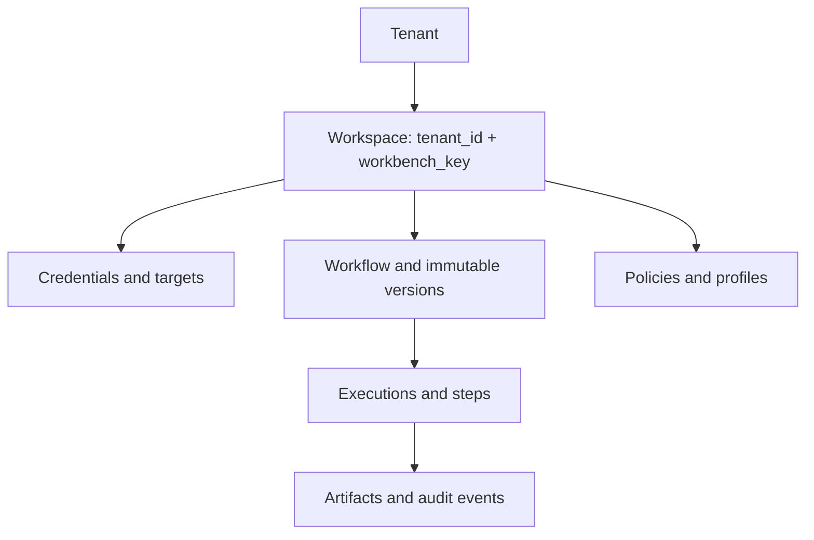

# PostgreSQL database specification

## Purpose and conventions

PostgreSQL is FlowForge's active deployed database. It is the durable source of truth for tenant/workspace isolation, canonical YAML drafts and immutable versions, credential encryption metadata, target/policy configuration, execution coordination, and audit history. Large artifacts and logs live in object storage; PostgreSQL stores their redacted metadata and immutable references.

All identifiers are UUIDs. All timestamps use `timestamptz` in UTC. Structured columns use bounded, schema-validated `jsonb`; opaque runtime output, secrets, and unrestricted JSON are not indexed. Rows use `created_at`, `updated_at`, and actor columns where applicable.

## Isolation model

`workspaces` is the operational isolation boundary. It is unique on `(tenant_id, workbench_key)`. Every mutable configuration, credential, target, profile, policy, workflow, execution, artifact, and audit row carries `workspace_id`; no client-side filter is trusted as a tenancy boundary.

All workspace-owned tables use PostgreSQL row-level security (RLS) with `FORCE ROW LEVEL SECURITY`. Request transactions set a transaction-local `app.workspace_id` only after host identity and workspace membership are validated; an unset, malformed, or cross-workspace setting matches no rows. Pool checkout resets leftover session scope and assumes the `flowforge_app` role (`NOSUPERUSER`, `NOBYPASSRLS`) so Docker/CI superuser logins cannot skip RLS. Worker service roles remain narrow and bind workspace ID in every query and queue claim. Where both records are workspace-owned, schema constraints use composite `(workspace_id, id)` foreign keys (or an equivalent trigger when PostgreSQL partitioning prevents that constraint), so a valid UUID from another workspace cannot be attached by a buggy query. RLS is defense in depth, not a substitute for those constraints.

Identity tables (`tenants`, `workspaces`, `users`, `roles`, `permissions`, `workspace_role_bindings`) are authorization substrate and are queried before scope is set. Resource tables call `app.enable_workspace_isolation(regclass)`. E2.2 installs hook tables `workspace_records` and `workspace_record_links` (`PRIMARY KEY (workspace_id, id)` plus composite parent FK) for credential, artifact, job, cache, realtime, and audit surfaces that exist today; later domain migrations must reuse the helper. After migrate, the API recreates `flowforge_app` and table grants: `pg_dump` omits cluster roles, and `--no-acl` restores drop GRANTs, so a restored database can already have `schema_migrations` without the request role.

## Identity and authorization

| Table | Key columns | Notes |
| --- | --- | --- |
| `tenants` | `id`, `slug`, `name`, `status` | Organization/host isolation root. |
| `workspaces` | `id`, `tenant_id`, `workbench_key`, `name`, `status` | Unique `(tenant_id, workbench_key)`. |
| `users` | `id`, `issuer`, `external_subject`, `display_name`, `status` | OIDC/host identity reference; unique `(issuer, external_subject)`; no provider token. |
| `roles` | `id`, `key`, `description` | Stable role vocabulary. |
| `permissions` | `id`, `key` | Examples: `workflow.execute`, `kubernetes.apply`, `ssh.run`. |
| `role_permissions` | `role_id`, `permission_id` | Role capability map. |
| `workspace_role_bindings` | `workspace_id`, `user_id`, `role_id` | Workspace-scoped RBAC. |
| `browser_sessions` | `id`, `user_id`, `token_hash`, `csrf_hash`, idle/absolute expiry, `revoked_at` | Cookie secrets stored only as SHA-256; no RLS (identity substrate). |
| `session_audit_events` | `id`, `user_id`, `session_id`, `event_type`, `outcome`, `reason`, `request_id` | Append-only, secret-free session security events. |

Host/embed identity assertions are validated before a transaction starts. The database records safe subject, host audience, tenant/workspace context, correlation ID, and permission decision in audit data; it does not persist the bearer assertion itself. Browser session cookies are hashed before persistence; audit rows never store token or CSRF values.

## Workflow authoring and versions

| Table | Key columns | Invariants |
| --- | --- | --- |
| `workflows` | `id`, `workspace_id`, `slug`, `name`, `status`, `draft_revision`, `created_by`, `updated_by` | Unique `(workspace_id, slug)`; one action remains a one-node workflow, never a separate action resource. |
| `workflow_drafts` | `workflow_id`, `normalized_yaml`, `definition_digest`, `parsed_definition`, `validation_state`, `revision` | Exactly one mutable draft per workflow; optimistic update requires current revision. |
| `workflow_versions` | `id`, `workflow_id`, `version_number`, `normalized_yaml`, `definition_digest`, `parsed_definition`, `publish_note`, `published_by`, `published_at` | Immutable after publish; unique `(workflow_id, version_number)` and `(workflow_id, definition_digest)`. |
| `workflow_version_artifacts` | `workflow_version_id`, `node_id`, `script_artifact_id` | Pins published script artifact per node. |
| `workflow_triggers` | `workspace_id`, `id`, `public_id` (`wh_`+64 hex), `workflow_id`, `workflow_version_id`, `type`, `status`, `secret_credential_id`, `content_type`, `field_mapping`, body/skew/replay/rate/concurrency limits | E10.2 (`000015_webhook_triggers.sql`). Safe metadata only; HMAC secret stays in `credentials` (`webhook_secret`). Unique `public_id`. Composite FKs to workflow, published version, and credential. FORCE RLS. |
| `webhook_replays` | `workspace_id`, `trigger_id`, `replay_id` (sha256 hex), `expires_at` | Exact signed-payload replay identifiers retained ≥ clock-skew window. |
| `webhook_rate_windows` | `workspace_id`, `scope_kind` (`trigger`/`workspace`), `scope_id`, `window_start`, `count`, `in_flight` | Per-minute rate and in-flight concurrency gates. |
| `workflow_templates` | `id`, `workspace_id` nullable, `name`, `normalized_yaml`, `digest`, `status` | Reviewed source for new drafts; never executed directly. |

`app.lookup_webhook_workspace(public_id)` is `SECURITY DEFINER` so public ingress can resolve an opaque id to a workspace before RLS-scoped reads. It returns NULL for unknown ids and never returns secrets.

`normalized_yaml` is the canonical saved document. `parsed_definition` is a validated query/execution projection, never an independently editable canvas graph. A draft save stores revision, YAML, digest, and parser/validation result atomically. Publishing copies the normalized definition into an immutable version and records exact policy/profile/artifact references.

## Credential vault and operational configuration

| Table | Key columns | Invariants |
| --- | --- | --- |
| `credentials` | `id`, `workspace_id`, `type`, `display_name`, `ciphertext`, `dek_envelope`, `key_reference`, `encryption_version`, `metadata`, `status`, `rotated_at`, `expires_at` | Ciphertext only; never plaintext after submission. |
| `credential_permissions` | `credential_id`, `principal_type`, `principal_id`, `permission` | Explicit use/rotate/manage grants. |
| `credential_events` | `id`, `credential_id`, `event_type`, `actor_id`, `details_redacted`, `occurred_at` | Rotation/test/disable audit; append only. |
| `cluster_targets` | `id`, `workspace_id`, `name`, `credential_id`, `endpoint_metadata`, `policy_id`, `status` | Cluster endpoint metadata is safe; kubeconfig remains encrypted credential payload. |
| `ssh_targets` | `id`, `workspace_id`, `name`, `credential_id`, `hostname`, `port`, `host_key_fingerprint`, `policy_id`, `status` | Key fingerprint/host policy only; no private key. |
| `command_profiles` / `command_profile_versions` | `id`, `workspace_id`, `name`, `version_number`, `parameter_schema`, `template`, `retry_safe`, `policy_id`, `status` | Published profile versions are immutable and pinned by execution. |
| `runtime_profiles` | `id`, `workspace_id` nullable, `name`, `language`, `image_digest`, `dependency_lock_digest`, `limits`, `status` | Runtime image is immutable by digest. |
| `script_artifacts` | `id`, `workspace_id`, `language`, `entrypoint`, `digest`, `signature`, `runtime_profile_id`, `runtime_profile_version_id`, `runtime_profile_digest`, `storage_ref`, `scan_status`, `status`, `package_blob`, `revoked_at`, `revoked_by`, `metadata` | Content-addressed and immutable after signing (E9.1, `000013_script_artifacts.sql`). JSON never returns `package_blob` / `storage_ref`. `revoked_at` / `revoked_by` are set by E9.4 (`000014_script_revocation.sql`); the app role may UPDATE only those columns plus secret-free `metadata`. |
| `connections` / `connection_versions` | `id`, `workspace_id`, `name`, `type`, `credential_id`, `endpoint_policy`, `version_number`, `status` | The endpoint policy has normalized host/method/path/port/TLS/redirect rules; published versions are immutable and execution pins one. |
| `recipient_lists` / `recipient_list_versions` | `id`, `workspace_id`, `name`, `version_number`, `recipient_policy`, `status` | Approved recipients/domains only; published versions are immutable and execution pins one. |
| `message_templates` / `message_template_versions` | `id`, `workspace_id`, `name`, `version_number`, `input_schema`, `content_classification`, `status` | Template inputs are schema/classification constrained; published versions are immutable and execution pins one. |
| `response_schemas` | `id`, `workspace_id`, `name`, `schema`, `max_bytes`, `status` | Schema and size limit are validated before a provider result becomes port data. |
| `policies` / `policy_versions` | `id`, `workspace_id`, `kind`, `name`, `version_number`, `policy_json`, `status` | Target/profile policy revisions are immutable once referenced. |
| `target_policy_bindings` | `target_type`, `target_id`, `policy_version_id` | Binds operational target to an exact active policy version. |

E4.2 implements those logical resources as versioned rows in `ops_resources` (`kind` discriminator), `ops_resource_drafts`, immutable `ops_resource_versions`, immutable `ops_pins` (workflow version or execution owner), and `target_policy_bindings`. Kind-specific fields live in validated `payload` jsonb; `credential_id` and `policy_resource_id` are composite-FK columns when present. `flowforge_app` has INSERT/SELECT only on versions and pins.

Credentials use envelope encryption: the database stores ciphertext, encrypted data-encryption-key envelope, KMS/key reference, and encryption version. The API sends plaintext only to the backend over TLS at create/rotate time; it is encrypted before database persistence and never returned to the UI, logs, YAML, audit detail, or analytics. Rotating a credential creates/re-encrypts a new encrypted payload and preserves redacted history. E4.1 installs these tables in `000006_credentials.sql` with FORCE RLS. The local MVP KEK is `CREDENTIAL_KEK` / `CREDENTIAL_KEK_FILE` (32-byte AES-256); `key_reference` records `CREDENTIAL_KEK_ID`. Isolation hook table `workspace_records` (`kind=credential`) is not the vault.

## Execution, queue, and artifacts

| Table | Key columns | Invariants |
| --- | --- | --- |
| `executions` | `id`, `workspace_id`, `workflow_version_id`, `workflow_digest`, `trigger_id`, `status`, `idempotency_key`, `input_redacted`, `policy_snapshot`, `correlation_id`, `requested_by`, `started_at`, `finished_at`, `retention_until` | Unique `(workspace_id, workflow_version_id, idempotency_key)` when key is non-null. |
| `execution_steps` | `id`, `execution_id`, `node_id`, `node_type`, `attempt`, `status`, `lease_id`, `fencing_token`, `idempotency_key`, `policy_snapshot`, `target_snapshot`, `input_redacted`, `output_redacted`, `error_redacted`, timestamps | Unique `(execution_id, node_id, attempt)`; never store secret/plain raw output. |
| `execution_jobs` | `id`, `execution_step_id`, `status`, `available_at`, `lease_expires_at`, `heartbeat_at`, `worker_id`, `fencing_token`, `attempt` | Durable dispatch record; at most one active claim for a step attempt. |
| `execution_artifacts` | `id`, `workspace_id`, `execution_id`, `execution_step_id`, `kind`, `filename`, `content_type`, `storage_ref`, `digest`, `size_bytes`, `content_classification`, `redacted`, `expires_at`, `metadata_ciphertext`, `dek_envelope`, `key_reference`, `encryption_version`, `legal_hold`, `legal_hold_reason`, `legal_hold_by`, `legal_hold_at` | Encrypted object-store reference (E5.3, `000010_execution_artifacts.sql`). `storage_ref` is an opaque server locator. JSON never exposes envelope or locator fields. Legal hold skips retention purge. FORCE RLS + composite FKs to executions/steps. |
| `artifact_download_grants` | `id`, `workspace_id`, `artifact_id`, `actor_id`, `expires_at` | Short-lived download grants (default 60s). FORCE RLS. Deleted with the artifact. |
| `approvals` | `id`, `workspace_id`, `workflow_id`, `workflow_version_id`, `workflow_digest`, `execution_id`, `node_id`, `operation`, target/policy version columns, `binding_fingerprint`, `approver_role`, `status`, `expires_at`, `requested_by`, `decided_by` | Approval is bound to workflow version, target revision, policy revision, operation, and expiry. Pending/approved rows are invalidated when those bindings change. Unique active fingerprint. |
| `approval_events` | `id`, `workspace_id`, `approval_id`, `event_type`, `actor_id`, `details`, `occurred_at` | Append-only, secret-free decision/invalidation audit. |
| `audit_events` | `id`, `workspace_id`, `actor_id`, `host_context_redacted`, `action`, `resource_type`, `resource_id`, `outcome`, `correlation_id`, `details_redacted`, `occurred_at` | Append-only to `flowforge_app` (SELECT/INSERT). UPDATE always fails. Non-expired DELETE fails. Expired rows are removed only via `app.purge_expired_audit_events`. |
| `operational_alerts` | `id`, `workspace_id`, `kind`, `severity`, `action`, `resource_type`, `resource_id`, `correlation_id`, `request_id`, `actor_id`, `outcome`, `code`, `details_redacted`, `acknowledged_at`, `acknowledged_by`, `occurred_at` | Actionable authorization/replay/policy/redaction signals. API returns identifiers only. Ack updates `acknowledged_*`. |

Workers claim eligible jobs with `FOR UPDATE SKIP LOCKED` (`POST /api/v1/jobs/claim`). A claim increments and returns `fencing_token` plus an HMAC job ticket bound to workspace, workflow version/digest, policy digest, and expiry. Every heartbeat, completion, and result write requires the matching active lease and token. A stale worker cannot overwrite a later worker's result. Lease expiry (E5.2, no provider verification hook yet) marks the job/step/execution `indeterminate`, not a silent retry. Cancellation is idempotent and requires `execution.cancel`. Retry creates a new `(node_id, attempt)` row only for retry-safe core nodes.

Execution input/output data is schema-limited and redacted before persistence. Large outputs, logs, and generated files are redacted/scanned before upload to encrypted object storage; an artifact that cannot be safely redacted is rejected rather than retained. `storage_ref` is an internal opaque locator, never a client-supplied URL or bucket/key. Artifact download authorization rechecks workspace and retention on **every** grant and stream request, then returns a short-lived same-origin grant (`/api/v1/artifact-downloads/{id}`); object-store credentials and durable public URLs are never returned. Retention purge deletes metadata and the encrypted object payload; a legal hold preserves both and writes `artifact.legal_hold.*` / `artifact.retention.held` audit rows. Local MVP objects live under `ARTIFACT_STORE_DIR` (or in-process memory when unset), encrypted with the vault KEK. Credential material, raw kubeconfig, SSH keys, access tokens, command lines containing secrets, and unredacted provider responses cannot be written to execution, artifact, or audit storage.

## Integrity rules

1. Every workspace-owned row must resolve to the same `workspace_id` as each referenced parent/resource.
2. Published workflow versions, command-profile versions, policy versions, script artifacts, and runtime image digests are immutable.
3. Every execution pins its workflow version/digest plus target, policy, profile, and artifact snapshots needed to reproduce authorization reasoning.
4. Credential use requires workspace scope, credential permission, and declared workflow node usage validation.
5. Steps exchange only declared redacted-safe output ports; no implicit context or secret propagation exists.
6. Soft-disable/retire credentials, targets, profiles, and policies before deletion. Block deletion while an active execution references the resource; show affected drafts/versions in the UI.
7. Database roles may not bypass RLS except a narrowly scoped migration/maintenance role. Application requests never use the owner role, `BYPASSRLS`, or an unreviewed `SECURITY DEFINER` function.

## Indexing, partitioning, and capacity

- Index all workspace foreign keys and common workspace views: `(workspace_id, updated_at DESC)` for workflows/configuration, `(workspace_id, status, started_at DESC)` for executions, and `(workspace_id, occurred_at DESC)` for audit events.
- Index `execution_steps(execution_id, node_id)`, `execution_artifacts(execution_id, execution_step_id)`, and active-job lease fields with partial indexes.
- Use GIN indexes only for bounded/queryable `parsed_definition`, label, and policy fields. Do not add blanket JSONB indexes.
- Partition high-write `audit_events` by month (`RANGE (occurred_at)` plus `app.ensure_audit_month_partition`). `executions` and `execution_steps` stay unpartitioned in E5.1 so `UNIQUE (workspace_id, workflow_version_id, idempotency_key)` and composite FKs (including `approvals`) remain valid; `retention_until` (90 days executions, 365 days audit) plus scoped purge replace monthly drops for those tables. Maintain retention jobs that delete expired artifact references and object payloads; audit retention follows a separately governed policy.
- E5.1 installs `execution_steps` and `execution_jobs` with lease/fencing columns and a partial unique active-claim index so E5.2 can add `SKIP LOCKED` without another table rewrite. Application roles may UPDATE execution status fields; version/digest/idempotency pins stay immutable. E5.4 revokes UPDATE/DELETE on `audit_events` from `flowforge_app`. The append-only trigger still rejects UPDATE and non-expired DELETE. Retention uses `app.purge_expired_audit_events` (SECURITY DEFINER) so the app role never issues DELETE.
- Use pooled connections, query timeouts, migration serialization, and measured connection/query/lock/vacuum headroom before increasing worker replicas. The initial capacity target is at least 2x observed peak for connection pool, write throughput, queue lag, and storage growth.

## Migration and validation plan

Migrations are forward-only, transaction-safe where PostgreSQL permits, and include indexes/constraints before application code relies on them. Initial migration sequence:

1. tenant/workspace/identity/RBAC and RLS helpers;
2. workflows, drafts, immutable versions, triggers, and templates;
3. credentials, target/profile/policy versioning, and artifact metadata;
4. E3.2 execution pin stubs (expanded by E5.1 `000009_executions.sql` with steps, jobs, and audit partitions);
5. E4.3 `approvals` / `approval_events` (policy-bound requirements; E10 extends wait/resume).

Validate with PostgreSQL-backed integration tests for RLS negative isolation (including unset/stale pooled-session context), cross-workspace composite-foreign-key rejection, immutable version enforcement, credential and artifact non-disclosure, idempotency uniqueness, `SKIP LOCKED` lease/fencing races, redaction, partition/retention behavior, and migration replay. Run `go test ./...`, `go run ./cmd/migrate`, and targeted PostgreSQL smoke tests before database work is complete.
