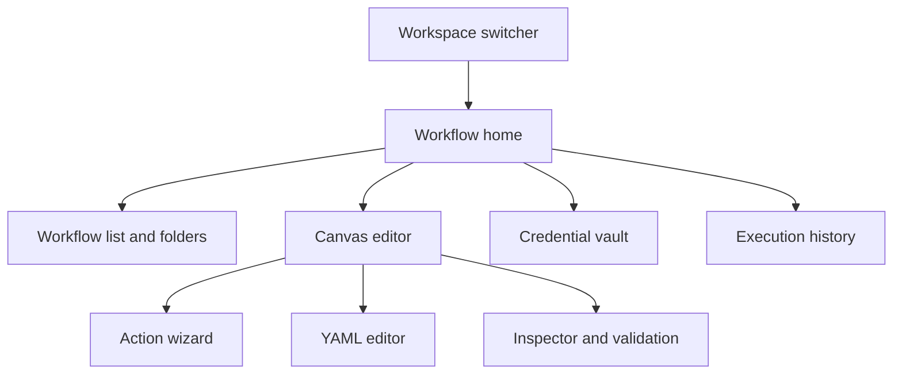

# Frontend UI

## Product principles

The FlowForge UI makes operational automation understandable before it makes it powerful. It borrows the spatial clarity of diagramming tools such as Lucidchart and Visio, but uses a more focused, modern workflow experience: clean surfaces, restrained color, direct manipulation, keyboard speed, and context-aware panels rather than a dense desktop-ribbon clone.

The canvas must stay responsive while workflow validation, credential tests, imports, publishing, or execution take longer. Show optimistic interaction feedback immediately, then clear pending/success/error state. Primary actions are visible and large enough for frequent use; advanced controls stay available through progressive disclosure.

## Information architecture



### Workspace shell

- Persistent workspace switcher with current workspace, role, and environment context.
- Left navigation: Workflows, Actions, Credentials, Executions, Templates, and Settings. Navigation only shows capabilities permitted by RBAC.
- Global search for workflows, action types, credentials by safe name/tag, execution IDs, and documentation. Never search plaintext secrets or redacted payloads.
- Command palette for keyboard-first navigation and common commands: new workflow, add action, open YAML, validate, publish, run a selected published version, and open execution.
- Notifications show background validation, credential-test completion, publish outcomes, and execution state; they do not expose secrets.

## Workflow home

Workflow home prioritizes operational work over dashboard decoration:

- Search, folders/tags, owner, trigger, environment, status, last run, and last modified filters.
- Compact list and card views; pinned/high-frequency workflows surface first.
- Create workflow, import YAML, duplicate, archive, export immutable version, and open run history.
- Draft/published state, version, validation health, and required approvals are visible without opening the editor.
- Templates provide reviewed starting points for Kubernetes rollout, SSH maintenance, Python/Go automation, and common compositions. Creating from a template always creates an editable draft in the current workspace.

## Canvas editor

The editor has one focused canvas with three coordinated areas:

1. **Action library**: searchable, categorized draggable node objects: triggers, Kubernetes, SSH, scripts, control flow, data transforms, and notifications. Each card shows its safe name, required permissions, inputs, outputs, and policy restrictions.
2. **Canvas**: pan, zoom, fit-to-workflow, snap-to-grid, minimap, multi-select, alignment/distribution, duplicate, group/ungroup, undo/redo, and keyboard shortcuts. Nodes use distinct shape/icon treatments by family plus text labels and status badges; color alone never conveys meaning.
3. **Inspector**: a contextual right panel for the selected workflow, node, edge, or execution. It shows configuration, typed ports, policy status, credentials by display name, validation, change history, and help.

Drag from a node output port to a compatible input port to create an edge. Incompatible ports are visibly unavailable and explain why on focus/hover. Edge creation opens a compact mapper when the destination accepts only a subfield. Selecting a node shows required inputs, optional defaults, upstream values, downstream consumers, and runtime policy without hiding the graph.

Canvas node states are explicit: draft, valid, warning, invalid, approval required, running, succeeded, failed, canceled, and indeterminate. Each state has an icon/text treatment in addition to color. The canvas never renders a guessed graph when YAML validation fails.

## Action wizard

The **Add action** wizard is the primary guided authoring path. It creates an action node, inserts it into the canvas, and writes the corresponding canonical YAML object.

1. **Choose type**: searchable categories and recommended actions based on selected upstream port, workspace permissions, and enabled target types.
2. **Choose target and credential**: dropdowns list only workspace-authorized Kubernetes cluster targets, SSH targets, command profiles, runtime profiles, and credential display names. Missing permissions explain the constraint; no secret value is shown.
3. **Configure**: type-specific controls with safe defaults. Kubernetes chooses target/namespace/dry-run/wait; SSH chooses target/profile/typed parameters/timeout; scripts choose language/source/entrypoint/runtime/resource limits.
4. **Connect data**: map upstream typed outputs to action inputs; show a preview of structure with sensitive fields redacted.
5. **Review**: show policy impact, required approval, retry behavior, redacted YAML preview, and validation before Add.

The wizard supports creating a single-action workflow or adding an action to a larger graph. It never creates a separate action execution model; an action is always a node in the canonical workflow YAML.

## YAML editor and round-trip

Canvas and YAML are two synchronized views of one draft:

- YAML mode offers syntax highlighting, schema-aware completion, outline/breadcrumb navigation, formatting, inline validation, line/column errors, and safe diff against the last saved or published version.
- Canvas edits update the typed draft model; Save serializes canonical YAML. YAML edits parse into that model after debounced validation.
- Save is disabled when YAML, graph, port typing, policy, or required configuration is invalid. The validation panel groups errors by workflow/node/edge and links directly to canvas nodes or YAML paths.
- The API returns normalized YAML and a digest after save. The UI replaces the local source with that response so export, visual editing, and execution all use identical semantics.
- Import validates before creating a draft. Export always names the workflow/version and returns the immutable normalized YAML.

## Credential vault

Credentials are workspace-scoped encrypted backend resources, never browser persistence or YAML fields.

- Credential types: Kubernetes target credential, SSH private key, token/API key, webhook secret, and future provider connectors.
- Add credential wizard: display name/tags, type, secret fields, target metadata, ownership, allowed use, rotation date, and optional test connection. Sensitive fields are masked, paste-safe, and cleared from UI memory after submission.
- The API encrypts values before persistence; UI receives only metadata, safe status, permitted actions, and last test/rotation timestamps. Plaintext is never returned after create/update.
- Credential details support metadata edit, permission/usage view, rotate/replace, disable, test, and audit history. Deletion requires confirmation and reports affected drafts/workflows before it proceeds.
- The workflow editor selects credentials by display name/reference; it does not expose secret values. Credential cards indicate health and policy state without revealing connection strings, keys, tokens, or provider internals.

## Execution experience

- Run a selected published version, schedule, webhook-trigger, pause/resume, cancel, and rerun options are explicit. Drafts can be validated and published but never executed directly; a test run must first create a distinct immutable test version with the same policy checks and audit trail.
- Pre-run review shows version digest, selected trigger input, target/environment, approvals, and side-effect warnings. A dry-run/plan option appears when supported by the node.
- Execution detail renders a graph replay: current node, duration, attempts, waiting/approval state, safe outputs, artifacts, correlation ID, and redacted logs.
- Compare two executions or versions to identify changed YAML objects, inputs, outcomes, and policy revisions. Secrets are always redacted.
- Failed and indeterminate nodes offer safe next actions: inspect diagnostics, retry when policy permits, open an approval, or create a follow-up workflow. They never imply that an unverified remote action did not occur.

## Collaboration, governance, and quality of life

- Draft ownership, autosave indicator, optimistic concurrency/conflict resolution, change history, comments/mentions, and approval requests.
- Version timeline with publish notes, immutable export, restore-as-new-draft, compare, and pinned release versions.
- RBAC-aware sharing; Management/read-only users can inspect permitted workflows and audits but cannot edit, run, or reveal credentials.
- Workflow linting identifies disconnected nodes, unreachable branches, missing required inputs, unsafe retry configuration, overly broad targets, and deprecated action types.
- Action templates and reusable pinned `workflow.call` nodes make common patterns discoverable without hiding the underlying YAML/version lineage.
- Empty states teach the first useful action: create a workflow, add a credential, choose a template, or import YAML.

## Accessibility and responsive behavior

- Full keyboard operation for canvas navigation, node/edge creation, selection, inspector controls, dialogs, and YAML errors.
- Visible focus, semantic labels, screen-reader node/edge summaries, live announcements for validation/execution changes, and non-color status indicators.
- Mouse/trackpad canvas interactions have keyboard equivalents; touch devices use a simplified inspector-first graph editing mode rather than tiny controls.
- Responsive layout preserves the canvas and inspector on desktop; on smaller screens, library and inspector become drawers while workflow review/run/history remain fully usable.
- Respect reduced motion and user color preferences. Motion is limited to meaningful execution/connection feedback.

## Initial implementation components

```text
frontend/src/features/workflows/
  WorkflowHome.tsx
  WorkflowCanvas.tsx
  ActionLibrary.tsx
  ActionWizard.tsx
  NodeInspector.tsx
  EdgeMapper.tsx
  YamlEditor.tsx
  ValidationPanel.tsx
  ExecutionReplay.tsx
frontend/src/features/credentials/
  CredentialVault.tsx
  CredentialWizard.tsx
  CredentialTestDialog.tsx
frontend/src/lib/workflowYaml.ts
frontend/src/lib/workflowGraph.ts
```

Use TypeScript/React with PascalCase components, camelCase hooks/utilities, Tailwind utilities, and colocated Vitest coverage. The graph adapter must round-trip the canonical `flowforge/v1` YAML without adding a persisted UI-only format.

## Required validation

- YAML import → canvas → no-edit save → export preserves normalized semantics and digest.
- Canvas-created action produces valid YAML with correct node, ports, and edge typing.
- Wizard target/credential dropdowns show only permitted metadata and never secret values.
- Invalid graphs, YAML, policies, and missing configuration have linked, accessible errors and cannot save/publish.
- Keyboard-only canvas/action-wizard/credential-vault flows work with visible focus and screen-reader labels.
- Credential create/rotate/test UI never persists plaintext in browser state, logs, URLs, snapshots, or analytics.
- Execution replay, diff, cancellation, retry, approval, and indeterminate states show correct safe actions and redaction.
