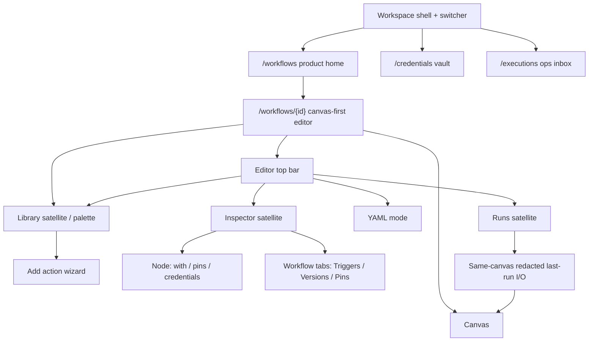

# Frontend UI

## Product principles

The FlowForge UI makes operational automation understandable before it makes it powerful. It borrows the spatial clarity of diagramming tools such as Lucidchart and Visio, but uses a more focused, modern workflow experience: clean surfaces, restrained color, direct manipulation, keyboard speed, and context-aware panels rather than a dense desktop-ribbon clone.

The canvas must stay responsive while workflow validation, credential tests, imports, publishing, or execution take longer. Show optimistic interaction feedback immediately, then clear pending/success/error state. Primary actions are visible and large enough for frequent use; advanced controls stay available through progressive disclosure.

**Not an n8n clone.** The canvas-first shell used n8n’s *interaction model* as a behavior reference only ([n8n-io/n8n](https://github.com/n8n-io/n8n)): canvas-first shell, left library, right inspector, executions drawer, credentials. FlowForge does **not** copy n8n assets, trademarks, colors, CSS, icons, or source. YAML (`flowforge/v1`) remains the only persisted definition; the canvas is a projection. Triggers stay workflow-level. Drafts never execute.

## Information architecture

Landed UX.1–UX.11 chrome (epic) plus R2.1 remembered-open library satellite, R2.2 NDV-style inspector satellite, R2.3 canvas undo/redo, R3.1 type-specific NDV parameter editors, R3.2 typed field-path mapping, R3.3 NDV validation/policy, R4.1 `/executions` inbox density, R4.2 in-editor Runs overlay operate density, R4.3 selected-node NDV redacted last-run I/O density, R5.1 `/credentials` display-name find density, R5.2 credential-detail test/rotate/usage/deletion-impact density, R5.3 selected-node NDV add-credential without leaving the graph, R6.1 editor activation chrome (D2 compose: enable + version pin; no new resource), R6.2 `/workflows` home activation column/status, R6.3 one-gesture test-run (D5: mint a published test version then start), R7.1 the same R2–R6 rewrite chrome on `/embed/v1` after `GET /session` `session.embed` (ADV-021; no second embed tree), R7.2 membership/isolation off product chrome (ADV-024 grant stays; Settings may link carefully; isolation success is a denial), R7.3 local seed Example context stays labeled and local-only (operator-admin + frontend-ui + deployment seed docs match rewrite IA; trusted-dev header fallback is never rewrite login), UXL.1 editor top-bar verb chunking (authoring / satellites / run), UXL.2 draft / published / test-run working-memory chrome, UXL.3 Doherty-safe pending chrome (pending immediately, then success or error, on save / publish / test-run / start / vault test-rotate / catalog), and UXL.4 peak-end operate endings (Start published / Test run land on the Runs overlay; success ≠ indeterminate; overlay peak-end success is focused/selected only —), UXL.5 home row scan order (activation and last run at the scan ends), UXL.6 empty states that teach the model (Create / Import YAML / reviewed template each create a **draft**; canvas **+** / Add action; vault masked wizard), UXL.7 palette category-first first paint (enabled catalog only; search still reaches any enabled type), and UXL.8 Aesthetic-Usability density pass (spacing, type, and satellite alignment consistent on standalone and `/embed/v1`; error / warning / `indeterminate` / ADV-024 denial contrast stay loud; status stays icon + text), and O.1 Overview header + search/sort/filter + card list (cards are the primary browse surface; compact folder rail remains a filter; stats / Personal / link-count skipped), and V.1 token foundation (named CSS variables; dark-first charcoal; one teal-family accent; standalone and `/embed/v1` share one token file), and V.2 shell restyle (dark charcoal product chrome; one teal accent on the active nav item; editor icon-rail; Membership / Isolation stay off chrome; same shell on `/embed/v1` after `session.embed`), and V.3 Overview home visual rebuild (dark card rows; Create; search/sort/filter; path pills), and V.4 editor chrome (dark canvas + satellite chrome; UXL grouping held; Fitts sizes held), and V.5 vault + executions restyle (dark find/detail and inbox density; display-name + UUID only; no KEK chrome; loud `indeterminate`; inbox is not a second replay graph; ADV-024 denial contrast stays loud), and V.0b Login chrome + signed-out gate (full-dark email/username + password + Sign in; complete-install 401 → Login, not wizard; embed never mounts Login), and X.1 (;) Explorer shell (folder tree + content pane + breadcrumb; Overview cards demoted from primary). This is the **current product IA** — not the pre-makeover operator stacked page (inventory), and not the rewrite end state. Successor charter: [n8n-class parity rewrite](../architecture/flowforge-rewrite-n8n-class-parity.md) ([§11.1](../architecture/flowforge-rewrite-n8n-class-parity.md#111-ui-surfaces-and-operator-migration-notes) UI fold-in; expanded tables: [rewrite-ui-surfaces.md](rewrite-ui-surfaces.md)). ADV-021/024, embed `session.embed`, grant-gated membership/isolation, and the draft-never-runs rule are unchanged. UX.12 updated this diagram and the [operator-admin](../guides/operator-admin.md) authoring walkthrough.



Authoring path: **home → editor top bar → palette → inspector → YAML mode → runs drawer.** Same editor page under `/embed/v1/workflows/{id}`.

### Workspace shell

- Persistent workspace switcher with current workspace, role, and environment context.
- Left navigation (V.2): labeled groups **Build** (Workflows, Actions, Templates, Config/targets), **Observe** (Executions, Approvals, Alerts, Audit), **Vault** (Credentials), **Settings**. Same routes; grouping is chrome only. Membership / Isolation are off product chrome (R7.2): Settings may link carefully when ADV-024 is granted; nav/search/Commands omit them otherwise. Navigation only shows capabilities permitted by RBAC from `GET /workspace`. Until E6.1, the slim operator header exposed the same destinations; E6.1 replaces that header with the product shell.
- On `/workflows/{id}` the nav **collapses** to an icon-rail (or overlay on compact / when expanded) so the canvas can take the viewport. List surfaces keep the full rail. Marks are original abbreviations — not cloned icons.
- Global search for workflows, action types, credentials by safe name/tag, execution IDs, and documentation. Never search plaintext secrets or redacted payloads.
- Command palette (Ctrl+Shift+K, or the Commands button) for keyboard-first navigation and common commands: new workflow, import YAML, open YAML/editor, validate, publish, run a selected published version, and open execution / vault / config / approvals / alerts. On the editor, Commands bind to the **route** workflow id.
- Notifications show safe validation, publish, and execution status; they do not expose secrets.
- **Visual tokens (V.1):** one token file (`apps/web/src/app/tokens.css`) shared by standalone and `/embed/v1`. Dark-first charcoal canvas, lifted surface, text, muted, **one** teal-family accent (`#0f766e`), danger/denial distinct from the accent, and focus ring. Type scale + 4px space + 8–12px radius are documented and applied on the shell root (`.ff-shell`). Skip link, `:focus-visible`, and contrast hold on dark cards. shadcn-friendly aliases map to FlowForge tokens — not default zinc/orange. No second theme tree. Light theme is not required. Isolation success stays a denial.
- **Shell restyle (V.2):** dark charcoal canvas/surface on every product route using V.1 tokens. Active nav item uses the one teal accent. Editor still collapses to an original icon-rail. Membership / Isolation stay off product chrome. `/embed/v1` uses the same shell after `session.embed`; missing bind is still an ADV-021 alert. Host query stays display-only. No second theme tree. No n8n orange.
- **Overview home (V.3):** dark card rows on V.1 tokens. Header + Create; search/sort/filter; path pills; published / activation / last-run at the scan ends; kebab. Compact Finder rail stays filter-only / non-recursive. Unfiled has no pills. No stats, Personal, link-count, Miller columns, or n8n Overview tabs. Empty states stay UXL.6 / O.3 card chrome teaching, presented on Explorer pane chrome (X.4). Move still `PATCH folderId` only. Same `WorkflowHome` on `/embed/v1/workflows` (O.4). Not an n8n clone.
- **Explorer shell (X.1):** `/workflows` default chrome is Windows Explorer-style: left folder tree (disclosure + folder icons; Unfiled virtual) + right content pane for the **selected folder only** (non-recursive `?folderId=`) + breadcrumb from ancestry. Overview card list fields remain on dense content-pane rows (O.1) but cards are demoted from the primary layout. Compact Finder rail / path pills stay (O.2). Empty states stay UXL.6 / O.3 card chrome teaching on Explorer pane chrome (X.4). Move still `PATCH folderId` only. Same `WorkflowHome` on `/embed/v1/workflows` after `session.embed`. No Miller columns. Not Finder-primary. Not an n8n clone.
- **Explorer context menus (X.2):** grant-gated right-click on folder (tree or content-pane folder row), workflow row, and empty pane. Folder: New folder / Rename / Delete (disabled if non-empty) / Expand. Workflow: Open / Move… (Rename / Delete omitted — no existing workflow mutate client). Empty pane: New folder / Create workflow / Import YAML. Viewers get Open / Expand / select only. Unfiled is not destructively mutable. Existing F/O verbs only. Paste deferred. No Miller / Tags / Favorites.
- **Explorer select/open (X.3):** dense content-pane rows (name, published/activation, last-run as scan ends — no stats/Personal/link-count). Single-click selects a folder-child or workflow row without navigating. Double-click / Enter opens: workflow → editor; folder → expand/select in the tree and content pane. Selected-row highlight uses V.1 teal accent on charcoal. Right-click selects the target so X.2 menus stay. Arrow keys move the highlight when the list is focused. Multi-select deferred. Same `WorkflowHome` on embed (X.5).
- **Explorer empty / Unfiled teaching (X.4):** empty folder and empty Unfiled differ on Explorer chrome. A real folder teaches create here / move (delete only when empty — refuse-if-nonempty). Unfiled stays virtual and never looks deletable or renamable. Drafts-do-not-run chrome stays loud on empty/home create surfaces. X.2 empty-pane context menu (New folder / Create / Import) stays. F.5 / O.3 teaching verbs carry forward; Overview card chrome (O.3) remains the teaching contract. Same `WorkflowHome` (X.5).
- **Explorer embed parity (X.5):** `/embed/v1/workflows` shows the same Explorer chrome as standalone after `session.embed` — tree + content pane + breadcrumb, grant-gated right-click menus, dense select/open, empty / Unfiled teaching. Viewers select/open only; mutate chrome is grant-gated. Unfiled stays virtual. Missing `session.embed` is still an ADV-021 alert. Host query is display-only. Wizard / Login / Change-password never mount on embed. Same shared `WorkflowHome` — no second tree. Tree comes from the API, not `localStorage`.
- **Explorer home copy (X.6):** `/workflows` (and `/embed/v1/workflows` after `session.embed`) shows short operator help only. Epic/story product-commentary (X.1–X.5 / O.* / V.* / sprint notes) stays in this doc and GitHub — not in-page. Explorer chrome, empty/Unfiled teaching, hard lines, ADV embed gates, and V.1 tokens stay. Same shared `WorkflowHome`.
- **Explorer inline rename (X.7):** **New folder** creates via the existing F.3 API, selects the new row, and names it **inline** in the tree (F2 / type-to-name / Enter commit / Esc keeps the server name). Rename from the folder menu uses the same in-place field — no modal / `window.prompt`. Unfiled stays virtual. Refuse-if-nonempty delete held. Interaction only; do not invent a new visual look. Same `WorkflowHome` on embed.
- **Explorer folder chrome (X.8):** left folder nav tree matches the locked Win11 dark Explorer TAKE — compact rows, yellow folder icons, thin white ▸/▾ chevrons, gray selected fill + thin light border on the whole row, dark pane + white labels, indent ≈ one icon width per depth. No visible New folder / Rename folder / Delete folder buttons on the rail; those verbs stay grant-gated right-click (X.2). Tokens live in V.1. SKIP This PC / Disk / Network / status bar / New-Cut toolbar. Keep inline rename, X.2 menus, Unfiled virtual, embed parity. Same `WorkflowHome`.
- **Editor chrome (V.4):** dark canvas + satellite chrome (palette / Inspector / Runs) on V.1 tokens and the V.2 shell. UXL.1–UXL.4 / UXL.7 grouping and working memory stay. Invalid YAML still does not guess a graph. Drafts still never run. One overlay. Loud `indeterminate`. Save / Publish / Test run / canvas **+** stay full-size. Selection uses one accent ring. Nodes: family shape + icon + label; clear ports. Not an n8n NDV clone. Same chrome on `/embed/v1/workflows/{id}`.
- **Vault + executions (V.5):** dark find/detail and inbox density on V.1 tokens. Vault identity is display-name + UUID only. No KEK chrome. Inbox is not a second replay graph. One replay path: `/executions/{id}` / Open execution. `indeterminate` stays loud (icon + text + explanation). Drafts never run. ADV-024 isolation success stays a denial — contrast is not quieter. Not an n8n clone.
- **Settings + first-run wizard (V.6):** same V.1 tokens as the product (dark charcoal + one teal accent). Wizard never on `/embed/v1`. B.2–B.5 order unchanged. Skip stays loud HTTP-until-Settings. No remount after complete. No PEM / KEK / password in chrome or `localStorage`. Settings `#bootstrap` / `#tls` / handoff match shell tokens; `steps.tls.mode=skipped` stays clear.
- **Status + embed visual gate (V.7):** icon+text on every status. Success ≠ indeterminate. ADV-024 denial contrast holds. Standalone and `/embed/v1` match (spacing, type, cards, satellites) on the same V.1 tokens and shared `StatusMark` — no second tree and no forked embed chrome. Catalog 403 / missing `session.embed` still fail closed. Loud `indeterminate`, waiting→decide, and peak-end focused success stay as behavior.
- **Login (V.0b):** standalone product door is full-dark local Login (email/username + masked password + one accent **Sign in**). Signed-out standalone routes show Login. B.1 stays: incomplete → wizard only. Complete-install `401` → Login, **not** wizard. After success → `/workflows` (Overview) **unless** `session.must_change_password` (first-run one-time `admin` / `admin`) — then only the change-password screen until `POST /api/v1/session/password`. Workspace switcher is unchanged. Embed never mounts Login; missing `session.embed` is still the ADV-021 alert and host query stays display-only. Password POSTs once to `POST /api/v1/login` and is cleared from form state. Never persist password / hash / PEM / KEK in chrome, query, or `localStorage`. No SSO / OIDC buttons on first ship. Example-context / Establish session / trusted-dev stay off this door (Settings / membership debug only).
- **Change-password:** standalone `/change-password` + must-change gate on V.1 / V.0b tokens. New + confirm (masked) + one accent **Change password**. No Skip / Cancel. Client rejects empty, mismatch, and one-time `admin` reuse before `POST /api/v1/session/password`. Success clears the flag and lands `/workflows`. Product chrome is unreachable while the flag is true. Incomplete install still hits the wizard first. Embed never mounts this door.
- **Route boundaries (G.0.4):** root `global-error.tsx` and segment `error.tsx` with **Try again** plus a digest. `loading.tsx` and `not-found.tsx` on primary App Router segments (home plus workflows, executions, credentials, approvals, alerts, config, actions, templates, settings, audit, membership, isolation). V.1 tokens only — no second theme tree. Same files serve `/embed/v1` via rewrite; missing `session.embed` is still an ADV-021 alert. Login / wizard / Change-password never mount on embed.

### Product surfaces

Folded from the pre-makeover inventory. Routes and keep/reshape that **landed**; do not treat the old stacked-operator snapshot as current.

| Surface | Routes / chrome | Landed behavior |
| --- | --- | --- |
| Login | `/login` + signed-out standalone gate | V.0b / Full-dark charcoal + one teal accent. Email/username + masked password + **Sign in**. `POST /api/v1/login` `{identifier, password}` mints `ff_session` / `ff_csrf`. First-run one-time may set `session.must_change_password`. Password POSTs once and is cleared. Complete-install `401` → this screen, not the wizard. Incomplete → wizard only. After success → `/workflows` unless that flag is set. Never on `/embed/v1`. No SSO / OIDC / Example-context / Establish session as the product door. |
| Change-password | `/change-password` + must-change standalone gate | chrome (API on `main` via). Full-dark V.1 / V.0b tokens. New password + confirm (masked) + one accent **Change password**. No Skip / Cancel. Client rejects empty, mismatch, and obvious one-time reuse before `POST /api/v1/session/password` (CSRF). Success clears `must_change_password` and lands `/workflows`. While the flag is true, product routes (Overview, shell nav, editor, vault, executions, Settings) fail closed back to this screen. Incomplete install still shows the wizard first. Embed / `POST /embed/exchange` / ADV-021 never mounts this door. Trusted-dev stays a separate identity. Password POSTs once and is cleared. |
| Product home | `/workflows` | Operational list. `/` with `workflow.view` lands here. Default chrome is an Explorer shell (X.1): folder tree + selected-folder content pane + ancestry breadcrumb. Grant-gated right-click menus (X.2) use existing F/O verbs only. Dense rows use single-click select and double-click / Enter open (X.3): workflow → editor; folder child → expand/select in the tree and pane. Right-click selects the target. Empty folder / empty Unfiled teaching sits on Explorer chrome (X.4); Unfiled stays virtual. Overview cards are demoted from primary. Left rail is Unfiled + the workspace folder tree (F.2). Editors create / rename / delete folders from grant-gated right-click on that rail (F.3 X.2 X.8) — not as visible tree buttons. New folder creates then inline-renames in the tree (X.7). Folder tree chrome matches Windows Explorer nav (X.8): compact rows, yellow folders, thin white chevrons, gray selected fill + thin light border. Editors move a workflow by dragging a row onto a folder or Unfiled, or via row-menu **Move…** (F.4); both call `PATCH /api/v1/workflows/{id}/folder` `{folderId}` (`null` = Unfiled). Move does not change YAML, draft revision, or activation. Viewers cannot drop or see Move. Scan ends are **activation** and **last run** (UXL.5 waiting / `indeterminate` when already joined). First-class **Activation** column/status (R6.2) composes published-version trigger enable + version pin; drafts never look live. Empty home teaches Create, Import YAML, or a reviewed template — each creates a **draft**; copy says drafts do not run (UXL.6). Empty home may also offer **New folder**. Empty folder is create here / move / delete (delete only when no workflows and no child folders). Unfiled-empty points at the tree or empty-home verbs. Unfiled is always in the rail and is not a persisted folder (F.5). Empty home / empty folder / Unfiled-empty use Overview card chrome (O.3). Default search is **across folders** by name/slug and shows folder path; optional **in this folder**. Across-folder hits join draft / last-run / activation extras for the current name/slug hits only; a failed unfiltered list keeps scoped rows; a failed folder list clears rail readiness and keeps the intended `?folder=` selection. The rail can filter folder names; Unfiled stays visible (F.6). Cold load / refresh / paste of `?folder=<uuid>` keeps that folder selected and lists `GET /workflows?folderId=<uuid>`. `/embed/v1/workflows` shows the same rail + list + empty states + move after `session.embed` (F.7) and the same Overview cards + compact Finder rail (O.4). The same Explorer chrome (tree + pane + breadcrumb, grant-gated menus, dense select/open, empty / Unfiled teaching) mounts after `session.embed` (X.5). Missing `session.embed` is still an ADV-021 alert. Host `?tenant=` / `?workbench=` stay display-only. Viewers are select-only — no create / rename / delete / move without `workflow.edit`. The tree is the API, not `localStorage`. Overview card list is the primary browse surface (O.1): header + Create CTA, search/sort/filter row, cards (name, last updated/created, published badge, kebab). Cards show folder path pills from `GET /workflow-folders` ancestry (O.2). Unfiled has no path pills. Compact Finder rail uses disclosure + folder icons and stays a non-recursive `?folderId=` filter — not Miller columns. Stats / Personal / link-count skipped. Health / OpenAPI live under Settings. |
| Canvas editor | `/workflows/{id}` · same page `/embed/v1/workflows/{id}` | Viewport canvas + sticky top bar. Dark canvas + satellite chrome on V.1 tokens (V.4). Undo/redo for graph edits (R2.3). Top bar states **Editing a draft** and which **published** version is active (or `not active`) (UXL.2 R6.1). Save draft, Publish, Test run, and Start published show **pending immediately**, then success or error (UXL.3). After Start published or Test run the editor ends on the **Runs overlay** for that run (UXL.4), not only a toast. Canvas stays interactive while those requests run. Empty canvas **+** / Add action is the add path (UXL.6); does not send operators to `/actions` to place a node; does not place triggers on the canvas. Spacing, type, and satellite alignment match `/embed/v1` (UXL.8). Drafts never look live. Not a second studio app. |
| Library / palette | Left drawer, remembered-open satellite | Opening `/workflows/{id}` (and embed) shows the enabled catalog or a persistent **Library** rail — not hide-by-default only. First paint is **categories** (control flow, data, Kubernetes, SSH, scripts, HTTP/notifications) as enabled by the live catalog (UXL.7). Search still reaches any enabled type. Recommended-from-upstream-port uses catalog port types / `allowedWith` only; missing catalog fails closed with no invented types. Triggers stay excluded. Disabled / next / provider types stay hidden. **Library** or canvas **+** opens the drawer; Hide remembers closed. Catalog load shows **pending immediately**, then success or a fail-closed error (UXL.3). 403 / empty still fail closed. **Add action** opens the wizard. Drag still inserts defaults. `/actions` is the catalog reference, not a third app. Remembered-open satellite (R2.1) is unchanged. Rail / header spacing aligns with Inspector and Runs (UXL.8). |
| Inspector | Right rail, remembered-open satellite | Selected **node** focuses a conversation shell: parameters / `with` / typed field-path mapping / pins / credential display names (add vault credential without leaving) / redacted last-run step I/O at operate density when a run is in context (overlay or latest; R4.3 failures jump to the node). Last-run success is explicit and distinct from `indeterminate` (UXL.4). Hide remembers closed; an **Inspector** satellite stays on the canvas. Rail / header spacing aligns with Library and Runs (UXL.8). **Workflow**: tabs Triggers / Versions / Pins. Triggers tab leads with **Editing a draft** plus which **published** version is active (or `not active`) (UXL.2 R6.1 D2 compose of existing enable + version pin). **Edge**: port compatibility and field-path mapping. No SecretField. No expression language. |
| YAML mode | Drawer under the canvas, hidden on first paint | Validate / Normalize here (or Commands). Starter/invalid fixtures are Developer samples or Settings → Developer. Import stays on home. |
| Runs overlay | Remembered-open satellite (R4.2) | Scoped to the open workflow. Status chips + skip-to-failed / skip-to-indeterminate. Choosing a run overlays step status on the **same** canvas and shows redacted last-run I/O in the inspector. Start published / Test run end here for that run (UXL.4). Success is explicit and distinct from loud `indeterminate`. Loud peak-end success is only on the focused/selected operate ending (or the just-finished run); other succeeded rows stay quiet success badges. Waiting → decide and cancel / retry / stop stay on this path. Closed stays a **Runs** rail — not hide-by-default only. |
| Credential vault | `/credentials`, `/new`, `/{id}` | Dark find/detail on V.1 tokens (V.5). Workbench find (R5.1): display-name search + type/status/tag filters, useful columns, open-to-detail. Empty vault adds via the masked wizard; selectors stay display-name + UUID; no sample secrets (UXL.6). Detail operate (R5.2): test / rotate / usage / deletion-impact on existing vault routes; disable/enable stay clear; rotate returns display-name + UUID only. Test and rotate show **pending immediately**, then success or error (UXL.3). Selected-node NDV add (R5.3): guided masked wizard without abandoning the graph (return-to-editor); picker selects the new display name; YAML stores UUID only. R5 security line: no KEK in the browser; display-name + UUID only; secrets never in YAML / search / analytics; unexpected plaintext is a contract bug (strip + stop). No KEK / secret chrome (UXL.8). Dedicated routes remain. Wizard stays add; NDV stays edit/pick. |
| Executions inbox | `/executions`, `/executions/{id}` | Dark inbox density on V.1 tokens (V.5). Workspace operate inbox (R4.1): status + workflow filters on existing `GET /executions` params, useful columns, open-to-detail. Full replay stays on `/{id}`. **Open execution** is the deep-link from the editor, not a second studio. Not a second replay graph (UXL.4). `indeterminate` stays icon + text + explanation; success is distinct; waiting → decide stays on the row. |
| Membership / Isolation | `/membership`, `/isolation` | R7.2: off product chrome. ADV-024 grant only. Settings may link carefully. Isolation success is a denial — never a “pass”; denial contrast stays loud (UXL.8). Meaning of the grant is unchanged. R7.3: labeled **Example context** stays local-only (`https://idp.example` / `admin-1` / `local` / `default`). Trusted-dev header fallback is never rewrite login. |
| Embed / Portal | `/embed/v1/…`, `/portal/workflows` | R7.1: R2–R6 rewrite chrome mounts on the existing `/embed/v1` rewrite after `GET /session` `session.embed` (ADV-021). Same pages as standalone — Commands + Search remap hrefs once chrome is open. Spacing, type, and satellite alignment match standalone (UXL.8). No second embed tree. CHIPS, host-issuer bind, and ADV-024 grant gating unchanged. Host `?tenant=` / `?workbench=` is never authorization. Missing `session.embed` stays a visible **alert** (UXL.3). Host query stays display-only — no optimistic workspace switch. `/embed/v1/workflows` is the same `WorkflowHome` rail + list + empty states + move after `session.embed` (F.7) and the same Explorer chrome after `session.embed` (X.5). Embed without `workflow.edit` cannot mutate folders — viewers are select-only. CHIPS / Portal iframe: folder tree comes from `GET /workflow-folders`, not `localStorage`. No second tree. |
| First-run wizard | standalone shell gate · Settings `#bootstrap` | Dark charcoal + one teal accent on V.1 tokens (V.6). B.6 / B.7 / B.8 / `GET /api/control-plane/bootstrap` from standalone only. `incomplete` → wizard (persistence → first admin → public URL → TLS, fail-closed). Non-prod path-2 chrome may pre-fill issuer `http://localhost`, subject `admin-1`, and public URL `http://localhost` (editable; production stays blank). Persistence is unchanged. Wizard still does not collect or echo a password (one-time Login seed stays orthogonal). TLS offers Create / Upload / **Skip for now** (loud HTTP-until-Settings; `{action:"skip"}` only). Create / Upload re-POSTs `https://localhost` while incomplete when the URL is still HTTP localhost, plus a loud toast held until readable; Skip does not rewrite; non-localhost URLs are never clobbered. `complete` or GET `401` → `/workflows`. A mutation `401` while incomplete expires stale `ff_*` at the Next proxy (no logout CSRF) and retries once — it does not skip the wizard. After local Login, path-2 still has a selectable `local` / `default` workbench from B.3 create-or-bind. Never on `/embed/v1`. After complete, Settings `#bootstrap` / `#tls` / handoff match shell tokens (including `tls.mode=skipped`) and links out (users → `/membership`); the wizard does not remount. No browser-held secrets. |

**Keep (do not n8n-clone):** YAML as source of truth (no persisted canvas format); invalid YAML never guesses a graph; triggers stay workflow-level; drafts never execute; vault never returns plaintext; RBAC fail-closed nav; approval resume is `POST /approvals/{id}/decide`; embed/Portal/CHIPS contracts.

## Workflow home

`/workflows` is the **product home** (UX.8). `/` with `workflow.view` replaces to this list. The editor is never a second home. Health and OpenAPI live under Settings.

Workflow home prioritizes operational work over dashboard decoration:

- Explorer shell (X.1): left folder tree + right content pane + breadcrumb. Selecting a tree row filters the content pane to that folder only (non-recursive `?folderId=`). Unfiled is virtual. Breadcrumb is ancestry (Unfiled is a virtual label only). Overview card list is demoted from the primary home layout; dense content-pane rows are the default. Create / rename / delete / move stay on the existing rail and row verbs.
- Explorer context menus (X.2): right-click folder / workflow / empty pane. Grant-gated existing F/O verbs only (`PATCH folderId`, refuse-if-nonempty). Viewers are Open / select only. Unfiled cannot be renamed or deleted. Paste is deferred.
- Explorer select/open (X.3): dense list rows; single-click selects; double-click / Enter opens a workflow in the editor or navigates into a folder. Selected-row highlight uses V.1 teal / charcoal. Right-click selects the target. Multi-select deferred.
- Explorer empty / Unfiled teaching (X.4): empty folder teaches create/move (delete only when empty); empty Unfiled stays virtual and never looks deletable or renamable. Drafts-do-not-run chrome stays loud on empty/home create surfaces. X.2 empty-pane menu stays.
- Explorer embed parity (X.5): `/embed/v1/workflows` shows the same Explorer chrome after `session.embed` (tree + pane + breadcrumb, grant-gated menus, dense select/open, empty / Unfiled teaching). Viewers select/open only. Cold missing `session.embed` is ADV-021. Wizard / Login / Change-password never mount on embed. Same `WorkflowHome` — no second tree.
- Explorer home copy (X.6): visible `/workflows` help is short operator copy. Product-commentary / keep-open notes stay in docs and GitHub, not on the page. Empty/Unfiled teaching stays. Same `WorkflowHome` on embed.
- Explorer inline rename (X.7): New folder creates then inline-renames in the tree. F2 / Rename edit in place. Enter commits the existing name PATCH. Escape keeps the server name. No modal prompt. Unfiled cannot be renamed. Interaction only — no new visual density. Same `WorkflowHome`.
- Explorer folder chrome (X.8): nav tree is compact Win11 Explorer — yellow folders, thin white chevrons, gray selected row + thin light border, one-icon indent. No visible New / Rename / Delete buttons on the rail; organize verbs stay grant-gated right-click. V.1 tokens only. Unfiled stays virtual. Same `WorkflowHome`.
- Left folder rail (F.2): Unfiled + workspace tree from `GET /workflow-folders`. Selecting a row filters the main list with `GET /workflows?folderId=` for **that folder only** — not descendants; `?folderId=` is not a tree walk of children. `?folder=` is the deep link and is honored on cold load / refresh / paste. Workspace / tenant+workbench change drops previous-workspace folder state after the folder list loads. Editors get New folder / Rename folder / Delete folder from grant-gated right-click on the rail (F.3 X.2 X.8) — not as visible tree buttons; viewers do not. Name rules and sibling uniqueness errors are visible. Empty delete returns to the parent or Unfiled; non-empty delete is disabled or surfaces `409` with counts. Editors drag a workflow onto a folder or Unfiled, or use row-menu **Move…** (keyboard) (F.4). Both call `PATCH /api/v1/workflows/{id}/folder` `{folderId}` (`null` = Unfiled). Move does not change YAML, draft revision, or activation. Viewers cannot drop or see Move. Default search is **across folders** by name/slug on the unfiltered list (omit `folderId`; no invented `q`) — a **separate mode** from selected-folder listing; results show folder path and join the same draft / last-run / activation extras as the selected-folder list for the current name/slug hits only (not every workspace row on each folder visit). A failed unfiltered `GET /workflows` keeps the selected-folder rows (does not replace them with `[]`). A failed `GET /workflow-folders` clears rail readiness and keeps the intended `?folder=` selection — it does not resolve a stale cache or empty tree as Unfiled. Optional **in this folder** is still this folder only, not children. The rail can filter folder names; Unfiled stays visible (F.6). `/embed/v1/workflows` shows that same rail + list + empty states + move after `session.embed` (F.7) and the same Explorer chrome after `session.embed` (X.5). Missing `session.embed` is still an ADV-021 alert. Host query is display-only. Viewers are select-only — no create / rename / delete / move without `workflow.edit`. The tree is the API, not `localStorage`. Overview card list is the primary browse surface (O.1). Cards show folder path pills from `GET /workflow-folders` ancestry (O.2); Unfiled has no pills. Compact Finder rail is disclosure + folder icons and stays filter-only / non-recursive. Tags, owner, trigger, environment, status, activation, last run, and last modified stay client-side. No secret search. No marketplace. Commands do not file via `/actions`.
- Overview **card list** is the primary browse surface (O.1): header + Create CTA, search/sort/filter row, cards (name, last updated/created, published badge, kebab) from existing list fields only. Dark card rows use V.1 tokens (V.3). Cards show folder **path pills** joined from `GET /workflow-folders` ancestry (root → parent → folder) (O.2). Unfiled has no path pills and is not a persisted folder. Compact Finder rail uses disclosure + folder icons and stays a non-recursive `?folderId=` filter — not Miller columns, not primary browse. Stats strip, Personal badge, and link-count are skipped. Scan ends still prioritize **activation** and **last run** (UXL.5 waiting / `indeterminate` when already joined).
- Create workflow, import YAML, duplicate, archive, export immutable version, and open run history.
- Draft/published state, **activation** (published version active for webhook/schedule), version, validation health, and required approvals are visible without opening the editor or three drawers.
- Empty home (UXL.6): Create, Import YAML, or pick a reviewed template — each creates a **draft**. Copy says drafts do not run. Optional **New folder**. No starter/invalid YAML as primary buttons. Developer samples stay under Settings. Empty folder (F.5): create here / move / delete only when there are no workflows and no child folders (refuse-if-nonempty stays). Unfiled-empty points at the tree or empty-home verbs. Unfiled is always in the rail and is not a persisted folder. Empty home / empty folder / Unfiled-empty carry F.5 / O.3 teaching onto Explorer chrome (X.4). Overview card chrome remains the teaching contract, not dense-list empty chrome (O.3).
- Templates provide reviewed starting points for Kubernetes rollout, SSH maintenance, Python/Go automation, and common compositions. Creating from a template always creates an editable draft in the current workspace, then opens `/workflows/{id}`. Drafts do not run.
- Row actions: Open editor, **Test run** (copy names “publish a test version, then start it”; when the role can publish and execute — mints a published test version from the last saved draft, then starts it), Start published (when a published version exists; otherwise explains it needs a published version), Webhooks / Schedules when the role can see those triggers, Last run. Activation status uses the same wording as the editor (`published vN is active` / `not active` / `Draft — not live`) and opens `/workflows/{id}#activation`. Home query drawers (`?start=`, `?webhooks=`, `?schedules=`) still work; they are not the activation lesson or the test-run path. Filters do not grow a fourth activation drawer.

## Canvas editor

The editor is **canvas-first** (UX.1–UX.11). The graph takes the viewport. The left library and right inspector are satellites. The top bar carries workflow context and save / publish / start-published. YAML is a mode, not a permanent stack under the graph. Dark canvas + satellite chrome uses V.1 tokens (V.4). This is **not** the pre-makeover stacked operator page.

**Editor top bar** (sticky): identity / unsaved state leads; authoring (Save draft, Publish), satellites (Library, Inspector, YAML, Runs), and run (Start published, **Test run**) read as three groups (UXL.1). Persistent working-memory chrome (UXL.2) states **Editing a draft**; which **published** version is active (or `not active`); and **Test run: publish a test version, then start it.** Save draft, Publish, Test run, and Start published show **pending immediately**, then success or error (UXL.3). The canvas stays interactive while those requests run. Fail-closed waits stay visible: invalid YAML does not paint a guessed graph; catalog 403 / empty fail closed. No invented progress that claims a run succeeded when status is `indeterminate`. After Start published or Test run, the editor ends on the **Runs overlay** for that run (UXL.4), not only a toast. Unsaved: Test run and Start published stay disabled or explain they need the last **saved** draft / a published version. Add action, Undo (Ctrl+Z), Redo (Ctrl+Shift+Z), Activation, and optional publish note stay available. Save and Publish stay large, labeled, and visible — not overflow-only. Start published + Test run trail. Publish is last **saved** draft only. Start lists **published** versions only. **Test run** (R6.3) is one gesture: mint a published test version from the last saved draft, then start that `workflowVersionId`. Never the unsaved/draft buffer. No silent test of the open editor YAML. Drafts never run. Same grouping on `/embed/v1` after `session.embed`.

1. **Action library** (remembered-open drawer + persistent satellite): category-first first paint of the enabled catalog — control flow, data, Kubernetes, SSH, scripts, and HTTP/notifications as enabled (UXL.7). Search still reaches any enabled type. Triggers stay **workflow-level**; they are not canvas nodes. Disabled / next / provider types stay hidden. Each card shows its safe name, required permissions, inputs, outputs, and policy restrictions. First paint opens the palette unless the operator hid it (remembered). A **Library** satellite stays on the canvas when the drawer is closed. **Library** or canvas **+** opens the drawer; **Add action** opens the wizard. Empty canvas (UXL.6): **+** / Add action is the add path. Does not send operators to `/actions` to place a node. Does not place triggers on the canvas.
2. **Canvas**: pan, zoom, select, drag nodes, output→input connect, library drag-drop (defaults). Undo/redo covers graph edits (node move/add/remove/connect) before save — **Undo (Ctrl+Z)** / **Redo (Ctrl+Shift+Z)** (R2.3). Multi-select, fit-to-view, and snap-to-grid land on the current canvas (R2.4): Shift+click or Shift+drag, **Ctrl+A**, **Fit (F)**, **Snap (G)** to the 16px grid. Delete removes the selection. Optional non-authoritative `metadata.ui.layout` round-trips with draft save/load (R2.5): read `summary.ui.layout` or YAML `metadata.ui.layout` on canvas load; write `{version: 1, nodes: {<id>: {x, y}}}` on Save (normalize → PUT). Missing/invalid layout is auto-layout. Extra node keys are ignored; missing keys auto-place. The canvas never invents a graph from layout. Nodes use distinct shape/icon treatments by family plus text labels and status badges; color alone never conveys meaning. Minimap and alignment remain aspirational. Invalid YAML still never guesses a graph. Embed + standalone share this behavior.
3. **Inspector** (remembered-open drawer + persistent satellite): selected **node** focuses a conversation shell — type-specific parameters / `with` (core / Kubernetes / SSH / script / HTTP; not a bare JSON blob) / typed field-path mapping between ports (`allowedWith` / catalog port types; R3.2) / pins / credential display names (pick or add a vault credential without leaving; secret entry stays in the masked wizard) / redacted last-run step I/O at operate density when a run is in context (overlay selection or latest published run; R4.3 failures jump to the node). First paint opens the rail unless the operator hid it (remembered). An **Inspector** satellite stays on the canvas when the drawer is closed. Selected **workflow** shows tabs **Triggers / Versions / Pins**. Selected **edge** explains port compatibility and field-path mapping; incompatible mappings are blocked or explained. Validation groups errors and links to a node or YAML path. No expression language.
4. **YAML mode** (drawer, hidden on first paint): see [YAML editor and round-trip](#yaml-editor-and-round-trip).
5. **Runs overlay** (remembered-open satellite, R4.2): scoped to the open workflow. Status chips and skip-to-failed / skip-to-indeterminate stay on the graph. Choosing a run overlays step status on the **same** canvas; the inspector shows redacted last-run I/O. Start published / Test run end on this overlay for that run (UXL.4). Success is explicit and distinct from `indeterminate`. Loud peak-end success is only on the focused/selected operate ending. Closed stays a **Runs** rail. `/executions` remains the workspace inbox.

Drag from a node output port to a compatible input port to create an edge. Incompatible ports are visibly unavailable and explain why on focus/hover. Edge creation opens a compact mapper when the destination accepts only a subfield. Selecting a node shows required inputs, optional defaults, upstream values, downstream consumers, and runtime policy without hiding the graph.

Canvas node states are explicit: draft, valid, warning, invalid, approval required, running, succeeded, failed, canceled, and indeterminate. Each state has an icon/text treatment in addition to color. The canvas never renders a guessed graph when YAML validation fails.

## Action wizard

The **Add action** wizard is the primary guided authoring path. It creates an action node, inserts it into the canvas, and writes the corresponding canonical YAML object.

1. **Choose type**: category-first first paint (control flow, data, Kubernetes, SSH, scripts, HTTP/notifications as enabled). Search still reaches any enabled type. Recommended-from-upstream-port uses catalog port types / `allowedWith` only; missing catalog fails closed with no invented types (UXL.7).
2. **Choose target and credential**: dropdowns list only workspace-authorized Kubernetes cluster targets, SSH targets, command profiles, runtime profiles, and credential display names. Missing permissions explain the constraint; no secret value is shown.
3. **Configure**: type-specific controls with safe defaults. Kubernetes chooses target/namespace/dry-run/wait; SSH chooses target/profile/typed parameters/timeout; scripts choose language/source/entrypoint/runtime/resource limits.
4. **Connect data**: map upstream typed outputs to action inputs; show a preview of structure with sensitive fields redacted.
5. **Review**: show policy impact, required approval, retry behavior, redacted YAML preview, and validation before Add.

The wizard supports creating a single-action workflow or adding an action to a larger graph. It never creates a separate action execution model; an action is always a node in the canonical workflow YAML.

## YAML editor and round-trip

Canvas and YAML are two synchronized views of one draft. YAML is a **mode** (UX.2): the drawer is hidden on first paint. Validate and Normalize live in YAML mode or Commands — Normalize is not a Save peer. Starter / invalid fixtures are a Developer samples disclosure or Settings → Developer. Import stays on `/workflows` and still validates before create.

- YAML mode offers syntax highlighting, schema-aware completion, outline/breadcrumb navigation, formatting, inline validation, line/column errors, and safe diff against the last saved or published version.
- Canvas edits update the typed draft model; Save serializes canonical YAML. YAML edits parse into that model after debounced validation.
- Save is disabled when YAML, graph, port typing, policy, or required configuration is invalid. The validation panel groups errors by workflow/node/edge and links directly to canvas nodes or YAML paths.
- The API returns normalized YAML and a digest after save. The UI replaces the local source with that response so export, visual editing, and execution all use identical semantics.
- Import validates before creating a draft. Export always names the workflow/version and returns the immutable normalized YAML.

## Credential vault

Credentials are workspace-scoped encrypted backend resources, never browser persistence or YAML fields.

- Credential types: `kubernetes`, `ssh_private_key`, `token`, `webhook_secret`, and `provider`.
- Add credential wizard: display name/tags, type from `GET /credentials/catalog`, secret fields, safe metadata, and optional `expiresAt`. Sensitive fields are masked, paste-safe, and cleared from UI memory after submission. Empty vault (UXL.6) adds via this masked wizard; selectors stay display-name + UUID; no sample secrets.
- The API encrypts values before persistence; UI receives only metadata (`displayName`, `type`, `status`, `tags`, `fingerprint`, test/rotation timestamps, `permittedActions`). Plaintext is never returned after create/update.
- Credential details (R5.2) expose test, rotate, usage, and deletion-impact at operate density on existing vault routes. Disable/enable stay clear. After rotate, chrome shows display-name + UUID only. Deletion uses the already-loaded `deletion-impact` then `DELETE` with `{confirm:true}`.
- The workflow editor selects credentials by display name/reference; it does not expose secret values. From the selected-node NDV (R5.3), **Add credential** opens the guided masked wizard without abandoning the graph (modal or `/credentials/new` return-to-editor). After add, the picker selects the new display name; YAML stores the UUID only. The `/credentials` workbench (R5.1) finds by display name with type/status/tag filters and columns (display name, type, status, tags, last test, rotated, Open). Rows open existing `/credentials/{id}`. Metadata only — no connection strings, keys, tokens, provider internals, or `CREDENTIAL_KEK`.

Operator routes (E4.1 + R5.1 + R5.2 + R5.3): `/credentials` (display-name find), `/credentials/new` (wizard; NDV return-to-editor), `/credentials/{id}` (operate detail). Contract adapter: `apps/web/src/lib/credential-contract.ts`. Unexpected secret fields on API responses are stripped and treated as a contract bug.

## Execution experience

The editor **Runs** overlay (UX.6 / UX.11 / R4.2) is a remembered-open satellite that lists executions for the **open** workflow. Status chips filter existing `GET /workflows/{id}/executions` (`status`, `limit`). Arrow keys move; Enter / Space overlays the focused run on this canvas (existing `overlayExecutionOnGraph` helpers — do not mount a second `ExecutionReplay` graph). Skip-to-failed / skip-to-indeterminate stay on the graph. After Start published or Test run the editor ends on this overlay for that run (UXL.4) — not only a toast. Success is explicit and distinct from `indeterminate`. Loud peak-end success (`data-peak-end=success`) is only on the focused/selected operate ending or the just-finished run; other succeeded rows stay quiet success badges. Fail jumps to the node. Waiting → decide stays on overlay and inbox. Cancel / retry / stop stay on the same path. The inspector **Last run** panel shows redacted input / output / logs for the selected node (`GET /executions/{id}` step payloads + `…/steps/{stepId}/logs`). Secrets stay `[redacted]`. `indeterminate` stays icon+text+explanation on overlay **and** inbox. **Open execution** deep-links to `/executions/{id}`. Workspace `/executions` remains the ops inbox — not a second replay graph. Compare stays the existing client diff on the inbox — not a second overlay. Do not invent `/replay`.

- Run a selected published version, schedule, webhook-trigger, pause/resume, cancel, and rerun options are explicit. Drafts can be validated and published but never executed directly; a test run must first create a distinct immutable test version with the same policy checks and audit trail.
- Pre-run review shows version digest, selected trigger input, target/environment, approvals, and side-effect warnings. A dry-run/plan option appears when supported by the node.
- Execution detail renders a graph replay: current node, duration, attempts, waiting/approval state, safe outputs, artifacts, correlation ID, and redacted logs.
- Compare two executions or versions to identify changed YAML objects, inputs, outcomes, and policy revisions. Secrets are always redacted.
- Failed and indeterminate nodes offer safe next actions: inspect diagnostics, retry when policy permits, open an approval, or create a follow-up workflow. They never imply that an unverified remote action did not occur.

## Collaboration, governance, and quality of life

- Draft ownership, autosave indicator, optimistic concurrency/conflict resolution, change history, comments/mentions, and approval requests.
- Version timeline with publish notes, immutable export, restore-as-new-draft, compare, and pinned release versions.
- RBAC-aware sharing; Management/read-only users can inspect permitted workflows and audits but cannot edit, run, or reveal credentials.
- Workflow linting identifies disconnected nodes, unreachable branches, missing required inputs, unsafe retry configuration, overly broad targets, and deprecated action types.
- Action templates and reusable pinned `workflow.call` nodes make common patterns discoverable without hiding the underlying YAML/version lineage.
- Empty states teach the model (UXL.6): Create / Import YAML / reviewed template each create a **draft** (drafts do not run); canvas **+** / Add action (not `/actions`, not trigger nodes); vault add via masked wizard (display-name + UUID; no sample secrets). Developer samples stay under Settings.

## Accessibility and responsive behavior

- Full keyboard operation for canvas navigation, node/edge creation, selection, inspector controls, dialogs, and YAML errors.
- Visible focus, semantic labels, screen-reader node/edge summaries, live announcements for validation/execution changes, and non-color status indicators.
- Mouse/trackpad canvas interactions have keyboard equivalents; touch devices use a simplified inspector-first graph editing mode rather than tiny controls.
- Responsive layout preserves the canvas and inspector on desktop; on smaller screens, library and inspector become drawers while workflow review/run/history remain fully usable.
- Respect reduced motion and user color preferences. Motion is limited to meaningful execution/connection feedback.
- E12.3 review and cheap shell/search/palette/session/vault fixes: [e12-accessibility-review.md](e12-accessibility-review.md). Operator keyboard paths: [operator-admin UI guide](../guides/operator-admin.md).
- UX.10 canvas-first chrome contract: skip link still `#main-content`; editor bar controls are labeled; library / YAML / runs / (narrow) inspector drawers close on Esc and restore focus; canvas keeps `role="application"`, node/edge names, and icon+text state; selecting a node announces enough to use the inspector. Status is never color-only. Do not nest a second `<main>`. This is **not** a screen-reader graph rewrite. R7.4 extends that same Esc / focus return / no nested `<main>` / icon+text contract to NDV, palette, Runs overlay, activation chrome, and other R2–R6 satellites. Still no SR graph rewrite. Touch stays the `touch-inspector-first` breakpoint — not a mobile app.
- UX.11 last-run I/O: choosing a run in the editor overlay overlays existing replay step status on the **same** editor canvas and shows redacted node I/O / logs in the inspector (`GET /executions/{id}` + `…/steps/{stepId}/logs`). Secrets stay `[redacted]`. `indeterminate` stays icon+text. Workspace `/executions` and `/executions/{id}` remain the ops inbox — do not mount a second graph and do not invent `/replay`. Still no draft execute. R4.2 densifies that overlay as a remembered-open satellite. R4.3 densifies selected-node last-run I/O to operate density from overlay selection or the latest published run; failures jump to the node.

### Touch / narrow inspector-first (documented gap)

At `max-width: 767px` the editor stacks the inspector above the canvas (`order-first`). That is a **layout breakpoint**, not a mobile app and not a full touch graph editor. Tiny canvas handles, a dedicated mobile authoring mode, and a complete inspector-first editing flow remain a tracked frontend-ui gap (`touch-inspector-first`). Desktop keyboard + inspector rail stay the MVP path.

## E6.1 workspace shell and workflow home

E6.1 replaces the slim operator header with the product workspace shell. `apps/api` is unchanged. Session cookies + `X-CSRF-Token` and tenant + workbench identity stay the same as E2.3 / E2.1.

- **Shell:** persistent switcher (`GET /workspaces` + `GET /workspace`) shows workspace name, role, and environment (`workbench_key`). Left nav is fail-closed once permissions are known. Gated items: Workflows / Actions / Templates (`workflow.view`), Credentials (`credential.view`), Targets / Profiles / Config (`opsconfig.view`), Executions (`execution.view`), Approvals (`approval.view`), Alerts / Audit (`alert.view`). Settings stays available. Membership and Isolation stay ADV-024 grant-gated and are off product chrome (R7.2); Settings may link carefully. On the editor route the nav collapses to an icon-rail (or overlay). Full session / workspace-context / CSRF-exercise stacks live on Settings, membership, and isolation. Product routes use the session chip (and a compact Settings hint when identity is missing) — not `IsolationIdentityPanel`.
- **Search / palette:** client-side index of workflow name/slug, core catalog action types, credential display name/tags, execution IDs, alerts (identifiers only), and docs. Unexpected secret fields are stripped and never searchable. Ctrl+Shift+K (Commands) opens the command palette. New workflow / import use existing `POST /workflows`.
- **Workflow home (`/workflows`):** Explorer shell is the default home (X.1): left folder tree (disclosure + icons; Unfiled virtual) + right content pane for the selected folder only + ancestry breadcrumb. Grant-gated right-click menus (X.2) wire folder / workflow / empty-pane verbs to existing F/O handlers. Dense rows use single-click select and double-click / Enter open (X.3). Empty folder / empty Unfiled teaching sits on Explorer chrome (X.4). Overview cards are demoted from the primary layout. Overview card list is the primary browse surface (O.1) metadata on those dense rows: header + Create CTA, search/sort/filter row, cards (name, last updated/created, published badge, kebab). Cards show folder path pills from `GET /workflow-folders` ancestry (O.2). Unfiled has no path pills. Compact Finder rail uses disclosure + folder icons and stays a non-recursive `?folderId=` filter — not Miller columns. Stats / Personal / link-count skipped. The left rail is Unfiled + the workspace folder tree (`GET /workflow-folders`); the selected-folder list is `GET /workflows?folderId=` (UUID or `unfiled`) for **that folder only** — not descendants; `?folderId=` is not a tree walk of children. `?folder=` deep-links the selection on cold load / refresh / paste and is dropped when the workspace / tenant+workbench changes after folders load (F.2). Prefix-in-name is no longer the primary organizer. Viewers can select folders. Editors create / rename / delete folders on the rail (F.3). Editors drag a workflow onto a folder or Unfiled, or use row-menu **Move…** (F.4); both call `PATCH /api/v1/workflows/{id}/folder` `{folderId}` (`null` = Unfiled). Move does not change YAML, draft revision, or activation. Viewers cannot drop or see Move. Default search is **across folders** by name/slug on the unfiltered list (omit `folderId`; no invented `q`) — a **separate mode** from selected-folder listing; results show folder path and join the same draft / last-run / activation extras as the selected-folder list for the current name/slug hits only (not every workspace row on each folder visit). A failed unfiltered `GET /workflows` keeps the selected-folder rows (does not replace them with `[]`). A failed `GET /workflow-folders` clears rail readiness and keeps the intended `?folder=` selection — it does not resolve a stale cache or empty tree as Unfiled. Optional **in this folder** is still this folder only, not children. The rail can filter folder names; Unfiled stays visible (F.6). `/embed/v1/workflows` is the same `WorkflowHome` after `session.embed` (F.7) and the same Explorer chrome (X.5). Missing `session.embed` is still an ADV-021 alert. Host query is display-only. Viewers are select-only — no create / rename / delete / move without `workflow.edit`. The tree is the API, not `localStorage`. Client-side filters remain for tags (from status), owner, trigger from draft summary, environment, status, last run, and last modified. No secret search. No marketplace. Commands do not file via `/actions`. Validation health and pending approvals are joined from existing draft / `GET /approvals` responses. Last run uses `GET /workflows/{id}/executions?limit=1` so a workspace-wide top-50 list cannot mark older workflows as never run. Create, import, duplicate, and template cards POST a draft into the selected folder when one is selected; empty home copy says drafts do not run (UXL.6). Empty folder / Unfiled-empty chrome is F.5 Unfiled is always in the rail and is not a persisted folder. Those empty states carry F.5 / O.3 teaching onto Explorer chrome (X.4). Overview card chrome (O.3) remains the teaching contract. Export uses `GET …/versions/{id}/export` when a published version exists. There is no archive or template API on main. Search and home list drop previous-workspace metadata as soon as tenant/workbench changes. Single `<main>`, labeled folder rail, no nested main (UX.10 / R7.4).
- **Editor:** `/workflows/{id}` is the canvas-first editor (UX.1–UX.11 chrome above; E6.2 still owns graph/YAML sync). `/actions` lists the enabled catalog library. `/templates` and `/settings` are shell destinations. `/` with `workflow.view` lands on `/workflows` (UX.8).

## E6.2 synchronized YAML and canvas

E6.2 extends the E3.1–E3.3 palette / inspector / YAML operator and the E6.1 shell. `apps/api` is unchanged. Session cookies + `X-CSRF-Token` and tenant + workbench identity stay the same. UX.1–UX.11 reshaped the **chrome** (library/YAML as drawers; inspector tabs; runs overlay) — the sync contract below is unchanged.

- **Action library:** `GET /workflows/catalog` filtered to enabled implementations (`phase: core` by default; next/provider only when `enabled: true`). `rules.triggersAreWorkflowLevel` keeps `manual` / `webhook` / `schedule` off the canvas palette. Schedule admin is `triggers[type=schedule].admin`. `flow.approval` ships full ports/`allowedWith`/policy/bounds. Cards show ports and policy/bounds hints. The library is a left drawer that defaults open and remembers Hide (R2.1), not a hide-by-default hunt and not a permanent 18rem column. A thin satellite remains when closed.
- **Canvas:** nodes and `nodeId.port` edges from a successful validate summary only. Invalid YAML never draws a guessed graph. Pan/zoom/select/drag; incompatible ports are unavailable with text, not color alone. Node states use icon + label. Undo/redo (Ctrl+Z / Ctrl+Shift+Z) applies to graph edits before save (R2.3). Optional D1 `metadata.ui.layout` hints apply on load and write back on draft save (R2.5). Save still normalize → PUT draft. Drafts never run.
- **Inspector:** remembered-open satellite (R2.2). Selected node focuses a conversation shell (type-specific parameters / `with` / pins / credential display names). Core-neutral `with` forms stay from E3.3; cataloged Kubernetes / SSH / script / HTTP nodes use typed parameter editors in the NDV (R3.1), not a bare JSON blob. Typed field-path mapping is R3.2. Validation/policy density (validate/normalize problems + catalog bounds + `POST /policy/evaluate` when a published version is in play) is R3.3. Failures jump to a field or YAML path. Approval resume stays decide. Credentials appear by display name only. Workflow tabs Triggers / Versions / Pins remain. No SecretField. No expression language. No draft execute.
- **YAML:** syntax highlighting, line/column jump, debounced `POST /workflows/validate`. Save serializes through `POST /workflows/normalize` then `PUT /workflows/{id}/draft` and replaces the buffer with the normalize YAML + digest.
- **Validation:** errors grouped by workflow / node / edge and linked to a canvas node or YAML path. Save is disabled while YAML, ports, policy, or required config is invalid.
- **Import / export:** import validates before `POST /workflows`. Export uses `GET …/versions/{id}/export` when a published version exists.

Helpers: `apps/web/src/lib/workflow-graph.ts`, `workflow-action-library.ts`. Canvas is not a persisted UI format.

## E6.3 guided action and credential authoring

E6.3 adds the **Add action** wizard as the primary canvas authoring path and polishes the E4.1 vault / E4.3 policy preview. `apps/api` is unchanged. Session cookies + `X-CSRF-Token` and tenant + workbench identity stay the same.

- **Action wizard:** Choose type (searchable categories + recommendations from catalog, selected upstream port, workspace permissions, and published target kinds) → authorized target + credential selectors (`POST …/select` + `GET /credentials`, display names only) → type-specific configure with safe defaults → map upstream typed outputs → review (catalog policy, `POST /policy/evaluate` when a published version is selected, retry hints, redacted YAML, validation) → insert a canonical `spec.nodes[]` object and optional `spec.edges[]`. Not a separate execution model.
- **Optimistic feedback:** pending / success / error on Add. Library **Add** opens the wizard; drag-drop still inserts defaults (E6.2).
- **Vault:** `/credentials` create / rotate / test clear secret fields from UI memory after submit and on unmount. Masked, paste-safe inputs never write `localStorage` / URL / analytics. Unexpected secret keys on responses stay stripped.
- **Policy preview:** wizard review and pre-run both render evaluate + approval requirements. E4.3 decide (`POST /approvals/{id}/decide`) is unchanged.
- **Catalog gap:** E7.2 fills `allowedWith` / `policy` / `bounds` / `redaction` on Kubernetes nodes. E8.2 / E9.x do the same for SSH and scripts. E10.4 overlays `http.request` / `notification.webhook` / `notification.email` from GET `/http/catalog`, ops-config `httpNotificationEngine`, and GET `/workflows/catalog`. Operators pick pinned connections / templates / recipients / schemas only. When `INTEGRATION_ACTIONS_ENABLED=false` the UI respects catalog `enabled` / absence and does not invent an enable toggle.

Helpers: `apps/web/src/lib/workflow-action-wizard.ts`. Component: `ActionWizard.tsx`.

## E6.4 execution history and replay

E6.4 extends E5.1–E5.3 `/executions` and the E6.2/E6.3 editor run control. `apps/api` is unchanged. Prefer existing E5 routes. Session cookies + `X-CSRF-Token` stay the same.

- **Published-version run:** `/workflows/{id}` top-bar **Start published** lists published versions only. Pre-run review shows version digest, trigger input (optional JSON, secrets stripped), pinned target/environment, `POST /policy/evaluate`, and side-effect warnings. Start is still `POST /workflows/{id}/executions` `{workflowVersionId, idempotencyKey, input}` plus `Idempotency-Key`. E10.1 run dialog always sends a key and typed `input` from the published manual trigger schema / catalog `triggers[type=manual].start`. **Test run** (R6.3) is a one-gesture shortcut: `POST /workflows/{id}/publish` with the last saved revision and a test note (additive `kind: test` is sent; the API currently ignores `kind` and persists `note`), then `POST /workflows/{id}/executions` with the minted `workflowVersionId`. Never the unsaved/draft buffer. No silent test of the open editor YAML. Drafts never execute. The editor **Runs** drawer lists this workflow’s executions; choosing a run overlays the same helpers on the editor canvas (UX.6 / UX.11).
- **Graph replay:** `/executions/{id}` remains the ops replay of the pinned version YAML (`GET /workflows/{id}/versions/{versionId}`). Invalid YAML is never guessed. Current node, duration, attempts, waiting/approval, safe outputs, artifacts, correlation ID, and redacted logs are shown. Status uses icon + text — `indeterminate` is unmistakable. The editor does **not** mount a second replay graph.
- **Cancel / retry:** E5.2 rules unchanged. Cancel is idempotent. Retry is hidden for `indeterminate` and provider nodes.
- **Compare:** two executions on `/executions` or detail — client-side diff of redacted summaries (status, inputs, outcomes, policy, pins). Same-workflow YAML can still use `POST /workflows/{id}/compare`. Secrets are stripped; plaintext never appears in the diff.
- **Approvals:** waiting state lists `GET /approvals?executionId=`. Inbox rows and the editor overlay expose decide chrome (`POST /approvals/{id}/decide`, R4.5). Open approval still goes to `/approvals/{id}`; full run detail stays `/executions/{id}`. E10.3 enables wait/resume: job/step/execution become `waiting` with no worker lease; resume is decide (fresh `approval.decide`, no self-approval). Do not invent a separate resume route.
- **Accessibility:** history list is a keyboard listbox (arrows / Home / End / Enter). Detail has skip links and error navigation to failed or indeterminate nodes. Status is never color alone.

Helpers: `apps/web/src/lib/execution-replay.ts`. Components: `ExecutionReplay.tsx`, `ExecutionCompare.tsx`.

**API gaps (not blocking):** no execution-vs-execution compare route; no replay projection endpoint (client uses version YAML + steps). Wait/resume is E10.3 (`waiting` + decide).

## E7.1 cluster target and Kubernetes policy

E7.1 extends the E4.2 `/config` cluster-target and policy surfaces for that epic. `apps/api` is unchanged. The single retarget adapter is `apps/web/src/lib/kubernetes-contract.ts`, wired to map on `main`. Existing ops-config collections plus one new catalog (`GET /kubernetes/catalog`). Cookie session + `X-CSRF-Token`, camelCase JSON, RFC 9457.

- **Cluster targets:** `spec.credentialId` is a workspace `type=kubernetes` vault credential only — never kubeconfig. Require `endpoint.apiServer` or `tlsServerName`. Optional `allowedNamespaces`, published `policyId`, and `serviceAccount.{name,namespace,roleTemplate}`. Publish/select re-check credential type and namespace subset vs the bound Kubernetes policy.
- **Kubernetes policy:** `kind=kubernetes`. Aliases map to `allowedNamespaces` / `allowedKinds` / `allowedVerbs`. Empty allowlists are omitted (API rejects present-but-empty). Publish needs a non-empty namespace list unless `deny=true`. Kinds/verbs and SA template paths come from `GET /ops-config/catalog` (`kubernetesEngine`) or `GET /kubernetes/catalog`.
- **Selectors:** action wizard and node inspector list only authorized published cluster targets (credential-bound when the API reports `credentialId`). `POST …/select` remains the authorize step. HTTP 403 fails closed — no leftover rows.
- **Session:** cookie session + `X-CSRF-Token` on POST/PUT. Host-supplied `id` / `workspaceId` is error UX (API 400). Unexpected secret fields are stripped and treated as a contract bug.
- **Proxies:** same-origin `/api/control-plane/{cluster-targets,policies,kubernetes/catalog,ops-config/{catalog,select}}/…`. `retargetKubernetesApiPath` matches the collections. Do not invent routes.
- **Operator routes:** existing `/config/cluster-targets` and `/config/policies` — not a duplicate Targets app.
- **Typed client:** `apps/web/src/lib/kubernetes-client.ts`. Helpers: `kubernetes.ts`.

## E7.2 Kubernetes read/apply node config

E7.2 adds placeable `kubernetes.apply` / `kubernetes.get` / `kubernetes.list` configuration to the E6.2 library and E6.3 action wizard. `apps/api` is unchanged. The single retarget adapter is `apps/web/src/lib/kubernetes-node-contract.ts`, wired to map on `main`. Prefer `GET /workflows/catalog` plus `GET /kubernetes/catalog` `nodes[]` / `errors[]` / `apply` when listed; otherwise use marked `contract-fallback` entries (same pattern as E3.3/E6.3). Cookie session + `X-CSRF-Token`, camelCase JSON, RFC 9457.

- **Library:** apply / get / list are placeable when enabled in the catalog or via fallback. Overlay engine `nodes[]` titles / `allowedWith` when `GET /kubernetes/catalog` is available. `kubernetes.rolloutStatus` is an E7.3 stub only if the catalog already lists it — no full rollout UX.
- **Wizard:** published workspace `type=kubernetes` cluster targets (display name + id, `POST …/select`). Namespace is required and constrained to the target allowlist when the pin reports one. Apply uses a multi-document YAML editor. get/list choose an MVP kind. Shared `with`: `clusterTargetId`, `namespace`, optional `dryRun` (`client`|`server` — client never replaces the mandatory server-side dry-run on apply), `wait` (`none`|`ready`; ready performs a bounded watch — see E7.3), `timeoutSeconds` (1–3600, default 60), read-only `fieldManager=flowforge`, optional `policyId`. Extra: apply → `manifests`; get → `kind`+`name`; list → `kind`.
- **Apply rules:** surface catalog `apply` (`FieldManager=flowforge`, `Force=false`, server dry-run always) and engine `errors[]` (ownership conflict is 409). No force toggle.
- **Fail closed:** no kubeconfig paste, no Secret `data` / `stringData` / `binaryData`. Cluster-scoped resources, namespaces, CRDs, RBAC, admission webhooks, privileged / hostPath / host namespaces, unsafe Ingress, and `:latest` tags are denied in local manifest checks. Target selectors fail closed on 403 / empty lists.
- **Unchanged:** The UI never receives or stores kubeconfigs. E7.1 `/config` cluster-target and policy screens stay the source of allowlists. Rollout watch is E7.3 below.

## E7.3 Kubernetes rollout status

E7.3 promotes `kubernetes.rolloutStatus` from the E7.2 stub to a placeable, configurable observation node and surfaces bounded watch progress on execution detail. `apps/api` is unchanged. The single retarget adapter is `apps/web/src/lib/kubernetes-rollout-contract.ts`, wired to map on `main`. Prefer `GET /workflows/catalog` plus `GET /kubernetes/catalog` `nodes[]` / `apply.waitReady` / `observation`. Cookie session + `X-CSRF-Token`, camelCase JSON, RFC 9457.

- **Library / wizard:** `kubernetes.rolloutStatus` is always placeable. Configure `clusterTargetId`, `namespace`, `kind`+`name` or `resource` `{kind,name}`, `timeoutSeconds` (1–3600, default 60). Verb is `watch`; needs `kubernetes.read`. No force / rollback / delete controls.
- **wait=ready:** `kubernetes.apply` + `wait=ready` watches observable kinds after SSA. Catalog `apply.waitReady` and `observation.waitReady` are `observed`. Non-observable kinds (ConfigMap, Service, CronJob, Ingress, NetworkPolicy) return `observation=skipped`. Timeout or cancel stops waiting and never deletes or rolls back resources.
- **States:** `ready` | `failed` | `timeout` | `canceled` | `skipped` | `progressing` (interim). Recognition: Deployment availability + observed generation; StatefulSet ready replicas; DaemonSet updated/available; Job completion/failure.
- **Execution:** poll existing E5 `GET /executions/{id}`. Render `result.observation`, `result.status.progress[]`, and redacted `result.audit` (actor, target, policy revision, manifest digest, resource identities, dry-run/apply/watch outcome, correlation ID). Unexpected secret / kubeconfig fields fail closed.
- **Unchanged:** E7.1 `/config` targets and policies; E7.2 apply/get/list fields; no invented routes; `apps/api` untouched.

## E8.1 SSH target and command-profile management

E8.1 extends the E4.2 `/config` SSH-target and command-profile surfaces for that epic. `apps/api` is unchanged. The single retarget adapter is `apps/web/src/lib/ssh-contract.ts`, wired to map on `main`. Prefer `GET /ssh/catalog` plus `GET /ops-config/catalog` `sshEngine` for parameter types, render rules, retry schema, and errors. Cookie session + `X-CSRF-Token`, camelCase JSON, RFC 9457.

- **SSH targets:** `spec.credentialId` is a workspace `type=ssh_private_key` vault credential only — never `privateKey` / `passphrase`. Require `hostname` and `hostKeyFingerprint` (`sha256:<hex>` or OpenSSH `SHA256:<base64>`). Optional `port` (default 22), `allowedAddresses` (IP/CIDR; present empty list and `0.0.0.0/0` are rejected), published `policyId` (`kind=ssh`). Key-only auth is a read-only expectation.
- **Command profiles:** admin-owned versioned templates. `parameterSchema` is a restricted object schema (`string` / `integer` / `boolean`, ≤16 properties, `{name}` placeholders). The reviewed renderer owns POSIX single-quote substitution and rejects `$`, backticks, `${`, and `{{`. A profile cannot be edited in place after a workflow version pins it; publication pins the exact target + profile revisions. `retrySafe` (default false) plus `spec.verification` are edited in E8.3.
- **Denied MVP:** password authentication, agent forwarding, port forwarding, proxy commands, and host-key auto-acceptance. The UI does not offer toggles that enable them. This is not an interactive terminal.
- **Selectors:** action wizard lists only authorized published SSH targets (credential-bound when the API reports `credentialId`) and command profiles. `POST …/select` remains the authorize step. HTTP 403 fails closed — no leftover rows.
- **Session:** cookie session + `X-CSRF-Token` on POST/PUT. Host-supplied `id` / `workspaceId` is error UX (API 400). Unexpected secret fields are stripped and treated as a contract bug.
- **Proxies:** same-origin `/api/control-plane/{ssh-targets,command-profiles,ssh/catalog,ops-config/{catalog,select}}/…`. `retargetSshApiPath` matches the collections.
- **Operator routes:** existing `/config/ssh-targets` and `/config/command-profiles` — not a duplicate Targets app.
- **Helpers:** `apps/web/src/lib/ssh.ts`. Types: `ssh-types.ts`.

## E8.2 ssh.run node config

E8.2 adds a placeable `ssh.run` configuration to the E6.2 library and E6.3 action wizard. `apps/api` is unchanged. The single retarget adapter is `apps/web/src/lib/ssh-node-contract.ts`, wired to map on `main`. Prefer `GET /workflows/catalog` (`allowedWith` / `policy` / `redaction`) plus `GET /ssh/catalog` `nodes[]` / `retry` / `errors[]` / `isolation` when listed; otherwise use marked `contract-fallback` entries (same pattern as E7.2). Cookie session + `X-CSRF-Token`, camelCase JSON, RFC 9457.

- **Library / wizard:** `ssh.run` is always placeable. Configure workspace-scoped `sshTargetId`, `commandProfileId`, optional typed `parameters` from the pinned profile schema, bounded `timeoutSeconds` (1–3600, default 60), explicit `retryPolicy` (`maxAttempts` 0–5, default 0), and optional `policyId`.
- **Selectors:** reuse E8.1 published SSH target + command profile selectors (display name + id). `POST …/select` remains the authorize step. HTTP 403 / empty lists fail closed — no leftover rows. Never show `privateKey` / `passphrase`.
- **Hard guarantees (copy only — no violating toggles):** ephemeral credential handle; known-host fingerprint match; every resolved IP in `allowedAddresses`; dial verified IP only; key-only / no forwarding / proxy / interactive shell; non-root (default `flowforge`).
- **Retry:** default `maxAttempts=0`. `maxAttempts>0` requires profile `retrySafe` **and** `verification`. Lease loss / unknown outcome is `indeterminate`. Enable Retry only when `result.retry.allowed` is true; never blindly re-run. See E8.3.

- **YAML:** references and typed values only — never SSH keys, passwords, host fingerprints as secrets, connection settings as secrets, or raw logs.
- **Unchanged:** E8.1 `/config` SSH targets and command profiles; no invented routes; `apps/api` untouched.

## E8.3 SSH indeterminate / retry semantics

E8.3 wires map on `main`. `apps/api` is unchanged. The single retarget adapter is `apps/web/src/lib/ssh-retry-contract.ts`. Prefer `GET /ssh/catalog` (`retry.ui` / `retry.probe` / `errors[]`) plus `GET /workflows/catalog` `ssh.run.policy` and `POST /policy/evaluate` (`retryMaxAttempts`, `retrySafe`, `retryAllowed`, `verificationDeclared`). Cookie session + `X-CSRF-Token`, camelCase JSON, RFC 9457.

- **Command profiles:** first-class `retrySafe` (default false) plus `spec.verification` (required when retrySafe). Probe is an idempotent read-only `{name}` template — never the mutating command. `onMatch=already-applied`, `onMismatch=safe-to-retry`, `onError=indeterminate`.
- **ssh.run wizard:** `retryPolicy.maxAttempts` defaults to 0. `maxAttempts>0` requires profile `retrySafe` **and** a declared verification probe (`retry-denied` / `invalid-verification`). No affordance that implies a blind repeat.
- **Execution / history:** `indeterminate` is unmistakable (icon + text) for lease loss / unknown / inconclusive probe — never imply the command did not run. Show **Retry** only when `result.retry.allowed` is true (same rule on `POST …/retry`; `409 execution_not_retryable` reason `retry_not_allowed` when closed). Hide Retry for non-retrySafe indeterminate.
- **Unchanged:** E8.1 `/config` collections; E8.2 node fields; no invented routes; `apps/api` untouched.

## E9.1 script source authoring and publish UI

E9.1 wires map on `main`. `apps/api` is unchanged. The single retarget adapter is `apps/web/src/lib/script-contract.ts` plus `script-client.ts`. Cookie session + `X-CSRF-Token`, camelCase JSON, RFC 9457.

| Route | Notes |
| --- | --- |
| `GET /scripts/catalog` | Node fields, publish rules, errors, E9.2–E9.4 hooks. Fallback: `GET /ops-config/catalog` `scriptEngine`. |
| `GET /ops-config/catalog` | Adds `scriptEngine`; runtime-profiles `engine=script`. |
| `POST /scripts` | Package/scan/sign → artifact metadata (no blob). |
| `GET /scripts/{id}` | Digest + scan/signature — never `package` / `storageRef`. |
| `POST /workflows/{id}/publish` | Also packages script nodes → `{version,pins,scriptArtifacts}`. |
| `GET …/versions/{v}/script-artifacts` | Pins bound at publish. |

- **Library / wizard:** `script.python` / `script.go` (`Run Python script` / `Run Go script`). Required `with`: `source`, `entrypoint` (basename), published `runtimeProfileId` (language match), `timeoutSeconds` (1–3600). Optional `memoryMiB` (32–2048), `cpuMillis`, `processes`, schemas, `policyId`. Forbidden: `env` / `environment` / `secrets` / `credentials` / `privateKey` / `token` / `password` / `kubeconfig` / `command` / `shell`.
- **Publish boundary:** Draft save writes YAML only. Publish packages, scans, signs, and pins. UI shows digest + `scanStatus` + signature present/missing — never package blobs or `storageRef`.
- **Execute fail-closed:** drafts / mutable / unscanned / unsigned / scan-failed → 400; needs `script.run` + `runtimeProfile.use`. Isolated runners are E9.2 (`GET /scripts/catalog` → `isolation` + new error codes). Do not rewrite `apps/web` in the API story.
- **Fail closed:** HTTP 403 empties the runtime-profile selector. Host-supplied `id` / `workspaceId` is 400 UX.
- **Unchanged:** `apps/api` untouched in the UI PR. No extra routes beyond.

## E9.2 isolated script runner runtime-profile UI

E9.2 authors and selects isolation-safe script runtime profiles. `apps/api` is unchanged. The single retarget adapter is `apps/web/src/lib/script-runtime-contract.ts` plus `script-runtime-client.ts`, wired to map on `main`. Prefer existing ops-config `/runtime-profiles` draft/publish/select verbs plus additive `GET /scripts/catalog` `isolation` / `errors[]` (or `GET /ops-config/catalog` `scriptEngine`). Do not invent routes. Cookie session + `X-CSRF-Token`, camelCase JSON, RFC 9457.

- **`/config/runtime-profiles`:** language `python`/`go`, digest-pinned `imageDigest` + `dependencyLockDigest` (`sha256:<64 hex>`), `limits.{cpuMillis,memoryMib,timeoutSeconds,processes}`. Optional `egress.destinations[{host,port,protocol}]` + `egress.dnsConstrained` (always true). Omitted egress is default-deny. Publish uses the E4.2 draft/publish/versions verbs. Mutable tags and unknown spec keys are rejected.
- **Fail-closed surfaces:** no package-install, Docker socket, metadata, privilege-escalation, or unconstrained-DNS toggles. Isolation is server-enforced copy: UID/GID `65532`, read-only root FS, ephemeral `/workspace`, drop ALL + `no_new_privs`, no SA mount, default-deny egress. CI uses HarnessRuntime (no live containers); prod manifests are `deploy/kubernetes/script-runner-*.yaml`.
- **Egress:** metadata / loopback / `*` / Docker socket destinations are rejected. Typed I/O and recovery are E9.3 below; revocation stays E9.4.
- **Authoring / wizard:** `script.python` / `script.go` only list published profiles whose language matches the node. HTTP 403 empties the selector. Labels show language + display name + version.
- **Unchanged:** E9.1 script source/publish; no extra `/scripts/*` routes; `apps/api` untouched.

## E9.3 typed script I/O and recovery

E9.3 authors declared input/output schemas and surfaces redacted results plus lease-loss recovery. `apps/api` is unchanged. The single retarget adapter is `apps/web/src/lib/script-io-contract.ts`, wired to map on `main`. Prefer existing `GET /scripts/catalog` (`io`, `retry.ui`, `retry.probe`, `errors[]`), `GET /workflows/catalog` `script.python` / `script.go` `allowedWith` / `policy.defaultMaxAttempts=0`, `POST /policy/evaluate` (`retrySafe` / `retryAllowed` / `verificationDeclared` for script nodes), and E5 `GET /executions/{id}` / `POST …/retry`. Do not invent routes. Cookie session + `X-CSRF-Token`, camelCase JSON, RFC 9457.

- **Authoring:** `script.python` / `script.go` edit `inputSchema` / `outputSchema` as the documented JSON Schema subset (`type`, `properties`, `required`, `additionalProperties`, `items`, `enum`, `maxLength`, `maxItems`, `maxProperties`, `minimum`, `maximum`, `classification`). Root `type` must be the string `object`. Size bounds are catalog 16 KiB plus schema `maxLength` / `maxItems` / `maxProperties`. Name=type stubs coerce to that subset. Secret / handle field names are rejected. `retrySafe` (default false) requires `idempotencyKey` and `verification.behavior=declared-hook`. `retryPolicy.maxAttempts` defaults to 0; `maxAttempts>0` without those gates is `retry-denied` / `invalid-verification`.
- **Handles / env:** never collect plaintext credentials into YAML, env, or the run form. Handles are `{id,scopes,expiresAt}` only (TTL 60s, max 5m). Runtime env is the catalog `FLOWFORGE_*` allowlist.
- **Execution / history:** redacted typed output, schema validation errors (path + code only), and loud `indeterminate` on lease loss / unknown / inconclusive hook — never imply the script did not run. Show **Retry** only when `result.retry.allowed` is true (same E8.3 pattern). Never a blind re-run. Scoped handles are stripped and never shown. Closed retry is HTTP 409 `execution_not_retryable` with reason `retry_not_allowed`.
- **Fail closed:** HTTP 403 empties selectors as in E9.1/E9.2. Unexpected secret fields are stripped and treated as a contract bug.
- **Unchanged:** E9.1 source/publish; E9.2 runtime-profile isolation; no invented routes; `apps/api` untouched.

## E9.4 artifact revocation and emergency stop

E9.4 wires map on `main`. `apps/api` is unchanged. The single retarget adapter is `apps/web/src/lib/script-ops-contract.ts` plus `script-ops-client.ts`. Prefer `GET /scripts/catalog` (`revocation`, `emergencyStop`, `errors[]`) plus `POST /scripts/{id}/revoke` `{reason?}` and `POST /executions/{id}/emergency-stop` (`{stepId?, uncertain?}` or the step twin). Cookie session + `X-CSRF-Token`, camelCase JSON, RFC 9457. (this UI story). Do not close or.

- **Artifacts:** show `revokedAt` on `GET /scripts/{id}` and version pins. **Revoke** requires `script.revoke` (operator/admin). Viewer → `403`. Idempotent. Optional secret-free `reason` (≤256 bytes). Clear confirmation. Already-running runs are not auto-halted.
- **Execute fail-closed:** revoked → `409 artifact-revoked` at start and at claim / first heartbeat. Do not offer Run on a revoked digest. Publish of a new draft still creates a new artifact.
- **Emergency stop:** distinct from Cancel. `POST /executions/{id}/emergency-stop` (`script.emergencyStop`). Policy may deny (`allowEmergencyStop=false`; missing policy allows). Queued / claimed (no heartbeat) → `canceled`. Running / `uncertain=true` → loud `indeterminate` until verified — never imply the script did not run. No blind retry after stop.
- **Unchanged:** E9.1–E9.3 authoring/I/O/retry; `apps/api` untouched in the UI PR.

## E10.1 authenticated manual starts

E10.1 wires map on `main`. `apps/api` is unchanged. The single retarget adapter is `apps/web/src/lib/manual-start-contract.ts`. Prefer `GET /workflows/catalog` `triggers[type=manual].start` plus existing `POST /workflows/{id}/executions` `{workflowVersionId, idempotencyKey, input}` and `GET /workflows/{id}/versions` (published only). Cookie session + `X-CSRF-Token`, camelCase JSON, RFC 9457. Do not invent `POST /executions`.

- **Published version only:** home, editor run control, and execution history pick a published `workflowVersionId` from `GET /workflows/{id}/versions`. Drafts never run (`400`).
- **Typed bounded input:** fields come from the published version YAML manual trigger `schema` / `inputSchema` / `with.schema` / `with.inputSchema` (catalog `schemaFields`). Secret property names are omitted. Payload is object-only and capped at 16 KiB. The body always includes `input` (`{}` when empty). When no schema is declared, optional JSON uses the contract-fallback object schema.
- **Idempotency:** the UI generates a key (`^[A-Za-z0-9._~:-]{1,128}$`, still `m-…` by default) and always sends it in the body and the `Idempotency-Key` header. `201` is a new run; `200` replays the same (workspace, version, key); `409` is a fingerprint mismatch **or** approval-required.
- **Authorization:** `workflow.execute` is required. Unknown permissions, HTTP 401, HTTP 403 (authz **or** policy deny), and missing CSRF fail closed — the UI does not treat a run as started.
- **Audit confirmation:** pre-start review shows version digest, redacted input, and the idempotency key. Audit action `execution.start` is secret-free.
- **Catalog fallback:** if `GET /workflows/catalog` `triggers[type=manual].start` is missing, the adapter uses marked  defaults (`catalog-fallback`). Route stays `POST /workflows/{id}/executions`.
- **Unchanged:** E5 start route. E10.3 enables wait/resume via approval decide (turns on UX). `apps/api` schedule + durable approval routes are on `main`.

## Foundation operator shell

E2–E5 operator pages remain mounted inside the E6.1 shell. Product home is `/workflows` (UX.8). Health/readiness and OpenAPI live under **Settings**, not a foundation landing on `/`. Session, membership, isolation, YAML editor, vault, config, approvals, executions, and alerts keep the same contracts:

- Control-plane health and readiness probes go through Next.js `/api/control-plane/*` proxies. Outbound calls send `X-Request-ID` (16–128 ASCII letters, digits, or hyphens; otherwise generated). The proxy echoes the header. API `application/problem+json` bodies are preserved; the card maps `title`, `detail`, `status`, `code`, and `request_id` only. Credentials, `DATABASE_URL`, and raw sensitive headers are never logged or shown.
- OpenAPI/Swagger links under Settings use the public control-plane origin (`NEXT_PUBLIC_API_URL` + `/api/v1/swagger`, `/openapi.json`, `/openapi.yaml`). The UI does not re-host the specification. **ADV-020 — no product UI.** Those routes require `platform.administer` (`PLATFORM_ADMINS`). Unauthenticated or non-admin callers get `401`/`403`. Do not add a metrics or swagger screen; treat a failed link as expected unless the operator is a platform-admin with a session.

## E2.1 membership operator

`/membership` is grant-gated workspace members admin (R7.2). It is not the product workspace shell and is not stacked with the isolation check.

- **Session (E2.3):** cookie session via same-origin `/api/v1/session` (`credentials: include`). Subject/expiry come from `session.idle_expires_at` / `session.absolute_expires_at`. Logout is `POST /session/logout`. CSRF header `X-CSRF-Token` is sent on mutations when `ff_session` is present. Bearer tokens are never stored in `localStorage` or the URL. Trusted-dev `POST /session` is local/dev only — never rewrite login.
- **Workspace context:** tenant id *or* tenant slug and workbench key live in tab `sessionStorage`. They are not secrets.
- **Example context (R7.3):** labeled button on `/membership` (and the isolation identity panel) fills issuer `https://idp.example`, subject `admin-1`, tenant slug `local`, workbench key `default`. Compose localseed only. Do not promote into production Settings copy.
- **Temporary header fallback:** local-only issuer/subject headers, clearly labeled, used only when no cookie session is active. **Never rewrite login.** Remove when session API is the sole subject path.
- **Workspace identity:** the UI and Next proxy never send `X-FlowForge-Workspace-ID` and do not offer a workspace-UUID lookup field. Current workspace resolution uses tenant + workbench key only.
- **Actions:** create tenant (`POST /tenants`, `platform.administer`), create workspace (`POST /workspaces`, `platform.administer`; caller becomes workspace admin), list caller workspaces (`GET /workspaces`), current workspace roles/permissions (`GET /workspace`), soft-delete current workspace (`DELETE /workspace`, `workspace.administer`; bound embed sessions including CHIPS become `401` — **ADV-019 / ** prefer existing session-expired handling, no dedicated chrome), members add/update/remove (`GET|PUT /workspace/members`, `DELETE /workspace/members/{userID}`), read-only permission matrix (`GET /permission-matrix`).
- **Proxies:** `/api/control-plane/{session,permission-matrix,roles,permissions,tenants,workspaces,workspace,workspace/members,workspace/members/{userID}}` attach workspace headers, session cookies, CSRF, and `X-Request-ID`, call `API_INTERNAL_URL` `/api/v1/...`, preserve `application/problem+json`, and echo the request id. Unauthorized, CSRF, and last-admin conflict problems show `title`, `detail`, `code`, and `request_id`.

## E2.3 browser session contract (API → UI)

The Go API now issues cookie sessions. owns the client UX; this is the contract to align with. Do not put bearer tokens or session secrets in `localStorage`. Prefer calling the API origin directly with `credentials: "include"` (set `CORS_ALLOWED_ORIGINS` to the UI origin, e.g. `http://localhost:3000`). Existing `/api/control-plane/*` header proxies remain valid for non-browser/server callers.

| Method | Path | Cookies / CSRF | Success |
| --- | --- | --- | --- |
| `POST` | `/api/v1/session` | Trusted-dev only (`TRUSTED_DEV_IDENTITY_HEADERS` + non-production `APP_ENV`). Never rewrite login. Sets `ff_session` + `ff_csrf`. Production is `401` and does not upsert a principal — use `POST /embed/exchange`. | `201` `{session,principal,csrf_token}` |
| `GET` | `/api/v1/session` | `ff_session` required. Safe method: no CSRF header. | `200` same shape |
| `POST` | `/api/v1/session/refresh` | Session cookie + `X-CSRF-Token` matching `ff_csrf`. Rotates CSRF. A stale pair after another tab refreshed is `409` — retry with the latest `csrf_token`. | `200` |
| `POST` | `/api/v1/session/logout` | Session cookie + CSRF. Clears cookies. | `204` |
| `GET` | `/api/v1/session/audit-events` | Session or identity headers. | `200` `{items}` |

After create/refresh, send `X-CSRF-Token: <csrf_token>` on every `POST`/`PUT`/`PATCH`/`DELETE` to `/api/v1/*`. `GET`/`HEAD` do not need it. Idle expiry is 30 minutes (refresh before then); absolute expiry is 12 hours. Stale session → `401` `unauthenticated`. Hostile `Origin` → `403` with no CORS grant. Viewer session + admin identity headers → `403` (privilege escalation fail-closed).

Cookie flags: top-level `ff_session` is `HttpOnly` + `SameSite=Lax` + `Path=/api/v1` + `Secure` on HTTPS. Top-level `ff_csrf` is readable + `SameSite=Strict` + same path/Secure. Embed sessions after `POST /embed/exchange` use CHIPS (`SameSite=None; Secure; Partitioned`) on both cookies so a cross-site iframe can keep the session without weakening first-party SameSite. Show expiry UX from `session.idle_expires_at` / `session.absolute_expires_at`.

## E2.2 isolation exercise

`/isolation` is negative isolation check for E2.2 isolation hook routes (R7.2). Success is a **denial**. It is not the product workspace shell and is not embedded on `/membership`.

- **Same identity as E2.1 / E2.3:** cookie session preferred; optional temporary header fallback (local-only, never rewrite login); tenant id *or* slug and workbench key from tab-scoped `sessionStorage`. Workspace lookup is never a host-supplied workspace UUID.
- **Foreign-id exercises:** `POST /workspace/credentials/{id}/use`, `GET /workspace/artifacts/{id}`, `GET /workspace/cache/{key}`, `POST /workspace/realtime/channels/{id}/subscribe`, `GET /workspace/records/{id}`, plus scoped `GET /workspace/records?kind=`, `GET /workspace/jobs`, and `GET /workspace/audit-events`. Success of the story is that cross-workspace access **fails** and `application/problem+json` (`title`, `detail`, `status`, `code`, `request_id`) is shown.
- **Optional mismatch demo:** the panel may send `X-FlowForge-Workspace-ID` *in addition to* tenant + workbench so the API can reject the mismatch. Workspace-ID-only is not offered as a selector. `POST /workspace/records` with `workspace_id` in the body is a separate fail demo.
- **Proxies:** `/api/control-plane/workspace/{records,credentials/{id}/use,artifacts/{id},jobs,cache/{key},realtime/channels/{id}/subscribe,audit-events}` attach FlowForge headers and `X-Request-ID`, preserve problem+json, and echo the request id. Query strings such as `kind=` are forwarded. Workspace-ID is forwarded only when tenant + workbench are also present. Session cookies and `X-CSRF-Token` are forwarded; `Set-Cookie` is rewritten onto the UI origin. Authorization/bearer is never forwarded.

## E2.3 browser session operator

`/membership` and `/isolation` consume session API from (now on `main`). The Go session store, cookie issuance, and server CSRF/CORS/CSP policy stay on `apps/api`.

- **Login/bootstrap:** product standalone sign-in is `POST /api/v1/login` `{identifier\|email\|username, password}` → `201` `{session,principal,csrf_token}` plus first-party `ff_session` / `ff_csrf` (Lax / Strict). Password POST once; never persist in chrome, query, or `localStorage`. Trusted-dev `POST /api/v1/session` with `{issuer, external_subject, display_name?}` stays local/dev only — never rewrite login. Embed stays `POST /embed/exchange` (ADV-021). OIDC chrome is not this page: the API contract is `POST /api/v1/oidc/start` then `POST /api/v1/oidc/callback`, and MFA is `GET/POST /api/v1/session/mfa`. Do not store `otpauth_uri`, `client_secret`, or the PKCE verifier. First-run wizard chrome (V.6) gates the standalone shell on `GET /api/v1/bootstrap`: `200` + `incomplete` → wizard only (B.1 unchanged). `200` + `complete` or `401` is not the wizard; V.0b — shows Login when there is no cookie session, then `/workflows` after sign-in unless `session.must_change_password` — standalone `/change-password` until `POST /api/v1/session/password`. After local Login, `GET /workspaces` lists the B.3 create-or-bind workbench (`local` / `default`, created if missing on path-2). Standalone chrome binds that default when the session is active and no workspace lookup is stored yet — no empty Select-a-workspace dead end. Never on `/embed/v1` (ADV-021 `session.embed` only). Embed exchange is unchanged. Steps stay fail-closed: `POST /api/v1/bootstrap/persistence` `{confirm:true}` → `POST /api/v1/bootstrap/admins` `{issuer, external_subject, display_name?, password?}` → `POST /api/v1/bootstrap/public-url` `{publicBaseUrl}` → `POST /api/v1/bootstrap/tls` `{action:"create-self-signed"}`, `{action:"upload", certPem, keyPem}`, or `{action:"skip"}`. TLS chrome offers Create / Upload / **Skip for now** (loud HTTP-until-Settings; skip is first-class, not a silent default). Wizard chrome still has no password field (V.0b owns Login chrome); the API accepts optional password on B.3. PEM POST once; skip sends no PEM; never `localStorage` for passwords / PEMs / KEK. Status never echoes the public URL. After complete, Settings (`#bootstrap` / `#persistence` / `#public-url` / `#tls`) links out — do not remount the wizard. Skipped TLS is surfaced on `#bootstrap` / `#tls`. Skip is not a permanent lockout. See [first-run bootstrap](./architecture/flowforge-first-run-bootstrap.md).
- **Current session:** `GET /api/v1/session` requires the cookie (header-only → `401`). Expiry UX uses `session.idle_expires_at` (30m) and `session.absolute_expires_at` (12h). `session.must_change_password` gates standalone product chrome to `/change-password`.
- **Change-password:** `POST /api/v1/session/password` `{password}` (CSRF) rotates the local-login secret and clears the flag. Chrome-only door; never on `/embed/v1`.
- **Refresh:** `POST /api/v1/session/refresh` with CSRF; extends idle and rotates CSRF.
- **Logout:** `POST /api/v1/session/logout` with CSRF (not `DELETE /session`).
- **Audit:** `GET /api/v1/session/audit-events`.
- **CSRF:** `X-CSRF-Token` on POST/PUT/PATCH/DELETE when `ff_session` is present. Header-only callers skip CSRF. Missing CSRF with a session cookie fails closed at the Next proxy before the Go API is called.
- **Cookies:** top-level `ff_session` HttpOnly `SameSite=Lax`; top-level `ff_csrf` readable `SameSite=Strict`; both `Path=/api/v1`. Embed exchange cookies are CHIPS (`SameSite=None; Secure; Partitioned`). Same-origin rewrite maps `/api/v1/*` → `/api/control-plane/*` so those cookies are sent. Domain is stripped; `Secure` is omitted on localhost HTTP for first-party cookies only — CHIPS cookies keep `Secure` + `Partitioned`.
- **Headers:** when a cookie session is active, issuer/subject headers are not sent (conflicting headers are `403` on the API).
- **Contract adapter:** `apps/web/src/lib/session-contract.ts`.

| Method | Path | CSRF | Notes |
| --- | --- | --- | --- |
| `POST` | `/api/v1/login` | no | V.0a local login; sets standalone `ff_session` + `ff_csrf`. First-run one-time may set `session.must_change_password`. Burst is `429` backoff (`Retry-After`); not invalid credentials. |
| `POST` | `/api/v1/session` | no | Trusted-dev create; sets `ff_session` + `ff_csrf` |
| `GET` | `/api/v1/session` | no | Cookie required. Exposes `session.must_change_password` for the change-password chrome gate. |
| `POST` | `/api/v1/session/refresh` | required | Extend idle; rotate CSRF |
| `POST` | `/api/v1/session/logout` | required | Revoke; clear cookies |
| `POST` | `/api/v1/session/password` | required | Rotate local-login password; clears `must_change_password`. Never on embed. |
| `GET` | `/api/v1/session/audit-events` | no | Secret-free audit rows |

## E3.2 draft / publish / version API

The Go API now persists drafts and immutable versions. owns the draft/publish/compare UI; do not treat `/workflows` E3.1 operator as the product editor. Contract details live in `docs/reference/backend-api-map.md` (E3.2). JSON is camelCase.

| Method | Path | Perm | Body / notes |
| --- | --- | --- | --- |
| `GET` | `/api/v1/workflows` | `workflow.view` | `{items}` summaries |
| `POST` | `/api/v1/workflows` | `workflow.edit` | `{definitionYaml, slug?, name?}` → `201` `{workflow,draft}` |
| `GET` | `/api/v1/workflows/{workflowId}` | `workflow.view` | summary + `draftRevision` / latest version |
| `GET` | `/api/v1/workflows/{workflowId}/draft` | `workflow.view` | `{revision,definitionYaml,digest,summary}` |
| `PUT` | `/api/v1/workflows/{workflowId}/draft` | `workflow.edit` | `{revision,definitionYaml}` or YAML + `If-Match`. `409` if stale. Replace editor with returned YAML. |
| `POST` | `/api/v1/workflows/{workflowId}/publish` | `workflow.publish` | `{revision?,note?}` → `201` `{workflow,version}` |
| `GET` | `/api/v1/workflows/{workflowId}/versions` | `workflow.view` | newest first |
| `GET` | `/api/v1/workflows/{workflowId}/versions/{versionId}` | `workflow.view` | frozen snapshot |
| `GET` | `/api/v1/workflows/{workflowId}/versions/{versionId}/export` | `workflow.view` | JSON export or `Accept: application/yaml` |
| `POST` | `/api/v1/workflows/{workflowId}/compare` | `workflow.view` | `{left,right}` where `kind` is `draft` or `version` (`versionId` or `versionNumber`) |
| `POST` | `/api/v1/workflows/{workflowId}/versions/{versionId}/restore` | `workflow.edit` | `{expectedRevision?}` → new draft revision; version unchanged |
| `POST` | `/api/v1/workflows/{workflowId}/executions` | `workflow.execute` | **must** send `{workflowVersionId}`. E10.1 run dialog sends `{workflowVersionId, idempotencyKey, input}` plus `Idempotency-Key`. `201` new / `200` replayed / `400` draft or bad input / `403` authz or policy deny / `409` fingerprint mismatch or approval-required. Drafts cannot run. |
| `GET` | `/api/v1/workflows/{workflowId}/executions` | `execution.view` | per-workflow list (`status`, `limit`) |
| `GET` | `/api/v1/workflows/{workflowId}/executions/{executionId}` | `execution.view` | detail + steps/jobs/pins/audit; pin is stable |

Next proxies: `/api/control-plane/workflows` plus `/api/control-plane/workflows/{workflowId}`, `.../draft`, `.../publish`, `.../compare`, `.../versions`, `.../versions/{versionId}`, `.../versions/{versionId}/export`, `.../versions/{versionId}/restore`, `.../executions`, `.../executions/{executionId}`. Forward session cookies, CSRF, tenant + workbench headers, `If-Match`, and `X-Request-ID`; preserve `application/problem+json` including `errors[]`.

## E3.1 workflow YAML operator

`/workflows` keeps E3.1 catalog / validate / normalize editor (not the E6 canvas). E3.2 adds persistence on the same page.

- **Same identity as E2.3 / E2.1:** cookie session + `X-CSRF-Token` on POST/PUT; workspace lookup is tenant + workbench key. Header-only local-dev fallback is unchanged.
- **Editor:** YAML textarea with line numbers. Debounced `POST /workflows/validate` shows valid + warnings, or linked `errors[]` (`path`, `line`, `column`, `code`, `message`). Invalid YAML never renders a guessed graph.
- **Normalize / import:** `POST /workflows/normalize` (or file import then normalize) **replaces** the editor buffer with `definitionYaml` and shows the `sha256:` digest plus summary counts.
- **Palette:** `GET /workflows/catalog` filtered to `phase: core` only. `next` / `provider` / unknown phases fail closed.
- **E3.3 catalog deltas:** additive fields on the same `GET /workflows/catalog` response — do not require a web rewrite to keep E3.1/E3.2 working. See [core node contracts](core-node-contracts.md) for the inspector/`with` map. Highlights: `rules.triggersAreWorkflowLevel` (do not offer `manual`/`webhook`/`schedule` as canvas nodes); seven nodes now ship `allowedWith`, `policy`, `bounds`, `redaction`, and port `classification`/`maxBytes`; `flow.fail` now **requires** `with.code`; `flow.condition` needs `compare` unless `op` is `exists`; `flow.delay` rejects years/months and durations above `P7D`; unknown `with` keys on these nodes are `unknown-field`. E7.2 adds the same metadata on `kubernetes.apply` / `get` / `list`. E10.4 overlays HTTP/notification contracts from GET `/http/catalog`.
- **Proxies:** `/api/control-plane/workflows/{catalog,validate,normalize}` attach session cookies, CSRF, workspace headers, and `X-Request-ID`; preserve `application/problem+json` including `errors[]`.

## E3.3 core neutral nodes

`/workflows` adds a place/configure surface for the seven E3.3 graph nodes. owns the control-plane contracts; this slice does not change `apps/api`.

- **Action palette:** `flow.condition`, `flow.delay`, `data.set`, `data.map`, `data.validate`, `flow.stop`, `flow.fail`. Filterable by name, type, family, and ports. Insert writes a canonical `spec.nodes[]` object (`id`, `type`, `name`, `with`).
- **Triggers:** remain workflow-level `spec.triggers`. They are not graph nodes and are not insertable from the action palette.
- **Catalog adapter:** consume catalog contract (`title`, `allowedWith[]`, object `policy` / `bounds` / `redaction`, port `classification` / `maxBytes`, root `rules`). Fall back to that published contract only when `GET /workflows/catalog` is unavailable locally. Do not invent extra API fields.
- **Inspector:** bounded `with` forms only — condition `op`/`path`/`compare` (`compare` required unless `op=exists`), delay ISO-8601 `duration` (weeks/days/time, max `P7D`), `data.set` literal fields + optional `public`/`internal` classification, `data.map` dest→from object (`convert` optional), `data.validate` JSON-schema subset object, `flow.stop` `status`/`message`, `flow.fail` required `code` + `message`. No expression evaluation and no secrets in YAML.
- **Unchanged:** E3.1 validate/normalize/catalog proxies and E3.2 draft/publish/compare/run. Cookie session + CSRF and tenant + workbench identity stay the same.

## E3.2 draft / publish / compare operator

`/workflows` consumes draft/publish/version APIs from (now on `main`). `apps/api` is unchanged in this UI story. JSON is camelCase. Host-supplied `id` / `workspaceId` are never sent on writes.

- **Create / import:** `POST /workflows` `{definitionYaml, slug?, name?}` → keep `workflow.id` and `draft.revision`. Replace the editor with returned `draft.definitionYaml`.
- **Save:** `PUT /workflows/{id}/draft` `{revision,definitionYaml}` plus `If-Match: <revision>`. On `200`, replace the buffer with `draft.definitionYaml` and store `draft.revision` / `draft.digest`.
- **Conflict:** on `409` `conflict`, `GET` the draft and offer **Reload server draft**. The editor is not overwritten until the operator confirms.
- **Publish:** `POST /workflows/{id}/publish` `{revision, note?}`. Publish uses the last saved draft (unsaved editor buffer is not published). Show the immutable version digest.
- **History:** versions list, JSON export download (`filename` + `definitionYaml`), compare draft vs version or version vs version, restore-as-new-draft (`expectedRevision`).
- **Run:** `POST /workflows/{id}/executions` **must** send `{workflowVersionId}`. E10.1 run dialog sends `idempotencyKey`, `input` (always, `{}` when empty), and `Idempotency-Key`. CSRF on POST. `201` new / `200` `replayed` / `400` draft or bad input / `403` authz or policy deny / `409` fingerprint mismatch or approval-required. The selector lists published versions only — never a draft. Re-read pin after later edits.
- **Proxies:** `/api/control-plane/workflows` plus `/{workflowId}`, `.../draft`, `.../publish`, `.../compare`, `.../versions`, `.../versions/{versionId}`, `.../export`, `.../restore`, `.../executions`, `.../executions/{executionId}`. CSRF on POST/PUT; `If-Match` forwarded; problem+json including `errors[]` preserved.

| Method | Path | CSRF | Notes |
| --- | --- | --- | --- |
| `GET` / `POST` | `/api/v1/workflows` | POST | list / create |
| `GET` | `/api/v1/workflows/{workflowId}` | no | summary + `draftRevision` |
| `GET` / `PUT` | `/api/v1/workflows/{workflowId}/draft` | PUT | save with revision / If-Match |
| `POST` | `/api/v1/workflows/{workflowId}/publish` | yes | `{revision?,note?}` |
| `GET` | `/api/v1/workflows/{workflowId}/versions` | no | newest first |
| `GET` | `/api/v1/workflows/{workflowId}/versions/{versionId}` | no | frozen snapshot |
| `GET` | `/api/v1/workflows/{workflowId}/versions/{versionId}/export` | no | JSON export |
| `POST` | `/api/v1/workflows/{workflowId}/compare` | yes | `{left,right}` `draft` \| `version` |
| `POST` | `/api/v1/workflows/{workflowId}/versions/{versionId}/restore` | yes | restore-as-new-draft |
| `POST` | `/api/v1/workflows/{workflowId}/executions` | yes | `{workflowVersionId, idempotencyKey, input?}` · `201`/`200`/`409` |
| `GET` | `/api/v1/workflows/{workflowId}/executions` | no | per-workflow list |
| `GET` | `/api/v1/workflows/{workflowId}/executions/{executionId}` | no | pin is stable |

## E4.1 credential vault contract (API → UI)

The Go API now persists envelope-encrypted credentials. owns vault screens; **never display or store plaintext**. Contract details live in `docs/reference/backend-api-map.md` (E4.1). JSON is camelCase. Do not call isolation `POST /workspace/records` with `kind=credential` for the product vault. Isolation hook `POST /workspace/credentials/{id}/use` is not the product vault.

Suggested Next proxies: `/api/control-plane/credentials`, `/credentials/catalog`, `/credentials/{credentialId}`, `.../rotate`, `.../disable`, `.../enable`, `.../test`, `.../use`, `.../usage`, `.../deletion-impact`, `.../events`. Forward session cookies, CSRF on POST/PATCH/DELETE, tenant + workbench headers, and `X-Request-ID`; preserve `application/problem+json`.

| Method | Path | Perm | CSRF | Notes |
| --- | --- | --- | --- | --- |
| `GET` | `/api/v1/credentials/catalog` | `credential.view` | no | Type + field names only |
| `GET` | `/api/v1/credentials` | `credential.view` | no | `{items}` metadata |
| `POST` | `/api/v1/credentials` | `credential.manage` | yes | `{type,displayName,tags?,metadata?,expiresAt?,secret}` → `201` metadata; drop `secret` after submit |
| `GET` | `/api/v1/credentials/{credentialId}` | `credential.view` | no | metadata + `permittedActions` |
| `PATCH` | `/api/v1/credentials/{credentialId}` | `credential.manage` | yes | metadata only; `secret` is `400` |
| `POST` | `/api/v1/credentials/{credentialId}/rotate` | `credential.manage` | yes | `{secret}` |
| `POST` | `/api/v1/credentials/{credentialId}/disable` | `credential.manage` | yes | |
| `POST` | `/api/v1/credentials/{credentialId}/enable` | `credential.manage` | yes | |
| `POST` | `/api/v1/credentials/{credentialId}/test` | `credential.use` or `manage` | yes | `{result,credential}` redacted |
| `POST` | `/api/v1/credentials/{credentialId}/use` | `credential.use` | yes | `204` empty |
| `GET` | `/api/v1/credentials/{credentialId}/usage` | `credential.view` | no | drafts/versions/executions |
| `GET` | `/api/v1/credentials/{credentialId}/deletion-impact` | `credential.view` | no | `canDelete` |
| `DELETE` | `/api/v1/credentials/{credentialId}` | `credential.manage` | yes | `{confirm:true}`; `409` if active execution |
| `GET` | `/api/v1/credentials/{credentialId}/events` | `credential.view` | no | secret-free audit |

Masked, paste-safe secret fields; clear them from component state after `201`/`200`. Responses never include `secret`, `kubeconfig`, `privateKey`, `token`, `ciphertext`, or `dekEnvelope`. Viewer cannot list credentials. Editor can view names only.

## E4.3 policy evaluation and approvals contract (API → UI)

The Go API evaluates current published target/action policy before dispatch and stores approval requirements bound to workflow version + target revision + policy revision + operation + expiry. owns approval UX; **do not stack on an API feature branch** — these routes are on `main`. Full table: `docs/reference/backend-api-map.md` (E4.3 + E10.3). JSON is camelCase. Durable `flow.approval` wait/resume is enabled: `GET /approvals/catalog` has `waitResumeEnabled: true`; resume is `POST /approvals/{id}/decide` (fresh `approval.decide`, no self-approval). Show `waiting` execution/step status and enable decide on pending mid-run rows.

Suggested Next proxies: `/api/control-plane/policy/evaluate`, `/api/control-plane/approvals`, `/approvals/catalog`, `/approvals/{approvalId}`, `.../decide`, `.../events`. Forward session cookies, CSRF on POST, tenant + workbench headers, and `X-Request-ID`; preserve `application/problem+json`.

| Method | Path | Perm | CSRF | Notes |
| --- | --- | --- | --- | --- |
| `GET` | `/api/v1/approvals/catalog` | `approval.view` | no | `{statuses,decisions,defaultExpiresIn}` |
| `POST` | `/api/v1/policy/evaluate` | `workflow.view` | yes | `{workflowId,workflowVersionId}` → `decision`, `dispatchAllowed`, `requirements[]` |
| `GET` | `/api/v1/approvals` | `approval.view` | no | query `status`, `workflowId`, `workflowVersionId`, `executionId` |
| `POST` | `/api/v1/approvals` | `workflow.execute` | yes | materialize pending rows (idempotent on active binding) |
| `GET` | `/api/v1/approvals/{approvalId}` | `approval.view` | no | refreshes expiry / stale binding → `invalidated` or `expired` |
| `POST` | `/api/v1/approvals/{approvalId}/decide` | `approval.decide` | yes | `{decision:"approved"\|"rejected", note?}`. No self-approval. Stale binding is `409`. A closed approval (`status=canceled`, `closeReason` `run_canceled` or `workflow_deleted`) is `409` `approval_closed`. |
| `GET` | `/api/v1/approvals/{approvalId}/events` | `approval.view` | no | secret-free audit |
| `POST` | `/api/v1/workflows/{id}/executions` | `workflow.execute` | yes | still `{workflowVersionId}`; **`409`** if a valid approval is missing; **`403`** if policy denies |

Suggested operator routes: `/approvals` (inbox) and a pre-run review on the existing run dialog. Viewer can read; operator requests; approver/admin decides. After policy or target publish, treat existing approvals as dead and re-evaluate.

## E4.1 credential vault operator

`/credentials` consumes vault APIs from. This UI does not close alone and does not change `apps/api`. JSON is camelCase. Host-supplied `id` / `workspaceId` are never sent on writes. Cookie session + `X-CSRF-Token` on POST/PATCH/DELETE. KEK (`CREDENTIAL_KEK`) is server-only — the UI never reads or sends it.

- **Catalog:** `GET /credentials/catalog` → `{types}` field names only. Drive the add/rotate wizard from that catalog.
- **List/search:** `GET /credentials` → `{items}` metadata. Workbench find (R5.1) filters display name and tags in the browser (type/status too); `q` / `type` / `tag` / `status` stay on the workbench URL and are **not** sent as list query params. Never search or persist plaintext. Do not invent list query params.
- **Create:** `POST /credentials` `{type,displayName,tags?,metadata?,expiresAt?,secret}`. Response is metadata only. The wizard clears secret inputs after submit.
- **Detail:** `GET /credentials/{id}` (R5.2) auto-loads usage and deletion-impact at operate density. Metadata edit via `PATCH /credentials/{id}` `{displayName?,tags?,metadata?,expiresAt?}` (`secret` is `400`). After mutate, chrome shows display-name + UUID only. `keyReference` / `CREDENTIAL_KEK` are never shown.
- **Rotate / disable / enable / test / use:** `POST.../rotate` `{secret}` (fields clear; rotate never surfaces plaintext); `POST.../disable`; `POST.../enable`; `POST.../test` → `{result,credential}`; `POST.../use` → `204` empty. CSRF on mutations.
- **Usage / events:** `GET.../usage` loads with the detail; `GET.../events` stays on demand — redacted rows only (not `/audit`).
- **Delete:** `GET.../deletion-impact` is already on the page; typed-name confirmation before `DELETE /credentials/{id}` `{confirm:true}`. Active executions block delete (`409`).
- **Proxies:** `/api/control-plane/credentials` plus `/catalog`, `/{id}`, `.../rotate`, `.../disable`, `.../enable`, `.../test`, `.../use`, `.../usage`, `.../deletion-impact`, `.../events`. Session cookies, CSRF, tenant + workbench, and `X-Request-ID` are forwarded; `application/problem+json` is preserved. Authorization and request bodies are never logged.
- **Operator routes:** `/credentials` (display-name find), `/credentials/new` (wizard), `/credentials/{id}` (operate detail). Types: `kubernetes`, `ssh_private_key`, `token`, `webhook_secret`, `provider`.

## E4.2 versioned operational config

`/config` is operator for workspace-scoped cluster/SSH targets, command/runtime profiles, connections, recipient lists, message templates, response schemas, and policies. Stacked on the map now on `main` (`docs/reference/backend-api-map.md`). This UI does **not** close and does not change `apps/api`.

- **Draft / publish:** `POST /{collection}` `{name, slug?, spec}` → `{resource, draft}`. Save is `PUT /{collection}/{id}/draft` `{revision, spec, name?}` — **not** If-Match. `409` reloads the draft. Publish is `POST …/publish` `{revision?, note?}`. Draft and version JSON have **no `name`**; the resource head holds display name. Published detail is read-only.
- **Selectors / pins:** there is **no** `GET …/authorized`, compare, or restore route. Picker lists published heads, then `POST /{collection}/{id}/select` `{versionId?}` or batch `POST /ops-config/select` `{refs:[{kind,resourceId,versionId?}]}`. Pin shape is `{kind, resourceId, versionId, versionNumber, digest, name?, slug?, spec?}`. Restore in UI = PUT draft from a version snapshot. Compare, if shown, is client-side spec JSON only. Workflow pins: `GET /workflows/{workflowId}/versions/{versionId}/pins`.
- **Credentials:** E4.1 vault stays the secret store. Target/connection forms select credentials by display name/id only. Specs use fields (`endpoint.apiServer`, `type` + `endpointPolicy.pathPrefixes`, `limits.*`, `kind` + `policy`, `recipientPolicy.emails`/`domains`).
- **RBAC nav:** Targets / Profiles / Config appear when `GET /workspace` includes `opsconfig.view` (viewers included). Edit/publish buttons still require `opsconfig.edit` / `opsconfig.publish`.
- **Session:** cookie session + `X-CSRF-Token` on POST/PUT; tenant + workbench identity; `credentials: include`. Host-supplied `id` / `workspaceId` are never sent on writes.
- **Proxies:** `/api/control-plane/ops-config/{catalog,select}` plus `{cluster-targets,ssh-targets,command-profiles,runtime-profiles,connections,recipient-lists,message-templates,response-schemas,policies}` `{id}`, `…/draft` (GET|PUT), `…/publish`, `…/select`, `…/disable`, `…/enable`, `…/versions`, `GET /kubernetes/catalog`, `GET /ssh/catalog`, and `GET /workflows/{id}/versions/{versionId}/pins`. E7.1: cluster targets accept only workspace `type=kubernetes` credentials; catalog includes `kubernetesEngine` (allowlists, evaluation keys, SA templates under `deploy/kubernetes/`). Kubeconfig is never shown. E8.1: SSH targets accept only workspace `type=ssh_private_key` credentials; catalog includes `sshEngine` (parameter types, reviewed renderer, retry-safe flags). Private keys and passphrases are never shown.
- **Operator routes:** `/config`, `/config/{collection}`, `/config/{collection}/new`, `/config/{collection}/{id}`, `/config/{collection}/{id}/versions/{versionId}`.
- **Workflow editor:** `/workflows` adds a light published-pin picker (list + POST select). Version history reads `GET /workflows/{id}/versions/{versionId}/pins`. Run control shows execution `pins[]` from start/get execution. E3 draft/publish/run and the E4.1 vault are unchanged.

## E4.3 policy evaluation / approvals

`/approvals` is operator for policy-eval and approval bindings stacked on the map now on `main` (`docs/reference/backend-api-map.md`). This UI does **not** change `apps/api`.

- **Contract adapter:** all paths and write bodies live in `apps/web/src/lib/approval-contract.ts`.
- **Routes:** `GET /approvals/catalog`; `POST /policy/evaluate` `{workflowId,workflowVersionId}` (CSRF); `GET /approvals` query `status`, `workflowId`, `workflowVersionId`, `executionId`; `POST /approvals` `{workflowId,workflowVersionId}` (CSRF); `GET /approvals/{id}`; `POST /approvals/{id}/decide` `{decision:"approved"|"rejected", note?}` (CSRF); `GET /approvals/{id}/events`. There is no `/approve`, `/reject`, or execution-nested approvals path.
- **Binding snapshot (read-only):** workflow version + digest, target, policy revision, operation, node, expiry, fingerprint. Target or policy **publish** invalidates prior pending/approved rows — the config editor tells the operator to re-evaluate.
- **Decide:** cookie session + `X-CSRF-Token` on POST. No self-approval affordance when `GET /workspace` `principal.id` equals `requestedBy` (user UUIDs — not `session.subject`). Server `403` remains the authority. Expired / invalidated / not-pending are `409` `conflict` distinguished by detail text.
- **RBAC nav:** Approvals appears when `GET /workspace` includes `approval.view`. List statuses come from `GET /approvals/catalog`.
- **Workflow hooks:** evaluate → materialize pending rows when `decision=approval-required` → wait for current `approved` bindings (or `dispatchAllowed`) before start. Start execution still rechecks on the server. Execution waiting state lists `GET /approvals?executionId=`. E4.1 vault, E4.2 ops-config, and E3 workflows stay intact.
- **Operator routes:** `/approvals`, `/approvals/{id}`.
- **Proxies:** `/api/control-plane/approvals`, `/catalog`, `/{id}`, `…/decide`, `…/events`, and `/policy/evaluate`. Session cookies, CSRF, tenant + workbench, and `X-Request-ID` are forwarded; `application/problem+json` is preserved. Approval tokens are never stored in `localStorage`.

## E5.1 execution history

`/executions` is minimal workspace-scoped history operator for, wired to map. This UI does **not** change `apps/api` and is **not** stacked on an API feature branch. Graph replay stays out (E6). Artifact list/download is E5.3 below (API on `main` via; do not invent nested `/artifacts/{id}/download` under the execution). Cancel/retry UX is E5.2 below.

- **Contract adapter:** paths live in `apps/web/src/lib/execution-contract.ts`. Exact routes only — do not invent collections or query params.
- **List:** workspace `GET /executions` (`workflowId`, `status`, `limit`) and per-workflow `GET /workflows/{id}/executions` (`status`, `limit`). Inbox density (R4.1) syncs those params to the URL, shows status chips + workflow/limit filters, and operate columns (status, workflow, version, started, duration, correlation, Open). Open goes to existing `/executions/{id}` — do not mount a second replay graph on the inbox (R4.2 overlay stays on the editor). Cancel / retry / emergency stop sit on the inbox row (R4.4) using existing E5/E8/E9 routes; Retry is shown only when `result.retry.allowed` is true. Waiting rows load `GET /approvals?executionId=` and expose decide (`POST /approvals/{id}/decide`, R4.5); the requester cannot self-approve. Loud `indeterminate` (icon + text + explanation — never silent success). Compare stays the existing client diff. Do not invent cursor / time / trigger / actor filters, `/jobs/claim`, `/replay`, or a resume route. Secrets stay `[redacted]`. Drafts never run.
- **Detail:** `GET /executions/{id}` (or `GET /workflows/{id}/executions/{id}`) includes redacted `input`, bounded `steps` (`outputTruncated`), `jobs`, `pins`, `auditEvents`, and `artifacts` metadata. Optional extras: `…/steps`, `…/jobs`, `…/audit-events`, `…/artifacts`. Workspace audit is `GET /audit-events` (`resourceType`, `resourceId`, `action`) — not E2.2 `GET /workspace/audit-events`. Nested 403 fails closed.
- **Redaction:** API secrets appear as `[redacted]`. Unexpected secret field names are stripped and treated as a contract bug.
- **Indeterminate:** status badge + border + text — color is never the only signal. Do not imply an unverified remote action did not occur.
- **Idempotency:** `POST /workflows/{id}/executions` `{workflowVersionId, idempotencyKey, input?}` with CSRF. `201` new run; `200` + `replayed: true` reuses the original; same key + different input is `409` `conflict`. Do not retry 409 with a new key unless the operator intends a new run.
- **RBAC nav:** Executions appears when `GET /workspace` includes `execution.view`. List/detail 403 is fail-closed (no leftover rows).
- **Run control:** published-version selector only. E10.1 run dialog requires an idempotency key and bounded typed input. Pin panel links to `/executions/{id}`.
- **Operator routes:** `/executions`, `/executions/{id}`.
- **Proxies:** `/api/control-plane/executions`, `/{id}`, `…/steps`, `…/steps/{stepId}`, `…/jobs`, `…/audit-events`, `/audit-events`, and `GET /workflows/{id}/executions`. Session cookies, CSRF on POST, tenant + workbench, and `X-Request-ID` are forwarded; `application/problem+json` is preserved. Authorization and bodies are never logged.

## E5.2 cancel / status UX

 dispatch APIs are on `main` via (— alone). Do **not** stack the UI on an API feature branch. Do not rewrite worker `/jobs/*` into the browser. Artifact downloads are E5.3 below. This UI does **not** change `apps/api`.

**UI route map** — cookie session + `credentials: "include"`; `X-CSRF-Token` on POST. JSON camelCase. Host `id` / `workspaceId` on write bodies is `400`. Cross-workspace UUIDs are `404`.

| Method | Path | Perm | CSRF | Notes |
| --- | --- | --- | --- | --- |
| `GET` | `/api/v1/executions/{executionId}` | `execution.view` | no | Poll status, `steps[]`, `jobs[]` (`leaseExpiresAt`, `heartbeatAt`, `fencingToken`) |
| `POST` | `/api/v1/executions/{executionId}/cancel` | `execution.cancel` | yes | `{}` · idempotent `200` · viewer `403` · terminal non-canceled `409` |
| `POST` | `/api/v1/executions/{executionId}/retry` | `workflow.execute` | yes | `{stepId?}` · `201` new attempt · `indeterminate`/provider `409` |
| `POST` | `/api/v1/executions/{executionId}/steps/{stepId}/retry` | `workflow.execute` | yes | Prefer this when the clicked step is known |

Suggested UI flow:

1. Detail already from E5.1. Enable **Cancel** when `status` is `queued` or `running` and `GET /workspace` includes `execution.cancel`. If `status=queued` and `statusReason=no-worker`, show that no worker is claiming jobs (local compose: start the `worker` service). Do not call `/jobs/claim` from the UI.
2. Cancel posts `{}`. On `200`, replace the detail with the response (`status=canceled`). A second click is safe.
3. Enable **Retry** on a `failed` or `canceled` core `data.*` / `flow.*` step when the caller has `workflow.execute`. Hide/disable retry for `indeterminate` and provider node types — show copy that an unverified side effect must not be assumed absent.
4. `indeterminate` remains unmistakable (badge + text, not color alone). Do not offer a silent re-run.
5. Never call `POST /jobs/claim` (or heartbeat/complete/fail) from the UI.

**Implemented:** paths live in `apps/web/src/lib/execution-contract.ts`. Status polls `GET /executions/{id}` only — never `/jobs/*`. Cancel is CSRF + fail-closed 403. Retry is hidden for `indeterminate` and provider nodes unless `result.retry.allowed` is true (E8/E9). R4.4 densifies Cancel / Retry / Stop onto inbox rows and the editor overlay. R4.5 densifies waiting → `POST /approvals/{id}/decide` on those same surfaces. E5.1 list/detail, `[redacted]`, and idempotent start stay intact.

**Proxies:** `/api/control-plane/executions/{id}/cancel`, `.../retry`, `.../steps/{stepId}/retry`. CSRF on POST; preserve `application/problem+json`.

## E5.3 artifacts

 artifact APIs are on `main` via (— alone). Do **not** stack the UI on an API feature branch. **Base is `main`.** This UI does **not** change `apps/api`. Cookie session + `credentials: "include"`; `X-CSRF-Token` on POST. JSON camelCase. Host `id` / `workspaceId` / `storageRef` / `url` / `bucket` / `key` on write bodies is `400`. Cross-workspace UUIDs are `404`. Never persist a download `href`. Isolation hook `GET /workspace/artifacts/{id}` is not the product API. Cancel/retry/`indeterminate` from E5.2 stay intact.

**Canonical routes** — do **not** use `GET /executions/{id}/artifacts/{id}` or `POST …/download`:

| Method | Path | Perm | CSRF | Notes |
| --- | --- | --- | --- | --- |
| `GET` | `/api/v1/executions/{id}` | `execution.view` | no | Poll `steps[]` (`outputTruncated`) + `artifacts[]` metadata |
| `GET` | `/api/v1/executions/{id}/artifacts` | `execution.view` | no | `{items}` · query `stepId`, `kind` |
| `GET` | `/api/v1/executions/{id}/steps/{stepId}/logs` | `execution.view` | no | `{lines,offset,nextOffset,truncated,maxBytes}` |
| `GET` | `/api/v1/artifacts/{id}` | `execution.view` | no | One metadata row |
| `POST` | `/api/v1/artifacts/{id}/downloads` | `execution.view` | yes | `{}` → `{download:{id,artifactId,expiresAt,href,method:"GET"}}` · TTL 60s |
| `GET` | `/api/v1/artifact-downloads/{grantId}` | `execution.view` | no | Stream bytes · re-auth every request · `Cache-Control: no-store` |

Suggested UI flow:

1. Detail already from E5.1/E5.2. Render `artifacts[]` as name / digest / size / classification / retention. Strip any unexpected `storageRef`, envelope, or URL fields.
2. Logs: `GET …/steps/{stepId}/logs`. Paginate with `nextOffset` while `truncated` is true. Secret values appear as `[redacted]`; unexpected secret fields are stripped.
3. Download: mint a grant with CSRF, `GET` the returned `href` with cookies (stream via `grantId`), then discard the `href`. On `404`, mint again. On `403`, fail closed. Never store `storageRef`, bucket URLs, or the grant past expiry in `localStorage` / `sessionStorage` / React state.
4. Legal hold / purge stay admin-only (`POST /artifacts/{id}/legal-hold`, `POST /retention/purge`) — not required for the viewer. Operator-safe copy: retention removes metadata + payload; legal hold preserves evidence.

**Implemented:** paths live in `apps/web/src/lib/execution-contract.ts` against the map on `main`. Artifact cards show metadata only. Download mints a grant, streams via `grantId`, remints once on 404, and discards the href. E5.1/E5.2 cancel/retry/`indeterminate` stay intact.

**Proxies:** `/api/control-plane/executions/{id}/artifacts`, `.../steps/{stepId}/logs`, `/artifacts/{id}`, `.../downloads`, `/artifact-downloads/{grantId}`. Session cookies, CSRF on POST, tenant + workbench, and `X-Request-ID` are forwarded; `application/problem+json` is preserved. Grant streams pass through bytes with `Cache-Control: no-store`. Grant hrefs and artifact bytes are never stored in `localStorage`.

## E5.4 operational alerts

 alert APIs are on `main` via (— do **not** close alone; this is the last E5 story). Do **not** stack the UI on an API feature branch. **Base is `main`.** This UI does **not** change `apps/api`. Cookie session + `credentials: "include"`; `X-CSRF-Token` on POST. JSON camelCase. Host `id` / `workspaceId` on ack is `400`. Cross-workspace UUIDs are `404`. Do not invent SIEM webhooks, catalog, or resolve routes.

**Canonical routes**

| Method | Path | Perm | CSRF | Notes |
| --- | --- | --- | --- | --- |
| `GET` | `/api/v1/alerts` | `alert.view` | no | `{items}` · query `kind` (`authorization`\|`replay`\|`policy`\|`redaction`), `status` (`open`\|`acked`), `resourceType`, `resourceId`, `limit` |
| `GET` | `/api/v1/alerts/{alertId}` | `alert.view` | no | One row. Fields: `id`, `kind`, `severity`, `action`, `resourceType`, `resourceId`, `correlationId`, `requestId`, `actorId`, `outcome`, `code`, `acknowledgedAt`, `acknowledgedBy`, `occurredAt` |
| `POST` | `/api/v1/alerts/{alertId}/ack` | `alert.ack` | yes | `{}` · idempotent `200` · operator/admin |

Suggested flow:

1. Nav Alerts when `GET /workspace` includes `alert.view`. Hide Ack unless `alert.ack`.
2. Open queue: `GET /alerts?status=open`. Badge `critical` (policy/redaction) vs `warning` (authorization/replay).
3. Detail: render identifiers + `requestId` / `correlationId`. If `resourceType=execution`, link to `/executions/{resourceId}`. Optional audit: `GET /audit-events?action=alert.{kind}`.
4. Ack with CSRF. Already-acked → `200`. Viewer ack → `403` fail-closed.
5. Strip unexpected `details`, `token`, `authorization`, `storageRef`, or secret-shaped values. Alerts never include secret material.

**Implemented:** paths live in `apps/web/src/lib/alert-contract.ts` against the map on `main`. `/alerts` + `/alerts/{id}` show identifiers only. Ack is CSRF + empty `{}` and fail-closed on 403. `/audit` is a read-only browse of `GET /audit-events` (not E2.2 `GET /workspace/audit-events`); no edit/delete. E5.1–E5.3 execution/artifact surfaces stay intact.

**Proxies:** `/api/control-plane/alerts`, `/{id}`, `/{id}/ack`. Session cookies, CSRF on POST, tenant + workbench, and `X-Request-ID` are forwarded; `application/problem+json` is preserved.

## Initial implementation components

```text
frontend/src/features/workflows/
  WorkflowHome.tsx
  WorkflowCanvas.tsx
  ActionLibrary.tsx
  ActionWizard.tsx
  NodeInspector.tsx
  EdgeMapper.tsx
  YamlEditor.tsx
  ValidationPanel.tsx
  ExecutionReplay.tsx
frontend/src/features/credentials/
  CredentialVault.tsx
  CredentialWizard.tsx
  CredentialTestDialog.tsx
frontend/src/lib/workflowYaml.ts
frontend/src/lib/workflowGraph.ts
```

Use TypeScript/React with PascalCase components, camelCase hooks/utilities, Tailwind utilities, and colocated Vitest coverage. The graph adapter must round-trip the canonical `flowforge/v1` YAML without adding a persisted UI-only format.

## E10.1 authenticated manual start

 start APIs from stay on `POST /workflows/{id}/executions`. Do **not** invent `POST /executions`. Cookie session + `X-CSRF-Token`. Catalog: `GET /workflows/catalog` `triggers[type=manual].start`. Body `{workflowVersionId, idempotencyKey, input}` plus `Idempotency-Key`.

Run dialog fields:

| Control | Source | Notes |
| --- | --- | --- |
| Published version picker | `GET /workflows/{id}/versions` | Drafts never listed or sent |
| Typed input | version YAML `schema` / `inputSchema` / `with.schema` / `with.inputSchema` | Always sent; `{}` when empty; ≤16 KiB; secret names stripped |
| Idempotency key | generated or operator-entered | Required in body + `Idempotency-Key`. `201` / `200` / `409` |
| CSRF | `X-CSRF-Token` | Fail closed |

`201` new / `200` replayed / `400` draft or bad input / `403` authz or policy deny / `409` fingerprint mismatch or approval-required. `workflow.execute` 403 and stale-session 401 fail closed. Audit `execution.start` is secret-free. Schedule + durable `flow.approval` wait/resume are E10.3 below. Webhook admin/ingress is E10.2 below.

## E10.2 replay-safe webhook trigger config

ingress + admin APIs from stay on `POST /hooks/{publicId}` and `/workflows/{id}/triggers` / `/triggers/{id}`. `apps/api` is unchanged. Adapter: `apps/web/src/lib/webhook-trigger-contract.ts`. Cookie session + `X-CSRF-Token` on admin POST/PATCH/DELETE. Catalog: `GET /workflows/catalog` `triggers[type=webhook].ingress` + `.admin`. Marked **catalog-fallback** only if those objects are missing (still defaults). Host-supplied `id` / `workspaceId` is `400`.

**Public ingress (operators, not a session UI path):** `POST /hooks/{publicId}` → `POST /api/v1/hooks/{publicId}`. HMAC over `v1.{timestamp}.{rawBody}` **before parse**. Headers: `X-FlowForge-Timestamp` (unix seconds), `X-FlowForge-Signature: v1=<hex>`. Optional `Idempotency-Key`. No cookie / no CSRF. Fail-closed: `201` / `200` / `401` bad sig or skew / `404` unknown or disabled / `409` replay / `413` oversize / `429` rate.

**Admin:** `GET|POST /workflows/{id}/triggers`; `GET|PATCH|DELETE /triggers/{id}`; `POST /triggers/{id}/rotate|disable|enable`. Opaque `publicId` (`wh_` + 64 hex). Vault `webhook_secret` only — **never return `secret`**.

Admin fields:

| Control | Source | Notes |
| --- | --- | --- |
| Published version picker | `GET /workflows/{id}/versions` | Drafts never listed or sent |
| Secret | vault `webhook_secret` picker **or** `{secret:{secret}}` on create/rotate | Never shown after submit. PATCH rejects `secret` |
| Ingress URL | response `ingressPath` + `publicId` | `/api/v1/hooks/{publicId}`. Copyable. Secret is never in the URL |
| Field mapping | `fieldMapping` map | Single destination identifier → dotted source path (`alertId: payload.id`). Empty copies root |
| Limits | `maxBodyBytes` / `clockSkewSeconds` / `replayRetentionSeconds` / rate / concurrency | Defaults from catalog `ingress` (64 KiB, 300s, 600s, 60/min, 5) |
| CSRF | `X-CSRF-Token` | Fail closed on admin writes |

Operator surfaces: `/workflows` (Webhooks / `?webhooks=`) and `/workflows/{id}#webhook-triggers`. YAML may declare only `schema` / `inputSchema` / `contentType`. Schedule + durable `flow.approval` wait/resume are E10.3 below. HTTP/notification actions stay E10.4.

## E10.3 schedules + approval decide UX

schedule + durable `flow.approval` APIs from stay on `/schedules` and `POST /approvals/{id}/decide`. `apps/api` is unchanged. Adapter: `apps/web/src/lib/schedule-trigger-contract.ts` (plus E4.3 `approval-contract.ts` extensions). Cookie session + `X-CSRF-Token` on admin POST/PATCH/DELETE and dispatch. Catalog: `GET /workflows/catalog` `triggers[type=schedule].admin` and `GET /schedules/catalog` (safe defaults: skip overlap, ignore misfire, `catchUp=0`, required IANA timezone). Approvals: `GET /approvals/catalog` `waitResumeEnabled: true`; resume **is** decide. Do **not** invent `/executions/{id}/resume`. Host-supplied `id` / `workspaceId` is `400`.

**Admin:** `GET /schedules/catalog`; `GET|POST /schedules`; `GET|PATCH|DELETE /schedules/{scheduleId}`; `POST /schedules/{scheduleId}/enable|disable`. Pins published `workflowVersionId` only. `POST /schedules/dispatch` is an operator tick (`workflow.execute`), not public ingress.

Schedule fields:

| Control | Source | Notes |
| --- | --- | --- |
| Published version picker | `GET /workflows/{id}/versions` | Drafts never listed or sent |
| Timezone | IANA | Required. UTC or `Area/Location`. Browser TZ is never assumed |
| Expression | cron (5-field) **XOR** interval (ISO-8601, max `P7D`) | Exactly one |
| Overlap | `skip` / `reject` / `queue` | Safe default `skip` |
| Misfire / catch-up | `ignore` / `fire-once`; catchUp `0–5` | Safe default `ignore` + `0` |
| Dispatch | `POST /schedules/dispatch` | Operator tick. CSRF + `workflow.execute` |
| CSRF | `X-CSRF-Token` | Fail closed on admin writes |

Operator surfaces: `/workflows` (Schedules / `?schedules=`) and `/workflows/{id}#schedule-triggers`. Approval decide reuses E4.3 `POST /approvals/{id}/decide`. Mid-run wait parks as `waiting` (survives recover). SoD + fresh auth; expire/invalidate → `expired`. Waiting jobs hold no worker lease — do not claim them from the browser.

## R6.1 editor activation chrome

 UI only. `apps/api` is unchanged. Adapter: `apps/web/src/lib/editor-activation.ts` plus `editor-activation-client.ts`.

**The R6 confirmation** (bake hard here; inherit on R6.2 and R6.3 — do not weaken):

1. **D2:** “Active” = enable triggers on a **published** version — compose existing enable + version pin (`POST /triggers/{id}/enable` / `/disable`, schedule equivalents). **No new activation resource/aggregate.**
2. **D3:** Triggers stay **workflow-level** (not canvas nodes).
3. Drafts still never run / never look live.
4. Ask only if compose enable + version pin has a real read-model gap — document it; do not invent a resource.

[D2](../architecture/flowforge-rewrite-n8n-class-parity.md#d2--activation-model) / [D3](../architecture/flowforge-rewrite-n8n-class-parity.md#d3--trigger-placement) stay locked. Manual start is on-demand, not activation. Home activation column is. One-gesture test-run is.

The editor is the common path (D6, in place):

| Surface | Behavior |
| --- | --- |
| Top bar | Compact status (`published vN is active` / `not active` / `Draft — not live`) plus **Editing a draft** (UXL.2). **Activation** opens the inspector Triggers tab (`#activation`). Does not send operators to home drawers. |
| Triggers tab | Leads with **Editing a draft** and which published version is active (or `not active`). Activate / Deactivate enable or disable pins on the selected published version. Webhook and schedule admin stay below for create/rotate/limits. |
| Home drawers | `?webhooks=` / `?schedules=` / `?start=1` still work. Home activation column landed in R6.2. Do not teach three drawers for the common path. |

 standby: no read-model gap. The UI composes `GET /workflows/{id}/triggers`, `GET /schedules?workflowId=`, and `GET /workflows/{id}/versions`. An optional later computed `activation` summary on `GET /workflows` would be a read model only.

## R6.2 home activation column

 UI only. `apps/api` is unchanged. Adapter: `apps/web/src/lib/home-activation.ts` plus `home-activation-client.ts`. Inherits the + R6 confirmation from R6.1 — do not weaken.

`/workflows` surfaces activation as a first-class list column and card status (D6, densify in place):

| Surface | Behavior |
| --- | --- |
| List column | **Activation** at the leading scan end (UXL.5): `published vN is active` / `not active` / `Draft — not live` (same words as the editor; UXL.2). Opens `/workflows/{id}#activation`. Never paints a draft as live. Last run trails, including waiting / `indeterminate` when already joined. |
| Cards | Same activation chip at the top scan end; last run at the bottom. |
| Filter | Client-side Active / Not active / Draft — not live. |
| Row actions | Still role-gated (Start published, Webhooks, Schedules, Last run). Drawers still work; they are not the activation path. |

**List projection:** `GET /workflows` has no computed `activation` field. That is **not** a real gap — the UI joins existing `GET /workflows/{id}/versions`, `GET /workflows/{id}/triggers`, and `GET /schedules?workflowId=` (same compose as R6.1). Unpublished rows short-circuit from `latestVersionNumber`. Optional later computed summary on `GET /workflows` would be a read model only. Do not invent a resource or ask.

One-gesture test-run landed in R6.3. ADV/RBAC/embed unchanged.

## R6.3 one-gesture test-run

 UI only. `apps/api` is unchanged. Adapter: `apps/web/src/lib/editor-test-run.ts` plus `editor-test-run-client.ts`. Inherits the + R6 confirmation from R6.1 — do not weaken.

[D5](../architecture/flowforge-rewrite-n8n-class-parity.md#d5--one-gesture-test-run) locked: one-gesture test-run = mint a **published test version** then start it. Drafts still never run. No invented resume/`/replay`. No draft execute.

** D5 hard line:** one gesture may mint a published test version then start it — **never** run the unsaved/draft buffer. No draft execute path. No silent “test the open editor YAML.” Publish uses the last saved revision only. Start uses the minted `workflowVersionId` only.

| Surface | Behavior |
| --- | --- |
| Editor top bar | **Test run** publishes the last saved draft with a test note, then starts that published `workflowVersionId`. Disabled while unsaved, or without `workflow.publish` + `workflow.execute`. Opens Runs after start. |
| Commands | **Test run** on the open editor (same gesture). |
| Home | **Test run** row action when the role can publish and execute — including unpublished drafts. Uses the list `draftRevision`. `?start=1` remains Start published, not this path. |
| Start published | Unchanged. Lists existing published versions only. |

**Publish flavor:** `POST /workflows/{id}/publish` has no `kind` field. That is **not** a blocking gap — the locked equivalent is the existing `note` (`test`). The UI also sends additive `kind: "test"`, which today's decoder ignores. The minted version is still immutable and digest-pinned. Retention is unchanged. Do not invent draft-run or ask for a new resource.

## E10.4 HTTP and notification action config

E10.4 is a thin adapter on squash-merged map. `apps/api` is unchanged. Adapter: `apps/web/src/lib/core-http-notification-contract.ts`. Cookie session + `X-CSRF-Token` on POST select. Prefer `GET /http/catalog`, then `GET /ops-config/catalog` `httpNotificationEngine`, then `GET /workflows/catalog` (`allowedWith`, `policy`, `bounds`, `redaction`, `integrationGate`, `rules.integrationActionsEnabled`). Next proxy: `GET /api/control-plane/http/catalog`.

| Node | Required `with` | Optional `with` (catalog overlay) | Connection |
| --- | --- | --- | --- |
| `http.request` | `connectionId` | `method`, `path`, `host`, `timeoutSeconds` (1–60, default 15), `responseSchemaRef`, `policyId` | `http` |
| `notification.webhook` | `connectionId` | `path`, `host`, `timeoutSeconds`, `idempotencyKey`, `policyId` | `webhook` |
| `notification.email` | `connectionId` + `recipientListId` + `templateId` | `policyId` | `smtp` |

YAML / UI store **resource UUIDs only** for pins (`connectionId`, `recipientListId`, `templateId`, `responseSchemaRef`, `policyId`). Forbidden in node config: raw `url`, `headers`, `to`, `body`, secrets, free-form destinations. `host` is an optional allowlisted hostname on the pinned connection — never a URL. SSRF, DNS-rebinding, redirect, and size failures stay closed and surface as validation errors.

**ADV-010 — no UI change.** Private/loopback destinations are denied by default after DNS (and on each redirect). Do **not** add an action-wizard or connection-form toggle unless a later story asks for one. Operators who need internal endpoints set `endpointPolicy.allowPrivateDestinations: true` on the published connection (or `policy.allowPrivateDestinations: true` on a published `kind=http` / `kind=notification` policy) via existing ops-config draft/publish. Unset remains fail-closed. Other policy kinds cannot opt in. Link-local and metadata (including AWS IPv6 IMDS `fd00:ec2::254`) stay always denied. Catalog `GET /http/catalog` `isolation.privateAndLoopbackDeniedByDefault` and `isolation.allowPrivateDestinationsOptIn` document the map. Existing connection edits that spread `endpointPolicy` preserve an already-set flag.

When `INTEGRATION_ACTIONS_ENABLED=false`, catalog / validate / publish reject the three types. The UI respects catalog `enabled` / `integrationGate` / absence and does **not** invent an enable toggle.

TLS is required on the pinned connection; this UI has no TLS-off toggle. Credentials stay in the vault. Delivery results on execution steps are redacted (`authorization`, cookies, tokens, `set-cookie`). Selectors fail closed on HTTP 403.

Operator surfaces: action library (HTTP / Notifications families), Add-action wizard target + configure, and the node inspector pin pickers. Helpers: `core-http-notification-contract.ts`, `core-http-notification-client.ts`.

## E11.1 embed SDK/contract (API → UI)

mint/exchange + route map is squash-merged as. The embed shell stays in the web app. Adapter: `apps/web/src/lib/embed-contract.ts`. Next rewrites `/embed/v1` onto the canonical pages — do not invent a second UI. Cookie session after exchange + `X-CSRF-Token` on later mutations. CamelCase mint JSON. RFC 9457. Wire exactly as `docs/reference/embed-sdk.md`.

**Host flow**

1. Host backend `POST /api/v1/embed/assertions` `{capabilities}` (identity headers + tenant/workbench). Receives compact JWS once.
2. Host frontend `POST /api/v1/embed/exchange` `{assertion,sdk:"embed.v1"}` — **body only**, never a URL / `localStorage`.
3. `201` sets `ff_session` / `ff_csrf` and returns `workspace` + `capabilities`. Navigate to `/embed/v1/…`.
4. Treat host identity as display context until this exchange succeeds.

**Stable mounts** — same hrefs standalone and embed (`GET /api/v1/embed/catalog` `routes[]`):

| Standalone | Embed |
| --- | --- |
| `/workflows/{id}` | `/embed/v1/workflows/{id}` |
| `/executions/{id}` | `/embed/v1/executions/{id}` |
| `/credentials/{id}` | `/embed/v1/credentials/{id}` |
| `/approvals/{id}` | `/embed/v1/approvals/{id}` |
| `/config/{kind}/{id}` | `/embed/v1/config/{kind}/{id}` |
| `/alerts/{id}` | `/embed/v1/alerts/{id}` |

Query/hash fragments are unchanged. Next rewrites `/embed/v1/:path*` → `/:path*`. CSP `frame-ancestors 'none'` / `X-Frame-Options: DENY` stay the standalone default. The shared host allowlist (`WEB_EMBED_FRAME_ANCESTORS` ∪ `WEB_PORTAL_FRAME_ANCESTORS` ∪ `PORTAL_FRAME_ANCESTORS`) relaxes framing on `/embed/v1` only and is the same list used for postMessage.

**API**

| Method | Path | CSRF | Notes |
| --- | --- | --- | --- |
| `GET` | `/api/v1/embed/catalog` | no | Contract. No auth required. **ADV-024:** membership/isolation omitted unless the session grants `workspace.administer` / `platform.administer`. `frameAncestors` always published. |
| `GET` | `/api/v1/embed/jwks` | no | Public keys only |
| `POST` | `/api/v1/embed/assertions` | yes if cookie | Mint. `capabilities` ⊂ caller. Subject/issuer bind to the caller; a different subject requires `embed.impersonate` (`PLATFORM_ADMINS`). This shell does not mint. |
| `POST` | `/api/v1/embed/exchange` | no | Session issue |

E11.2 (API) binds `(tenant_id, workbench_key)` onto `session.embed`, atomically consumes `jti` (ADV-009: single-statement consume; used ids retained 24h past exp), and verifies active + overlap keys. The embed shell honors that contract (see below). No UI change for ADV-009.

## E11.3 CP Ops Portal adapter (API → UI)

 Portal adapter APIs + host wiring map. owns Portal embed host wiring. Do not rewrite the product shell. Adapter: `apps/web/src/lib/portal-adapter-contract.ts`. Wire exactly as `docs/reference/portal-adapter.md`.

**Host flow**

1. Portal RBAC allows entry (Portal-owned). This is not FlowForge authorization.
2. Portal backend maps Portal roles → FlowForge capabilities (`GET /api/v1/portal/adapter` `capabilityMap`).
3. Portal backend `POST /api/v1/portal/adapter/assertions` `{portalRoles}` (identity headers + tenant/workbench). Same mint as E11.1 (`aud=flowforge`). Compact JWS once. Minting `{subject}` for a Portal end-user requires the Portal service principal on `PLATFORM_ADMINS` (`embed.impersonate`); otherwise `403`.
4. Embed shell `POST /api/v1/embed/exchange` `{assertion,sdk:"embed.v1"}` — **body only**.
5. Navigate to `/embed/v1/…`. Persist tenant + workbench from the exchanged session.

`WEB_PORTAL_FRAME_ANCESTORS` is merged with `WEB_EMBED_FRAME_ANCESTORS` and `PORTAL_FRAME_ANCESTORS` on `/embed/v1` only (ADV-011). That same list drives postMessage. Standalone stays `frame-ancestors 'none'`. Portal never receives credentials or raw runner logs.

## E11.1 embed shell

Thin exchange gate on the map; R7.1 mounts R2–R6 rewrite chrome on the same `/embed/v1` rewrite after `session.embed`. `apps/api` is unchanged.

- **Mount:** `/embed/v1` (same standalone hrefs under rewrite). `/embed` redirects to `/embed/v1` only — not a parallel product tree. R2–R6 editor/home/vault/inbox chrome is the canonical pages — no `/studio` and no `/embed/v2`.
- **Rewrite chrome (R7.1):** after `GET /session` `session.embed`, EmbedChrome mounts Commands + Search (hrefs remapped) and the product children render. Missing `session.embed` fail-closes to the exchange gate (`EMBED_CHROME_MISSING_SESSION_MESSAGE`). The R7 hard line (baked in): ADV-021 session.embed only; ADV-024 grant stays; host query display-only; no second tree; do not weaken issuer / frame-ancestor fail-closed. Adapter: `apps/web/src/lib/rewrite-embed-mount.ts`.
- **Exchange:** `POST /embed/exchange` `{assertion, sdk?: "embed.v1"}` body-only. CSRF-exempt. `201` `{session,principal,csrf_token,assertion,workspace,tenant,capabilities}`. Nested `assertion` is metadata (no compact JWS). Forget the JWS after POST.
- **Catalog / JWKS:** `GET /embed/catalog`, `GET /embed/jwks` (public keys only; strip `d` / PEM / seed). JWKS refreshes overlap from the store and omits expired `overlapUntil`. Mint `POST /embed/assertions` is proxied for host backends (CSRF if cookie) — this shell does not mint. **ADV-004 / ADV-006 / ADV-014 / ADV-018:** no embed-shell UI change. Subject/issuer bind, durable signing, required short `overlapUntil` (max 4h), and production `https://` issuers are enforced on the API.
- **postMessage:** `{type:"flowforge.embed.assertion",version:1,assertion}`. Parents must be on the shared host allowlist from `GET /embed/catalog` `frameAncestors` (`parseCatalogFrameAncestors` + `isAllowedEmbedMessageOrigin`). Empty list denies, including same-origin, unless `'self'` or the exact origin is listed. `NEXT_PUBLIC_EMBED_FRAME_ANCESTORS` is not a source.
- **Secrets:** assertion never in query, hash, path, or `localStorage`. Host query values are display-only until exchange. Workspace lookup after exchange uses API `workspace` / `tenant`, not host query.
- **CSP:** standalone stays `frame-ancestors 'none'` / `X-Frame-Options: DENY`. The same shared list relaxes framing on `/embed/v1` only (`frameAncestorsForPath` / `embedHostAllowlist`).

## E11.2 embed tenancy / workbench

Thin contract adapter + chrome on map. `apps/api` is unchanged. Adapter: `apps/web/src/lib/embed-tenancy-contract.ts` on `embed-contract.ts` (`EMBED_TENANCY_RULES`, `embedWorkspaceHeaders`, `parseSessionEmbedBinding`).

After `POST /embed/exchange`, chrome and deep links use the FlowForge-verified `(tenant_id, workbench_key)` from `workspace` / `session.embed`. Host query, route, and postMessage tenant/workbench/`workspace_id` values are display-only and never become lookup headers or authorize.

- **Persist:** `workspace.tenant_id` + `workbench_key` or `GET /session` `session.embed` in tab `sessionStorage` (`flowforge.embed-verified.v1`, `source: "flowforge"`). Host-shaped records are ignored. After exchange, prefer a `GET /session` refetch over assertion leftovers.
- **Headers:** every later `/api/v1` / `/api/control-plane` call sends `X-FlowForge-Tenant-ID` + `X-FlowForge-Workbench-Key` via `embedWorkspaceHeaders` matching the bound session. Do not retry a `403` with host values.
- **Source of truth:** `GET /session` `session.embed` wins over host route state. Workspace switching is locked.
- **ADV-021 chrome:** `EmbedChrome` (mode, tenant/workbench/workspace, gated nav/actions, subject) reads verified `GET /session` `session.embed` plus `principal.display_name` via `parseEmbedChromeFromSession` / `EMBED_CHROME_FROM_SESSION` (`apps/web/src/lib/session-embed-contract.ts`). Fields: `mode`, `sdk`, `tenantId`/`tenantSlug`/`tenantName`, `workbenchKey`, `workspaceId`/`workspaceName`, capped `capabilities`. Refetch after exchange, on `/embed/v1` mount, after refresh, and on `401`. Fail closed if `session.embed` is missing (`EMBED_CHROME_MISSING_SESSION_MESSAGE`). Do not use host query, catalog guesses, peeked assertion leftovers, or pathname-only embed mode.
- **Capabilities:** hide chrome/nav the minted `session.embed.capabilities` set cannot perform.
- **Fail closed:** no verified pair → no `GET /workspace`. Mismatch vs `GET /workspace` closes the surface. Durable `jti` replay is HTTP `409` (no silent retry).
- **Deep links:** same standalone hrefs under `/embed/v1`. Chrome nav, session chip, command palette, and search remap hrefs. In-app `<a>` / `Link` clicks stay on the mount.
- **Rotate:** `POST /embed/keys/rotate` is proxied (ops / `platform.administer` via `PLATFORM_ADMINS`) and is not an embed-shell control. `workspace.administer` is `403`. The body `publicJwk` must be the current active key. `overlapUntil` is **required** (RFC3339, max 4h). Missing/too-long is `400`. The active signing key is not an overlap key. Expired `overlapUntil` is dropped on exchange/JWKS after a store refresh. Do not send `X-FlowForge-Workspace-ID` as the lookup key. **ADV-006 / ADV-014:** no embed-shell UI change.
- **Proxies:** `/api/v1/embed/{catalog,jwks,assertions,exchange,keys/rotate}` plus existing workspace hops. E11.3 adds `/api/v1/portal/adapter` and `/api/v1/portal/adapter/assertions` for the Portal host.

## E11.3 CP Ops Portal embed host

Thin host wiring on map. `apps/api` is unchanged. Adapter: `apps/web/src/lib/portal-adapter-contract.ts`. Demo host: `/portal/workflows` (`/portal` redirects). Wire exactly as `docs/reference/portal-adapter.md`.

| Step | Actor | Path |
| --- | --- | --- |
| 1. Entry | Portal RBAC | Host-owned (`/portal/workflows`). Not FlowForge authz. |
| 2. Map roles | Portal backend | `GET /api/v1/portal/adapter` → `capabilityMap` |
| 3. Mint | Portal backend | `POST /api/v1/portal/adapter/assertions` `{portalRoles}` — same Ed25519 mint as embed. `{subject}` for another user requires `embed.impersonate` / `PLATFORM_ADMINS` |
| 4. Mount | Embed shell | `/embed/v1/…` — frame + postMessage only if Portal origin is on the shared host allowlist (`GET /portal/adapter` / `GET /embed/catalog` `frameAncestors`) |
| 5. Exchange | Embed shell | `POST /api/v1/embed/exchange` `{assertion,sdk:"embed.v1"}` body only. Replay → `409`. |

- **Never:** assertion in query/hash/path/`localStorage`; Portal RBAC as FlowForge auth; shared DB/executor; retry a 403 with host tenant/workbench; Portal “admin” as FlowForge membership.
- **CSP / postMessage (ADV-011):** `/portal` and `/portal/workflows` set `frame-src 'self'` so the host can iframe same-origin `/embed/v1`. Production Portal origin must be on the shared host allowlist. `'self'` is accepted for the in-repo demo when it is on that list. Empty list fails closed. Standalone stays `frame-ancestors 'none'` / `frame-src 'none'`.
- **Proxies:** `GET /api/v1/portal/adapter` (no auth) and `POST /api/v1/portal/adapter/assertions` (CSRF if cookie). Exchange is not a Portal hop.
- **ADV-004:** no Portal host UI change. Mint subject bind / `embed.impersonate` is API-only. The demo host still posts `{portalRoles}` as the caller.
- **ADV-018:** no Portal host UI change. Production issuer allowlists must be `https://`; that is API boot/request enforcement.
- **ADV-013:** `/portal/workflows` remains same-origin. A real Portal host must use two HTTPS origins and `deliverCrossOriginPortalAssertion`. Re-run: `docs/reference/portal-adapter.md` (ADV-013) + `bash scripts/adv013-cross-origin.sh`.

## E12.2 operational resilience

**No UI.** Backup/restore, worker-loss recovery, queue lag, migration
serialization, and ≥2× capacity headroom are harness + docs
([e12-resilience-capacity.md](e12-resilience-capacity.md)). Do not add
operator chrome for lag or headroom on this story.

## E12.3 operator/admin UI + accessibility

 This file is **not**
the operator/admin guide. Walkthroughs live in
[operator-admin.md](../guides/operator-admin.md). Accessibility review:
[e12-accessibility-review.md](e12-accessibility-review.md).

- **Guide:** product-shell walkthroughs for canvas-first authoring
 (home → top bar → palette → inspector → YAML mode → runs drawer),
 membership, vault, approvals, executions, alerts, embed chrome, and
 admin screens. Points at [embed-sdk](embed-sdk.md) /
 [portal-adapter](portal-adapter.md). Membership/isolation only when
 granted (ADV-024) and off product chrome. Seed / labeled **Example
 context** stay local-only (R7.3).
 Trusted-dev header fallback is never rewrite login.
 ADV/embed/membership meaning is unchanged.
- **A11y:** findings, cheap fixes in `apps/web`, tracked gaps. No canvas
 redesign.

Control-plane docs stay authoritative for API/deploy/ops:

- [Release and operations](../operations/index.md)
- [API / OpenAPI](openapi.md)
- [Incident and recovery](../operations/incident-recovery.md)
- [Retention and backup](../operations/retention-backup.md)
- [Threat-model review](e12-threat-model-review.md)

## Required validation

- YAML import → canvas → no-edit save → export preserves normalized semantics and digest.
- Canvas-created action produces valid YAML with correct node, ports, and edge typing.
- Wizard target/credential dropdowns show only permitted metadata and never secret values.
- Invalid graphs, YAML, policies, and missing configuration have linked, accessible errors and cannot save/publish.
- Keyboard-only canvas/action-wizard/credential-vault flows work with visible focus and screen-reader labels.
- Credential create/rotate/test UI never persists plaintext in browser state, logs, URLs, snapshots, or analytics.
- Execution replay, diff, cancellation, retry, approval, and indeterminate states show correct safe actions and redaction.
