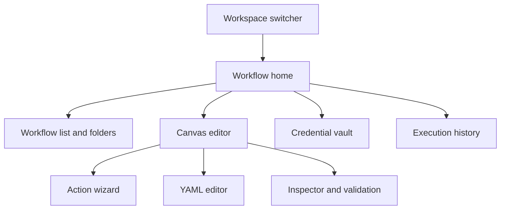

# Frontend UI

## Product principles

The FlowForge UI makes operational automation understandable before it makes it powerful. It borrows the spatial clarity of diagramming tools such as Lucidchart and Visio, but uses a more focused, modern workflow experience: clean surfaces, restrained color, direct manipulation, keyboard speed, and context-aware panels rather than a dense desktop-ribbon clone.

The canvas must stay responsive while workflow validation, credential tests, imports, publishing, or execution take longer. Show optimistic interaction feedback immediately, then clear pending/success/error state. Primary actions are visible and large enough for frequent use; advanced controls stay available through progressive disclosure.

## Information architecture



### Workspace shell

- Persistent workspace switcher with current workspace, role, and environment context.
- Left navigation: Workflows, Actions, Credentials, Targets, Profiles, Config, Executions, Templates, and Settings. Navigation only shows capabilities permitted by RBAC. Until E6, the operator header exposes Workflows, Credentials, Targets/Profiles/Config (E4.2; `opsconfig.view` — viewers can read), Approvals (E4.3; `approval.view`), Executions (E5.1 list/detail + E5.2 cancel/retry/status; `execution.view` / `execution.cancel` / `workflow.execute`), Membership, and Isolation.
- Global search for workflows, action types, credentials by safe name/tag, execution IDs, and documentation. Never search plaintext secrets or redacted payloads.
- Command palette for keyboard-first navigation and common commands: new workflow, add action, open YAML, validate, publish, run a selected published version, and open execution.
- Notifications show background validation, credential-test completion, publish outcomes, and execution state; they do not expose secrets.

## Workflow home

Workflow home prioritizes operational work over dashboard decoration:

- Search, folders/tags, owner, trigger, environment, status, last run, and last modified filters.
- Compact list and card views; pinned/high-frequency workflows surface first.
- Create workflow, import YAML, duplicate, archive, export immutable version, and open run history.
- Draft/published state, version, validation health, and required approvals are visible without opening the editor.
- Templates provide reviewed starting points for Kubernetes rollout, SSH maintenance, Python/Go automation, and common compositions. Creating from a template always creates an editable draft in the current workspace.

## Canvas editor

The editor has one focused canvas with three coordinated areas:

1. **Action library**: searchable, categorized draggable node objects: triggers, Kubernetes, SSH, scripts, control flow, data transforms, and notifications. Each card shows its safe name, required permissions, inputs, outputs, and policy restrictions.
2. **Canvas**: pan, zoom, fit-to-workflow, snap-to-grid, minimap, multi-select, alignment/distribution, duplicate, group/ungroup, undo/redo, and keyboard shortcuts. Nodes use distinct shape/icon treatments by family plus text labels and status badges; color alone never conveys meaning.
3. **Inspector**: a contextual right panel for the selected workflow, node, edge, or execution. It shows configuration, typed ports, policy status, credentials by display name, validation, change history, and help.

Drag from a node output port to a compatible input port to create an edge. Incompatible ports are visibly unavailable and explain why on focus/hover. Edge creation opens a compact mapper when the destination accepts only a subfield. Selecting a node shows required inputs, optional defaults, upstream values, downstream consumers, and runtime policy without hiding the graph.

Canvas node states are explicit: draft, valid, warning, invalid, approval required, running, succeeded, failed, canceled, and indeterminate. Each state has an icon/text treatment in addition to color. The canvas never renders a guessed graph when YAML validation fails.

## Action wizard

The **Add action** wizard is the primary guided authoring path. It creates an action node, inserts it into the canvas, and writes the corresponding canonical YAML object.

1. **Choose type**: searchable categories and recommended actions based on selected upstream port, workspace permissions, and enabled target types.
2. **Choose target and credential**: dropdowns list only workspace-authorized Kubernetes cluster targets, SSH targets, command profiles, runtime profiles, and credential display names. Missing permissions explain the constraint; no secret value is shown.
3. **Configure**: type-specific controls with safe defaults. Kubernetes chooses target/namespace/dry-run/wait; SSH chooses target/profile/typed parameters/timeout; scripts choose language/source/entrypoint/runtime/resource limits.
4. **Connect data**: map upstream typed outputs to action inputs; show a preview of structure with sensitive fields redacted.
5. **Review**: show policy impact, required approval, retry behavior, redacted YAML preview, and validation before Add.

The wizard supports creating a single-action workflow or adding an action to a larger graph. It never creates a separate action execution model; an action is always a node in the canonical workflow YAML.

## YAML editor and round-trip

Canvas and YAML are two synchronized views of one draft:

- YAML mode offers syntax highlighting, schema-aware completion, outline/breadcrumb navigation, formatting, inline validation, line/column errors, and safe diff against the last saved or published version.
- Canvas edits update the typed draft model; Save serializes canonical YAML. YAML edits parse into that model after debounced validation.
- Save is disabled when YAML, graph, port typing, policy, or required configuration is invalid. The validation panel groups errors by workflow/node/edge and links directly to canvas nodes or YAML paths.
- The API returns normalized YAML and a digest after save. The UI replaces the local source with that response so export, visual editing, and execution all use identical semantics.
- Import validates before creating a draft. Export always names the workflow/version and returns the immutable normalized YAML.

## Credential vault

Credentials are workspace-scoped encrypted backend resources, never browser persistence or YAML fields.

- Credential types: `kubernetes`, `ssh_private_key`, `token`, `webhook_secret`, and `provider`.
- Add credential wizard: display name/tags, type from `GET /credentials/catalog`, secret fields, safe metadata, and optional `expiresAt`. Sensitive fields are masked, paste-safe, and cleared from UI memory after submission.
- The API encrypts values before persistence; UI receives only metadata (`displayName`, `type`, `status`, `tags`, `fingerprint`, test/rotation timestamps, `permittedActions`). Plaintext is never returned after create/update.
- Credential details support metadata edit, usage, rotate/replace, disable/enable, test, use (204), and events. Deletion loads `deletion-impact` then `DELETE` with `{confirm:true}`.
- The workflow editor selects credentials by display name/reference; it does not expose secret values. Credential cards show status, last test, and fingerprint without revealing connection strings, keys, tokens, or provider internals.

Operator routes (Chloe, E4.1): `/credentials` (list/search), `/credentials/new` (wizard), `/credentials/{id}` (detail). Contract adapter: `apps/web/src/lib/credential-contract.ts`. Unexpected secret fields on API responses are stripped and treated as a contract bug.

## Execution experience

- Run a selected published version, schedule, webhook-trigger, pause/resume, cancel, and rerun options are explicit. Drafts can be validated and published but never executed directly; a test run must first create a distinct immutable test version with the same policy checks and audit trail.
- Pre-run review shows version digest, selected trigger input, target/environment, approvals, and side-effect warnings. A dry-run/plan option appears when supported by the node.
- Execution detail renders a graph replay: current node, duration, attempts, waiting/approval state, safe outputs, artifacts, correlation ID, and redacted logs.
- Compare two executions or versions to identify changed YAML objects, inputs, outcomes, and policy revisions. Secrets are always redacted.
- Failed and indeterminate nodes offer safe next actions: inspect diagnostics, retry when policy permits, open an approval, or create a follow-up workflow. They never imply that an unverified remote action did not occur.

## Collaboration, governance, and quality of life

- Draft ownership, autosave indicator, optimistic concurrency/conflict resolution, change history, comments/mentions, and approval requests.
- Version timeline with publish notes, immutable export, restore-as-new-draft, compare, and pinned release versions.
- RBAC-aware sharing; Management/read-only users can inspect permitted workflows and audits but cannot edit, run, or reveal credentials.
- Workflow linting identifies disconnected nodes, unreachable branches, missing required inputs, unsafe retry configuration, overly broad targets, and deprecated action types.
- Action templates and reusable pinned `workflow.call` nodes make common patterns discoverable without hiding the underlying YAML/version lineage.
- Empty states teach the first useful action: create a workflow, add a credential, choose a template, or import YAML.

## Accessibility and responsive behavior

- Full keyboard operation for canvas navigation, node/edge creation, selection, inspector controls, dialogs, and YAML errors.
- Visible focus, semantic labels, screen-reader node/edge summaries, live announcements for validation/execution changes, and non-color status indicators.
- Mouse/trackpad canvas interactions have keyboard equivalents; touch devices use a simplified inspector-first graph editing mode rather than tiny controls.
- Responsive layout preserves the canvas and inspector on desktop; on smaller screens, library and inspector become drawers while workflow review/run/history remain fully usable.
- Respect reduced motion and user color preferences. Motion is limited to meaningful execution/connection feedback.

## Foundation operator shell

Until authoring (E6) lands, the deployable shell is the home page, a slim header, the E2.1 membership operator, the E2.2 isolation exercise, the E2.3 cookie session controls, the E3.1 YAML validate/normalize editor, the E3.2 draft/publish/history operator, the E3.3 core-neutral node palette/inspector, the E4.1 credential vault, the E4.2 versioned operational-config operator, the E4.3 approvals operator, and the E5.1/E5.2 execution history operator:

- Control-plane health and readiness probes go through Next.js `/api/control-plane/*` proxies. Outbound calls send `X-Request-ID` (16–128 ASCII letters, digits, or hyphens; otherwise generated). The proxy echoes the header. API `application/problem+json` bodies are preserved; the card maps `title`, `detail`, `status`, `code`, and `request_id` only. Credentials, `DATABASE_URL`, and raw sensitive headers are never logged or shown.
- OpenAPI/Swagger links in the header and on the home page use the public control-plane origin (`NEXT_PUBLIC_API_URL` + `/api/v1/swagger`, `/openapi.json`, `/openapi.yaml`). The UI does not re-host the specification.

## E2.1 membership operator

`/membership` is a minimal operator surface (Chloe) that exercises jonny's E2.1 API contract. It is not the product workspace shell.

- **Session (E2.3):** cookie session via same-origin `/api/v1/session` (`credentials: include`). Subject/expiry come from `session.idle_expires_at` / `session.absolute_expires_at`. Logout is `POST /session/logout`. CSRF header `X-CSRF-Token` is sent on mutations when `ff_session` is present. Bearer tokens are never stored in `localStorage` or the URL.
- **Workspace context:** tenant id *or* tenant slug and workbench key live in tab `sessionStorage`. They are not secrets.
- **Temporary header fallback:** local-only issuer/subject headers, clearly labeled, used only when no cookie session is active. Remove when jonny's session API is the sole subject path.
- **Workspace identity:** the UI and Next proxy never send `X-FlowForge-Workspace-ID` and do not offer a workspace-UUID lookup field. Current workspace resolution uses tenant + workbench key only.
- **Actions:** create tenant (`POST /tenants`), create workspace (`POST /workspaces`; caller becomes admin), list caller workspaces (`GET /workspaces`), current workspace roles/permissions (`GET /workspace`), members add/update/remove (`GET|PUT /workspace/members`, `DELETE /workspace/members/{userID}`), read-only permission matrix (`GET /permission-matrix`).
- **Proxies:** `/api/control-plane/{session,permission-matrix,roles,permissions,tenants,workspaces,workspace,workspace/members,workspace/members/{userID}}` attach workspace headers, session cookies, CSRF, and `X-Request-ID`, call `API_INTERNAL_URL` `/api/v1/...`, preserve `application/problem+json`, and echo the request id. Unauthorized, CSRF, and last-admin conflict problems show `title`, `detail`, `code`, and `request_id`.

## E2.3 browser session contract (API → UI)

The Go API now issues cookie sessions. Chloe owns the client UX; this is the contract to align with. Do not put bearer tokens or session secrets in `localStorage`. Prefer calling the API origin directly with `credentials: "include"` (set `CORS_ALLOWED_ORIGINS` to the UI origin, e.g. `http://localhost:3000`). Existing `/api/control-plane/*` header proxies remain valid for non-browser/server callers.

| Method | Path | Cookies / CSRF | Success |
| --- | --- | --- | --- |
| `POST` | `/api/v1/session` | Sets `ff_session` + `ff_csrf`. No CSRF required to create. Prefer identity headers. JSON `{issuer,external_subject,display_name?}` is used only when headers are absent; a conflicting body is `403`. | `201` `{session,principal,csrf_token}` |
| `GET` | `/api/v1/session` | `ff_session` required. Safe method: no CSRF header. | `200` same shape |
| `POST` | `/api/v1/session/refresh` | Session cookie + `X-CSRF-Token` matching `ff_csrf`. Rotates CSRF. A stale pair after another tab refreshed is `409` — retry with the latest `csrf_token`. | `200` |
| `POST` | `/api/v1/session/logout` | Session cookie + CSRF. Clears cookies. | `204` |
| `GET` | `/api/v1/session/audit-events` | Session or identity headers. | `200` `{items}` |

After create/refresh, send `X-CSRF-Token: <csrf_token>` on every `POST`/`PUT`/`PATCH`/`DELETE` to `/api/v1/*`. `GET`/`HEAD` do not need it. Idle expiry is 30 minutes (refresh before then); absolute expiry is 12 hours. Stale session → `401` `unauthenticated`. Hostile `Origin` → `403` with no CORS grant. Viewer session + admin identity headers → `403` (privilege escalation fail-closed).

Cookie flags: `ff_session` is `HttpOnly` + `SameSite=Lax` + `Path=/api/v1` + `Secure` on HTTPS. `ff_csrf` is readable + `SameSite=Strict` + same path/Secure. Show expiry UX from `session.idle_expires_at` / `session.absolute_expires_at`.

## E2.2 isolation exercise

`/isolation` (also embedded at the bottom of `/membership`) is Chloe's negative operator surface for jonny's E2.2 isolation hook routes. It is not the product workspace shell.

- **Same identity as E2.1 / E2.3:** cookie session preferred; optional temporary header fallback; tenant id *or* slug and workbench key from tab-scoped `sessionStorage`. Workspace lookup is never a host-supplied workspace UUID.
- **Foreign-id exercises:** `POST /workspace/credentials/{id}/use`, `GET /workspace/artifacts/{id}`, `GET /workspace/cache/{key}`, `POST /workspace/realtime/channels/{id}/subscribe`, `GET /workspace/records/{id}`, plus scoped `GET /workspace/records?kind=`, `GET /workspace/jobs`, and `GET /workspace/audit-events`. Success of the story is that cross-workspace access **fails** and `application/problem+json` (`title`, `detail`, `status`, `code`, `request_id`) is shown.
- **Optional mismatch demo:** the panel may send `X-FlowForge-Workspace-ID` *in addition to* tenant + workbench so the API can reject the mismatch. Workspace-ID-only is not offered as a selector. `POST /workspace/records` with `workspace_id` in the body is a separate fail demo.
- **Proxies:** `/api/control-plane/workspace/{records,credentials/{id}/use,artifacts/{id},jobs,cache/{key},realtime/channels/{id}/subscribe,audit-events}` attach FlowForge headers and `X-Request-ID`, preserve problem+json, and echo the request id. Query strings such as `kind=` are forwarded. Workspace-ID is forwarded only when tenant + workbench are also present. Session cookies and `X-CSRF-Token` are forwarded; `Set-Cookie` is rewritten onto the UI origin. Authorization/bearer is never forwarded.

## E2.3 browser session operator

`/membership` and `/isolation` (Chloe) consume jonny's session API from **#22** (now on `main`). The Go session store, cookie issuance, and server CSRF/CORS/CSP policy stay on `apps/api`.

- **Login/bootstrap:** `POST /api/v1/session` with `{issuer, external_subject, display_name?}`. `201` `{session,principal,csrf_token}` plus `ff_session` / `ff_csrf`.
- **Current session:** `GET /api/v1/session` requires the cookie (header-only → `401`). Expiry UX uses `session.idle_expires_at` (30m) and `session.absolute_expires_at` (12h).
- **Refresh:** `POST /api/v1/session/refresh` with CSRF; extends idle and rotates CSRF.
- **Logout:** `POST /api/v1/session/logout` with CSRF (not `DELETE /session`).
- **Audit:** `GET /api/v1/session/audit-events`.
- **CSRF:** `X-CSRF-Token` on POST/PUT/PATCH/DELETE when `ff_session` is present. Header-only callers skip CSRF. Missing CSRF with a session cookie fails closed at the Next proxy before the Go API is called.
- **Cookies:** `ff_session` HttpOnly `SameSite=Lax`; `ff_csrf` readable `SameSite=Strict`; both `Path=/api/v1`. Same-origin rewrite maps `/api/v1/*` → `/api/control-plane/*` so those cookies are sent. Domain is stripped; `Secure` is omitted on localhost HTTP.
- **Headers:** when a cookie session is active, issuer/subject headers are not sent (conflicting headers are `403` on the API).
- **Contract adapter:** `apps/web/src/lib/session-contract.ts`.

| Method | Path | CSRF | Notes |
| --- | --- | --- | --- |
| `POST` | `/api/v1/session` | no | Create; sets `ff_session` + `ff_csrf` |
| `GET` | `/api/v1/session` | no | Cookie required |
| `POST` | `/api/v1/session/refresh` | required | Extend idle; rotate CSRF |
| `POST` | `/api/v1/session/logout` | required | Revoke; clear cookies |
| `GET` | `/api/v1/session/audit-events` | no | Secret-free audit rows |

## E3.2 draft / publish / version API (jonny → Chloe)

The Go API now persists drafts and immutable versions. Chloe owns the draft/publish/compare UI; do not treat `/workflows` E3.1 operator as the product editor. Contract details live in `docs/reference/backend-api-map.md` (E3.2). JSON is camelCase.

| Method | Path | Perm | Body / notes |
| --- | --- | --- | --- |
| `GET` | `/api/v1/workflows` | `workflow.view` | `{items}` summaries |
| `POST` | `/api/v1/workflows` | `workflow.edit` | `{definitionYaml, slug?, name?}` → `201` `{workflow,draft}` |
| `GET` | `/api/v1/workflows/{workflowId}` | `workflow.view` | summary + `draftRevision` / latest version |
| `GET` | `/api/v1/workflows/{workflowId}/draft` | `workflow.view` | `{revision,definitionYaml,digest,summary}` |
| `PUT` | `/api/v1/workflows/{workflowId}/draft` | `workflow.edit` | `{revision,definitionYaml}` or YAML + `If-Match`. `409` if stale. Replace editor with returned YAML. |
| `POST` | `/api/v1/workflows/{workflowId}/publish` | `workflow.publish` | `{revision?,note?}` → `201` `{workflow,version}` |
| `GET` | `/api/v1/workflows/{workflowId}/versions` | `workflow.view` | newest first |
| `GET` | `/api/v1/workflows/{workflowId}/versions/{versionId}` | `workflow.view` | frozen snapshot |
| `GET` | `/api/v1/workflows/{workflowId}/versions/{versionId}/export` | `workflow.view` | JSON export or `Accept: application/yaml` |
| `POST` | `/api/v1/workflows/{workflowId}/compare` | `workflow.view` | `{left,right}` where `kind` is `draft` or `version` (`versionId` or `versionNumber`) |
| `POST` | `/api/v1/workflows/{workflowId}/versions/{versionId}/restore` | `workflow.edit` | `{expectedRevision?}` → new draft revision; version unchanged |
| `POST` | `/api/v1/workflows/{workflowId}/executions` | `workflow.execute` | **must** send `{workflowVersionId, idempotencyKey?, input?}`. `201` new / `200` replay / `409` key conflict. Drafts cannot run. |
| `GET` | `/api/v1/workflows/{workflowId}/executions` | `execution.view` | per-workflow list (`status`, `limit`) |
| `GET` | `/api/v1/workflows/{workflowId}/executions/{executionId}` | `execution.view` | detail + steps/jobs/pins/audit; pin is stable |

Next proxies (Chloe): `/api/control-plane/workflows` plus `/api/control-plane/workflows/{workflowId}`, `.../draft`, `.../publish`, `.../compare`, `.../versions`, `.../versions/{versionId}`, `.../versions/{versionId}/export`, `.../versions/{versionId}/restore`, `.../executions`, `.../executions/{executionId}`. Forward session cookies, CSRF, tenant + workbench headers, `If-Match`, and `X-Request-ID`; preserve `application/problem+json` including `errors[]`.

## E3.1 workflow YAML operator

`/workflows` keeps Chloe's E3.1 catalog / validate / normalize editor (not the E6 canvas). E3.2 adds persistence on the same page.

- **Same identity as E2.3 / E2.1:** cookie session + `X-CSRF-Token` on POST/PUT; workspace lookup is tenant + workbench key. Header-only local-dev fallback is unchanged.
- **Editor:** YAML textarea with line numbers. Debounced `POST /workflows/validate` shows valid + warnings, or linked `errors[]` (`path`, `line`, `column`, `code`, `message`). Invalid YAML never renders a guessed graph.
- **Normalize / import:** `POST /workflows/normalize` (or file import then normalize) **replaces** the editor buffer with `definitionYaml` and shows the `sha256:` digest plus summary counts.
- **Palette:** `GET /workflows/catalog` filtered to `phase: core` only. `next` / `provider` / unknown phases fail closed.
- **E3.3 catalog deltas (Chloe):** additive fields on the same `GET /workflows/catalog` response — do not require a web rewrite to keep E3.1/E3.2 working. See [core node contracts](core-node-contracts.md) for the inspector/`with` map. Highlights: `rules.triggersAreWorkflowLevel` (do not offer `manual`/`webhook`/`schedule` as canvas nodes); seven nodes now ship `allowedWith`, `policy`, `bounds`, `redaction`, and port `classification`/`maxBytes`; `flow.fail` now **requires** `with.code`; `flow.condition` needs `compare` unless `op` is `exists`; `flow.delay` rejects years/months and durations above `P7D`; unknown `with` keys on these nodes are `unknown-field`. Other core nodes (k8s/SSH/HTTP/approval/scripts) still have E3.1 stubs (ports + `requiredWith` only).
- **Proxies:** `/api/control-plane/workflows/{catalog,validate,normalize}` attach session cookies, CSRF, workspace headers, and `X-Request-ID`; preserve `application/problem+json` including `errors[]`.

## E3.3 core neutral nodes (Chloe UI)

`/workflows` adds a place/configure surface for the seven E3.3 graph nodes. Jonny owns the control-plane contracts; this slice does not change `apps/api`.

- **Action palette:** `flow.condition`, `flow.delay`, `data.set`, `data.map`, `data.validate`, `flow.stop`, `flow.fail`. Filterable by name, type, family, and ports. Insert writes a canonical `spec.nodes[]` object (`id`, `type`, `name`, `with`).
- **Triggers:** remain workflow-level `spec.triggers`. They are not graph nodes and are not insertable from the action palette.
- **Catalog adapter:** consume jonny's #32 catalog contract (`title`, `allowedWith[]`, object `policy` / `bounds` / `redaction`, port `classification` / `maxBytes`, root `rules`). Fall back to that published contract only when `GET /workflows/catalog` is unavailable locally. Do not invent extra API fields.
- **Inspector:** bounded `with` forms only — condition `op`/`path`/`compare` (`compare` required unless `op=exists`), delay ISO-8601 `duration` (weeks/days/time, max `P7D`), `data.set` literal fields + optional `public`/`internal` classification, `data.map` dest→from object (`convert` optional), `data.validate` JSON-schema subset object, `flow.stop` `status`/`message`, `flow.fail` required `code` + `message`. No expression evaluation and no secrets in YAML.
- **Unchanged:** E3.1 validate/normalize/catalog proxies and E3.2 draft/publish/compare/run. Cookie session + CSRF and tenant + workbench identity stay the same.

## E3.2 draft / publish / compare operator

`/workflows` (Chloe) consumes jonny's draft/publish/version APIs from **#29** (now on `main`). `apps/api` is unchanged in this UI story. JSON is camelCase. Host-supplied `id` / `workspaceId` are never sent on writes.

- **Create / import:** `POST /workflows` `{definitionYaml, slug?, name?}` → keep `workflow.id` and `draft.revision`. Replace the editor with returned `draft.definitionYaml`.
- **Save:** `PUT /workflows/{id}/draft` `{revision,definitionYaml}` plus `If-Match: <revision>`. On `200`, replace the buffer with `draft.definitionYaml` and store `draft.revision` / `draft.digest`.
- **Conflict:** on `409` `conflict`, `GET` the draft and offer **Reload server draft**. The editor is not overwritten until the operator confirms.
- **Publish:** `POST /workflows/{id}/publish` `{revision, note?}`. Publish uses the last saved draft (unsaved editor buffer is not published). Show the immutable version digest.
- **History:** versions list, JSON export download (`filename` + `definitionYaml`), compare draft vs version or version vs version, restore-as-new-draft (`expectedRevision`).
- **Run:** `POST /workflows/{id}/executions` **must** send `{workflowVersionId}`. Optional `idempotencyKey` / `input`. CSRF on POST. `201` new / `200` `replayed` / `409` same key + different input. The selector lists published versions only — never a draft. Re-read pin after later edits.
- **Proxies:** `/api/control-plane/workflows` plus `/{workflowId}`, `.../draft`, `.../publish`, `.../compare`, `.../versions`, `.../versions/{versionId}`, `.../export`, `.../restore`, `.../executions`, `.../executions/{executionId}`. CSRF on POST/PUT; `If-Match` forwarded; problem+json including `errors[]` preserved.

| Method | Path | CSRF | Notes |
| --- | --- | --- | --- |
| `GET` / `POST` | `/api/v1/workflows` | POST | list / create |
| `GET` | `/api/v1/workflows/{workflowId}` | no | summary + `draftRevision` |
| `GET` / `PUT` | `/api/v1/workflows/{workflowId}/draft` | PUT | save with revision / If-Match |
| `POST` | `/api/v1/workflows/{workflowId}/publish` | yes | `{revision?,note?}` |
| `GET` | `/api/v1/workflows/{workflowId}/versions` | no | newest first |
| `GET` | `/api/v1/workflows/{workflowId}/versions/{versionId}` | no | frozen snapshot |
| `GET` | `/api/v1/workflows/{workflowId}/versions/{versionId}/export` | no | JSON export |
| `POST` | `/api/v1/workflows/{workflowId}/compare` | yes | `{left,right}` `draft` \| `version` |
| `POST` | `/api/v1/workflows/{workflowId}/versions/{versionId}/restore` | yes | restore-as-new-draft |
| `POST` | `/api/v1/workflows/{workflowId}/executions` | yes | `{workflowVersionId, idempotencyKey?, input?}` · `201`/`200`/`409` |
| `GET` | `/api/v1/workflows/{workflowId}/executions` | no | per-workflow list |
| `GET` | `/api/v1/workflows/{workflowId}/executions/{executionId}` | no | pin is stable |

## E4.1 credential vault contract (API → UI)

The Go API now persists envelope-encrypted credentials. Chloe owns vault screens; **never display or store plaintext**. Contract details live in `docs/reference/backend-api-map.md` (E4.1). JSON is camelCase. Do not call isolation `POST /workspace/records` with `kind=credential` for the product vault. Isolation hook `POST /workspace/credentials/{id}/use` is not the product vault.

Suggested Next proxies (Chloe): `/api/control-plane/credentials`, `/credentials/catalog`, `/credentials/{credentialId}`, `.../rotate`, `.../disable`, `.../enable`, `.../test`, `.../use`, `.../usage`, `.../deletion-impact`, `.../events`. Forward session cookies, CSRF on POST/PATCH/DELETE, tenant + workbench headers, and `X-Request-ID`; preserve `application/problem+json`.

| Method | Path | Perm | CSRF | Notes |
| --- | --- | --- | --- | --- |
| `GET` | `/api/v1/credentials/catalog` | `credential.view` | no | Type + field names only |
| `GET` | `/api/v1/credentials` | `credential.view` | no | `{items}` metadata |
| `POST` | `/api/v1/credentials` | `credential.manage` | yes | `{type,displayName,tags?,metadata?,expiresAt?,secret}` → `201` metadata; drop `secret` after submit |
| `GET` | `/api/v1/credentials/{credentialId}` | `credential.view` | no | metadata + `permittedActions` |
| `PATCH` | `/api/v1/credentials/{credentialId}` | `credential.manage` | yes | metadata only; `secret` is `400` |
| `POST` | `/api/v1/credentials/{credentialId}/rotate` | `credential.manage` | yes | `{secret}` |
| `POST` | `/api/v1/credentials/{credentialId}/disable` | `credential.manage` | yes | |
| `POST` | `/api/v1/credentials/{credentialId}/enable` | `credential.manage` | yes | |
| `POST` | `/api/v1/credentials/{credentialId}/test` | `credential.use` or `manage` | yes | `{result,credential}` redacted |
| `POST` | `/api/v1/credentials/{credentialId}/use` | `credential.use` | yes | `204` empty |
| `GET` | `/api/v1/credentials/{credentialId}/usage` | `credential.view` | no | drafts/versions/executions |
| `GET` | `/api/v1/credentials/{credentialId}/deletion-impact` | `credential.view` | no | `canDelete` |
| `DELETE` | `/api/v1/credentials/{credentialId}` | `credential.manage` | yes | `{confirm:true}`; `409` if active execution |
| `GET` | `/api/v1/credentials/{credentialId}/events` | `credential.view` | no | secret-free audit |

Masked, paste-safe secret fields; clear them from component state after `201`/`200`. Responses never include `secret`, `kubeconfig`, `privateKey`, `token`, `ciphertext`, or `dekEnvelope`. Viewer cannot list credentials. Editor can view names only.

## E4.3 policy evaluation and approvals contract (API → UI)

The Go API evaluates current published target/action policy before dispatch and stores approval requirements bound to workflow version + target revision + policy revision + operation + expiry. Chloe owns approval UX; **do not stack on an API feature branch** — these routes are on `main`. Full table: `docs/reference/backend-api-map.md` (E4.3). JSON is camelCase. Durable wait/resume is E10; keep wait-state controls disabled until then.

Suggested Next proxies: `/api/control-plane/policy/evaluate`, `/api/control-plane/approvals`, `/approvals/catalog`, `/approvals/{approvalId}`, `.../decide`, `.../events`. Forward session cookies, CSRF on POST, tenant + workbench headers, and `X-Request-ID`; preserve `application/problem+json`.

| Method | Path | Perm | CSRF | Notes |
| --- | --- | --- | --- | --- |
| `GET` | `/api/v1/approvals/catalog` | `approval.view` | no | `{statuses,decisions,defaultExpiresIn}` |
| `POST` | `/api/v1/policy/evaluate` | `workflow.view` | yes | `{workflowId,workflowVersionId}` → `decision`, `dispatchAllowed`, `requirements[]` |
| `GET` | `/api/v1/approvals` | `approval.view` | no | query `status`, `workflowId`, `workflowVersionId`, `executionId` |
| `POST` | `/api/v1/approvals` | `workflow.execute` | yes | materialize pending rows (idempotent on active binding) |
| `GET` | `/api/v1/approvals/{approvalId}` | `approval.view` | no | refreshes expiry / stale binding → `invalidated` or `expired` |
| `POST` | `/api/v1/approvals/{approvalId}/decide` | `approval.decide` | yes | `{decision:"approved"\|"rejected", note?}`. No self-approval. Stale binding is `409`. |
| `GET` | `/api/v1/approvals/{approvalId}/events` | `approval.view` | no | secret-free audit |
| `POST` | `/api/v1/workflows/{id}/executions` | `workflow.execute` | yes | still `{workflowVersionId}`; **`409`** if a valid approval is missing; **`403`** if policy denies |

Suggested operator routes: `/approvals` (inbox) and a pre-run review on the existing run dialog. Viewer can read; operator requests; approver/admin decides. After policy or target publish, treat existing approvals as dead and re-evaluate.

## E4.1 credential vault operator

`/credentials` (Chloe) consumes jonny's vault APIs from **#38**. This UI does not close **#35** alone and does not change `apps/api`. Relates to #35 / Part of #34. JSON is camelCase. Host-supplied `id` / `workspaceId` are never sent on writes. Cookie session + `X-CSRF-Token` on POST/PATCH/DELETE. KEK (`CREDENTIAL_KEK`) is server-only — the UI never reads or sends it.

- **Catalog:** `GET /credentials/catalog` → `{types}` field names only. Drive the add/rotate wizard from that catalog.
- **List/search:** `GET /credentials` → `{items}` metadata. Filter display name and tags in the browser. Never search or persist plaintext. Do not send invented list query params.
- **Create:** `POST /credentials` `{type,displayName,tags?,metadata?,expiresAt?,secret}`. Response is metadata only. The wizard clears secret inputs after submit.
- **Detail:** `GET /credentials/{id}`; metadata edit via `PATCH /credentials/{id}` `{displayName?,tags?,metadata?,expiresAt?}` (`secret` is `400`).
- **Rotate / disable / enable / test / use:** `POST .../rotate` `{secret}`; `POST .../disable`; `POST .../enable`; `POST .../test` → `{result,credential}`; `POST .../use` → `204` empty.
- **Usage / events:** `GET .../usage`, `GET .../events` — redacted rows only (not `/audit`).
- **Delete:** `GET .../deletion-impact` then typed-name confirmation before `DELETE /credentials/{id}` `{confirm:true}`. Active executions block delete (`409`).
- **Proxies:** `/api/control-plane/credentials` plus `/catalog`, `/{id}`, `.../rotate`, `.../disable`, `.../enable`, `.../test`, `.../use`, `.../usage`, `.../deletion-impact`, `.../events`. Session cookies, CSRF, tenant + workbench, and `X-Request-ID` are forwarded; `application/problem+json` is preserved. Authorization and request bodies are never logged.
- **Operator routes:** `/credentials` (list/search), `/credentials/new` (wizard), `/credentials/{id}` (detail). Types: `kubernetes`, `ssh_private_key`, `token`, `webhook_secret`, `provider`.

## E4.2 versioned operational config (Chloe UI)

`/config` is Chloe's operator for workspace-scoped cluster/SSH targets, command/runtime profiles, connections, recipient lists, message templates, response schemas, and policies. Stacked on the **#41** map now on `main` (`docs/reference/backend-api-map.md`). This UI does **not** close **#36** and does not change `apps/api`. Relates to #36 (already closed by #41) / Part of #34.

- **Draft / publish:** `POST /{collection}` `{name, slug?, spec}` → `{resource, draft}`. Save is `PUT /{collection}/{id}/draft` `{revision, spec, name?}` — **not** If-Match. `409` reloads the draft. Publish is `POST …/publish` `{revision?, note?}`. Draft and version JSON have **no `name`**; the resource head holds display name. Published detail is read-only.
- **Selectors / pins:** there is **no** `GET …/authorized`, compare, or restore route. Picker lists published heads, then `POST /{collection}/{id}/select` `{versionId?}` or batch `POST /ops-config/select` `{refs:[{kind,resourceId,versionId?}]}`. Pin shape is `{kind, resourceId, versionId, versionNumber, digest, name?, slug?, spec?}`. Restore in UI = PUT draft from a version snapshot. Compare, if shown, is client-side spec JSON only. Workflow pins: `GET /workflows/{workflowId}/versions/{versionId}/pins`.
- **Credentials:** E4.1 vault stays the secret store. Target/connection forms select credentials by display name/id only. Specs use #41 fields (`endpoint.apiServer`, `type` + `endpointPolicy.pathPrefixes`, `limits.*`, `kind` + `policy`, `recipientPolicy.emails`/`domains`).
- **RBAC nav:** Targets / Profiles / Config appear when `GET /workspace` includes `opsconfig.view` (viewers included). Edit/publish buttons still require `opsconfig.edit` / `opsconfig.publish`.
- **Session:** cookie session + `X-CSRF-Token` on POST/PUT; tenant + workbench identity; `credentials: include`. Host-supplied `id` / `workspaceId` are never sent on writes.
- **Proxies:** `/api/control-plane/ops-config/{catalog,select}` plus `{cluster-targets,ssh-targets,command-profiles,runtime-profiles,connections,recipient-lists,message-templates,response-schemas,policies}` `{id}`, `…/draft` (GET|PUT), `…/publish`, `…/select`, `…/disable`, `…/enable`, `…/versions`, and `GET /workflows/{id}/versions/{versionId}/pins`.
- **Operator routes:** `/config`, `/config/{collection}`, `/config/{collection}/new`, `/config/{collection}/{id}`, `/config/{collection}/{id}/versions/{versionId}`.
- **Workflow editor:** `/workflows` adds a light published-pin picker (list + POST select). Version history reads `GET /workflows/{id}/versions/{versionId}/pins`. Run control shows execution `pins[]` from start/get execution. E3 draft/publish/run and the E4.1 vault are unchanged.

## E4.3 policy evaluation / approvals (Chloe UI)

`/approvals` is Chloe's operator for policy-eval and approval bindings stacked on the **#44** map now on `main` (`docs/reference/backend-api-map.md`). This UI does **not** change `apps/api`. Relates to #37 (already closed by #44) / Part of #34.

- **Contract adapter:** all paths and write bodies live in `apps/web/src/lib/approval-contract.ts`.
- **Routes:** `GET /approvals/catalog`; `POST /policy/evaluate` `{workflowId,workflowVersionId}` (CSRF); `GET /approvals` query `status`, `workflowId`, `workflowVersionId`, `executionId`; `POST /approvals` `{workflowId,workflowVersionId}` (CSRF); `GET /approvals/{id}`; `POST /approvals/{id}/decide` `{decision:"approved"|"rejected", note?}` (CSRF); `GET /approvals/{id}/events`. There is no `/approve`, `/reject`, or execution-nested approvals path.
- **Binding snapshot (read-only):** workflow version + digest, target, policy revision, operation, node, expiry, fingerprint. Target or policy **publish** invalidates prior pending/approved rows — the config editor tells the operator to re-evaluate.
- **Decide:** cookie session + `X-CSRF-Token` on POST. No self-approval affordance when `GET /workspace` `principal.id` equals `requestedBy` (user UUIDs — not `session.subject`). Server `403` remains the authority. Expired / invalidated / not-pending are `409` `conflict` distinguished by detail text.
- **RBAC nav:** Approvals appears when `GET /workspace` includes `approval.view`. List statuses come from `GET /approvals/catalog`.
- **Workflow hooks:** evaluate → materialize pending rows when `decision=approval-required` → wait for current `approved` bindings (or `dispatchAllowed`) before start. Start execution still rechecks on the server. Execution waiting state lists `GET /approvals?executionId=`. E4.1 vault, E4.2 ops-config, and E3 workflows stay intact.
- **Operator routes:** `/approvals`, `/approvals/{id}`.
- **Proxies:** `/api/control-plane/approvals`, `/catalog`, `/{id}`, `…/decide`, `…/events`, and `/policy/evaluate`. Session cookies, CSRF, tenant + workbench, and `X-Request-ID` are forwarded; `application/problem+json` is preserved. Approval tokens are never stored in `localStorage`.

## E5.1 execution history (Chloe UI)

`/executions` is Chloe's minimal workspace-scoped history operator for #46, wired to jonny's #51 map. This UI does **not** change `apps/api` and is **not** stacked on an API feature branch. Relates to #46 / Part of #45 — do not close #46 alone. Graph replay stays out (E6). Artifact list/download is E5.3 below (API on `main` via this map; do not invent nested `/artifacts/{id}/download` under the execution). Cancel/retry UX is E5.2 below.

- **Contract adapter:** paths live in `apps/web/src/lib/execution-contract.ts`. Exact #51 routes only — do not invent collections or query params.
- **List:** workspace `GET /executions` (`workflowId`, `status`, `limit`) and per-workflow `GET /workflows/{id}/executions` (`status`, `limit`). Cards show id, workflow, version pin, status, started/finished, correlation id, and idempotency key.
- **Detail:** `GET /executions/{id}` (or `GET /workflows/{id}/executions/{id}`) includes redacted `input`, bounded `steps` (`outputTruncated`), `jobs`, `pins`, `auditEvents`, and `artifacts` metadata. Optional extras: `…/steps`, `…/jobs`, `…/audit-events`, `…/artifacts`. Workspace audit is `GET /audit-events` (`resourceType`, `resourceId`, `action`) — not E2.2 `GET /workspace/audit-events`. Nested 403 fails closed.
- **Redaction:** API secrets appear as `[redacted]`. Unexpected secret field names are stripped and treated as a contract bug.
- **Indeterminate:** status badge + border + text — color is never the only signal. Do not imply an unverified remote action did not occur.
- **Idempotency:** `POST /workflows/{id}/executions` `{workflowVersionId, idempotencyKey?, input?}` with CSRF. `201` new run; `200` + `replayed: true` reuses the original; same key + different input is `409` `conflict`. Do not retry 409 with a new key unless the operator intends a new run.
- **RBAC nav:** Executions appears when `GET /workspace` includes `execution.view`. List/detail 403 is fail-closed (no leftover rows).
- **Run control:** published-version selector only. Optional idempotency key. Pin panel links to `/executions/{id}`.
- **Operator routes:** `/executions`, `/executions/{id}`.
- **Proxies:** `/api/control-plane/executions`, `/{id}`, `…/steps`, `…/steps/{stepId}`, `…/jobs`, `…/audit-events`, `/audit-events`, and `GET /workflows/{id}/executions`. Session cookies, CSRF on POST, tenant + workbench, and `X-Request-ID` are forwarded; `application/problem+json` is preserved. Authorization and bodies are never logged.

## E5.2 cancel / status UX (Chloe)

Jonny's dispatch APIs are on `main` via **#53** (Relates to #47 / Part of #45 — do not close #47 alone). Do **not** stack the UI on an API feature branch. Do not rewrite worker `/jobs/*` into the browser. Artifact downloads are E5.3 below. This UI does **not** change `apps/api`.

**UI route map** — cookie session + `credentials: "include"`; `X-CSRF-Token` on POST. JSON camelCase. Host `id` / `workspaceId` on write bodies is `400`. Cross-workspace UUIDs are `404`.

| Method | Path | Perm | CSRF | Notes |
| --- | --- | --- | --- | --- |
| `GET` | `/api/v1/executions/{executionId}` | `execution.view` | no | Poll status, `steps[]`, `jobs[]` (`leaseExpiresAt`, `heartbeatAt`, `fencingToken`) |
| `POST` | `/api/v1/executions/{executionId}/cancel` | `execution.cancel` | yes | `{}` · idempotent `200` · viewer `403` · terminal non-canceled `409` |
| `POST` | `/api/v1/executions/{executionId}/retry` | `workflow.execute` | yes | `{stepId?}` · `201` new attempt · `indeterminate`/provider `409` |
| `POST` | `/api/v1/executions/{executionId}/steps/{stepId}/retry` | `workflow.execute` | yes | Prefer this when the clicked step is known |

Suggested UI flow:

1. Detail already from E5.1. Enable **Cancel** when `status` is `queued` or `running` and `GET /workspace` includes `execution.cancel`.
2. Cancel posts `{}`. On `200`, replace the detail with the response (`status=canceled`). A second click is safe.
3. Enable **Retry** on a `failed` or `canceled` core `data.*` / `flow.*` step when the caller has `workflow.execute`. Hide/disable retry for `indeterminate` and provider node types — show copy that an unverified side effect must not be assumed absent.
4. `indeterminate` remains unmistakable (badge + text, not color alone). Do not offer a silent re-run.
5. Never call `POST /jobs/claim` (or heartbeat/complete/fail) from the UI.

**Implemented (#52):** paths live in `apps/web/src/lib/execution-contract.ts`. Status polls `GET /executions/{id}` only — never `/jobs/*`. Cancel is CSRF + fail-closed 403. Retry is hidden for `indeterminate` and provider nodes. E5.1 list/detail, `[redacted]`, and idempotent start stay intact.

**Proxies:** `/api/control-plane/executions/{id}/cancel`, `.../retry`, `.../steps/{stepId}/retry`. CSRF on POST; preserve `application/problem+json`.

## E5.3 artifacts (Chloe UI)

Jonny's artifact APIs land on `main` (Relates to #48 / Part of #45 — do not close #48 alone). Do **not** stack the UI on an API feature branch. This UI does **not** change `apps/api`. Cookie session + `credentials: "include"`; `X-CSRF-Token` on POST. JSON camelCase. Host `id` / `workspaceId` / `storageRef` / `url` / `bucket` / `key` on write bodies is `400`. Cross-workspace UUIDs are `404`. Never persist a download `href`. Isolation hook `GET /workspace/artifacts/{id}` is not the product API.

**Canonical routes** (retarget any placeholder `/executions/{id}/artifacts/{id}/download` to these):

| Method | Path | Perm | CSRF | Notes |
| --- | --- | --- | --- | --- |
| `GET` | `/api/v1/executions/{id}` | `execution.view` | no | Poll `steps[]` (`outputTruncated`) + `artifacts[]` metadata |
| `GET` | `/api/v1/executions/{id}/artifacts` | `execution.view` | no | `{items}` · query `stepId`, `kind` |
| `GET` | `/api/v1/executions/{id}/steps/{stepId}/logs` | `execution.view` | no | `{lines,offset,nextOffset,truncated,maxBytes}` |
| `GET` | `/api/v1/artifacts/{id}` | `execution.view` | no | One metadata row |
| `POST` | `/api/v1/artifacts/{id}/downloads` | `execution.view` | yes | `{}` → `{download:{href,method,expiresAt}}` · TTL 60s |
| `GET` | `/api/v1/artifact-downloads/{grantId}` | `execution.view` | no | Stream bytes · re-auth every request · `Cache-Control: no-store` |

Suggested UI flow:

1. Detail already from E5.1. Render `artifacts[]` as name / digest / size / classification / retention. Strip any unexpected `storageRef`, envelope, or URL fields.
2. Logs: `GET …/steps/{stepId}/logs`. Paginate with `nextOffset` while `truncated` is true.
3. Download: mint a grant with CSRF, `GET` the returned `href` with cookies, then discard the `href`. On `404`, mint again. On `403`, fail closed.
4. Legal hold / purge stay admin-only (`POST /artifacts/{id}/legal-hold`, `POST /retention/purge`) — not required for the viewer.

**Proxies:** `/api/control-plane/executions/{id}/artifacts`, `.../steps/{stepId}/logs`, `/artifacts/{id}`, `.../downloads`, `/artifact-downloads/{grantId}`. Session cookies, CSRF on POST, tenant + workbench, and `X-Request-ID` are forwarded; `application/problem+json` is preserved. Grant hrefs and artifact bytes are never stored in `localStorage`.

## Initial implementation components

```text
frontend/src/features/workflows/
  WorkflowHome.tsx
  WorkflowCanvas.tsx
  ActionLibrary.tsx
  ActionWizard.tsx
  NodeInspector.tsx
  EdgeMapper.tsx
  YamlEditor.tsx
  ValidationPanel.tsx
  ExecutionReplay.tsx
frontend/src/features/credentials/
  CredentialVault.tsx
  CredentialWizard.tsx
  CredentialTestDialog.tsx
frontend/src/lib/workflowYaml.ts
frontend/src/lib/workflowGraph.ts
```

Use TypeScript/React with PascalCase components, camelCase hooks/utilities, Tailwind utilities, and colocated Vitest coverage. The graph adapter must round-trip the canonical `flowforge/v1` YAML without adding a persisted UI-only format.

## Required validation

- YAML import → canvas → no-edit save → export preserves normalized semantics and digest.
- Canvas-created action produces valid YAML with correct node, ports, and edge typing.
- Wizard target/credential dropdowns show only permitted metadata and never secret values.
- Invalid graphs, YAML, policies, and missing configuration have linked, accessible errors and cannot save/publish.
- Keyboard-only canvas/action-wizard/credential-vault flows work with visible focus and screen-reader labels.
- Credential create/rotate/test UI never persists plaintext in browser state, logs, URLs, snapshots, or analytics.
- Execution replay, diff, cancellation, retry, approval, and indeterminate states show correct safe actions and redaction.
