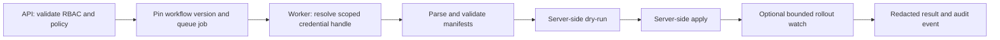

# Kubernetes API engine

## Purpose

The Kubernetes engine is FlowForge's first backend workflow capability. It lets an authorized workspace apply approved namespace-scoped manifests, inspect resources, and wait for rollout outcomes without exposing an unrestricted Kubernetes proxy.

## MVP operations

| Node | Behavior |
| --- | --- |
| `kubernetes.apply` | Validate YAML, server-side dry-run, then server-side apply. |
| `kubernetes.get` / `kubernetes.list` | Read an allowed resource in an allowed namespace. |
| `kubernetes.rolloutStatus` | Bounded observation of Deployment, StatefulSet, DaemonSet, or Job progress. |

Each node supplies `clusterTargetId`, `namespace`, `manifests` where applicable, `dryRun` (`client` or `server`), `wait` (`none` or `ready`), and bounded `timeoutSeconds`. `kubernetes.apply` always performs strict server-side dry-run before a persistent apply; `client` may add local validation but never replaces it. The field manager is fixed by the service (`flowforge`) and is not user-controlled.

## Execution flow



The queued job includes workspace, workflow version, cluster target, policy revision, correlation ID, and normalized-manifest SHA-256 digest. Workers revalidate authorization-relevant policy before contacting the target cluster. A retry is not presumed safe until the worker observes the intended object/generation.

## Manifest policy

Initial allowlist: `ConfigMap`, `Service`, `Deployment`, `StatefulSet`, `DaemonSet`, `Job`, `CronJob`, `Ingress`, and `NetworkPolicy`. `Secret` manifests are not accepted from workflow YAML: `data`, `stringData`, and `binaryData` are denied. A separately administered external-secret integration may populate a pre-approved secret outside this apply path, without returning its value to FlowForge.

Every non-empty document must include `apiVersion`, `kind`, and `metadata.name`; its namespace must equal the node namespace and an allowed target namespace. Templating is out of scope for the first release.

The engine rejects cluster-scoped resources, namespaces, CRDs, RBAC, admission webhooks, privileged workloads, host namespaces, `hostPath`, unsafe volumes, privilege/capability escalation, and mutable image tags (including `:latest`). Workload images must be allowlisted and pinned by digest. Ingress is limited to allowlisted hosts, TLS policy, same-namespace Service backends, and an annotation allowlist; controller-specific snippet/configuration annotations are denied. Arbitrary custom resources, `force` apply, deletion, rollback, and user-supplied kubeconfigs are also MVP non-goals.

Manifests are parsed document by document, normalized to JSON, client-validated, and submitted for strict server-side dry-run. Persisted changes use server-side apply with `FieldManager=flowforge` and `Force=false`; an ownership conflict is returned to the caller, never silently overridden.

## Authorization and credentials

FlowForge separates platform/workspace authorization from Kubernetes authorization:

- FlowForge permissions: `workflow.execute`, `kubernetes.read`, `kubernetes.apply`, and `clusterTarget.use`.
- Target policy narrows namespaces, kinds, verbs, and actions requiring approval. Evaluation keys (aliases in parentheses) fail closed when present: `allowedNamespaces` (`namespaces`), `allowedKinds` (`kinds`), `allowedVerbs` (`verbs`), `deny`, `requireApproval`, `approverRole`, `expiresIn`, `operations`.
- Cluster targets bind only a workspace-scoped `kubernetes` credential (`secret.kubeconfig`). Cross-workspace credential refs are `404`; host-supplied `id` / `workspaceId` is `400`.
- Each workspace/target uses an expiring credential handle and narrowly scoped Kubernetes service account, Role, and RoleBinding. ClusterRoles are not part of MVP. Operators apply [`deploy/kubernetes/`](../../deploy/kubernetes/) templates; targets may record `serviceAccount.{name,namespace,roleTemplate}` for E7.2 workers.
- The API and UI never receive kubeconfigs or plaintext credentials. Workers receive only ephemeral scoped material and redact secrets from all outputs.

Kubernetes service accounts should receive only the minimum permissions required, preferably through namespace-scoped roles and bindings. [Kubernetes service accounts](https://kubernetes.io/docs/concepts/security/service-accounts/) and [RBAC good practices](https://kubernetes.io/docs/concepts/security/rbac-good-practices/) support this model.

## Results, reliability, and audit

Apply returns resource identities, observed generation/state, and redacted diagnostics. Rollout watches recognize Deployment availability and observed generation, StatefulSet ready replicas, DaemonSet updated/available counts, and Job completion/failure. Timeout or cancellation stops waiting; it never deletes or rolls back resources.

Audit events record the actor, host-embed context when present, target, policy revision, manifest digest, resource identities, dry-run/apply outcome, and correlation ID. Inputs, outputs, logs, errors, and audit details are redacted.

## Initial implementation layout

```text
apps/api/internal/kubernetes/
  model.go catalog.go policy.go          # E7.1 control-plane (this story)
  manifest.go validator.go client.go apply.go status.go   # E7.2 / E7.3
apps/api/internal/opsconfig/            # E4.2 store: cluster_target + policy kinds
apps/api/internal/httpapi/opsconfig.go  # /cluster-targets, /policies, /kubernetes/catalog
deploy/kubernetes/
  workspace-serviceaccount.yaml
  workspace-role-template.yaml
  workspace-rolebinding-template.yaml
```

## Required validation

- Table-driven YAML parse, namespace/kind, secret-data, ingress-annotation/host, image-digest, and workload-security denial tests.
- Target-policy, RBAC, and credential-scoping tests.
- Fake-client tests for dry-run, apply, conflict, rollout success/failure, and timeout.
- API tests for authorization, RFC 9457 errors, idempotency, and redaction.
- PostgreSQL tenancy-query tests.
- `envtest` integration for API discovery, server-side dry-run, server-side apply conflicts, and runner deployment/network-policy validation.
