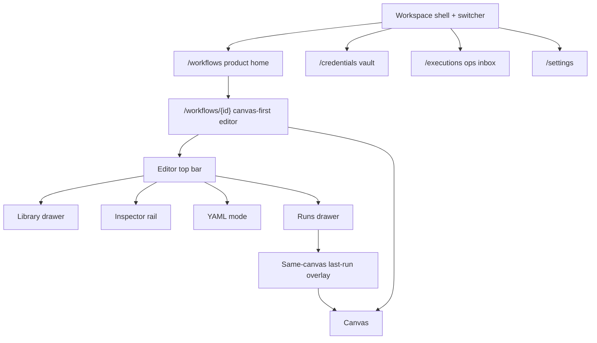

# Rewrite UI surfaces (Chloe)

Docs-only input for FlowForge’s **independent rewrite** toward
n8n-class UX and feature **parity**. This is **not** a clone brief.
It does **not** invent rewrite epic or story numbers, and it does
**not** close issues.

**Owner:** Chloe (UI surfaces, operator migration, keep/replace/retire).
**Folded into:** charter [§11.1](../architecture/flowforge-rewrite-n8n-class-parity.md#111-chloe--ui-surfaces--operator-migration-notes)
(PR #222). That subsection is the rewrite authority for this slice;
this page is the expanded surface map. Gracie/Arie still own
sequencing and epic cut. Do not open issues from this page.

**Current product IA (landed):** [frontend-ui.md](frontend-ui.md)
after epic #195 (UX.1–UX.12). Operator walkthrough:
[operator-admin.md](../guides/operator-admin.md).

## Independence and non-clone rules

n8n is a **behavior and capability reference** only
([n8n-io/n8n](https://github.com/n8n-io/n8n)): canvas-first shell,
left library, right inspector, executions overlay, credentials,
triggers, settings. FlowForge must remain its own product.

Do **not**:

- Copy n8n source, CSS, icons, trademarks, colors, or layout
  measurements.
- Pixel-match n8n screens or reuse n8n chrome names as product
  branding (no “NDV” in the UI; that term is used below only as a
  parity *reference* for a focused node inspector).
- Persist a second workflow format beside YAML.
- Put triggers on the canvas.
- Let drafts execute.
- Weaken ADV / RBAC / embed / Portal / CHIPS gates.

Do:

- Keep YAML (`flowforge/v1`) as the only persisted definition.
- Keep the canvas as a projection.
- Keep vault selectors as **display name + UUID**.
- Keep fail-closed catalog, nav, and secret handling.

## What landed on `main` after epic #195

Epic #195 (closed) reshaped **chrome**, not contracts. UX.1–UX.11
shipped the canvas-first editor; UX.12 (#219) updated the IA
diagram and authoring walkthrough. ADV-021/024, `session.embed`,
grant-gated membership/isolation, and **drafts never run** are
unchanged.

Authoring path today: **home → editor top bar → palette → inspector
→ YAML mode → runs drawer.** The same editor page mounts under
`/embed/v1/workflows/{id}`.

## Surface map: today vs n8n-class parity

Each row is a **behavior** target, not a visual spec. “Parity still
needs” means FlowForge should feel as capable for an operator who
already knows a canvas-first automation tool — implemented as
original FlowForge chrome.

| Surface | On `main` after #195 | n8n-class parity still needs (behavior) |
| --- | --- | --- |
| **Home** | `/workflows` is the product home (UX.8). `/` with `workflow.view` lands here; otherwise Settings. List/Cards, client-side filters (folder from `ops/…` / `ops: …` / slug `ops--name`, tags, owner, trigger, environment, status, last run, last modified). Create / import YAML / duplicate / templates all `POST` a **draft**. Start published (`?start=1`), webhook/schedule drawers (`?webhooks=`, `?schedules=`). Health/OpenAPI live under Settings. | First-class folders (not prefix encoding). Server-backed search/filter. Archive (status exists; **no archive API**). Template **API** (today templates are client YAML that still POST a draft). Pinned / high-frequency workflows that survive refresh without inventing a second home. Empty states that teach “create, template, or import” without dumping developer fixtures. |
| **Canvas** | `/workflows/{id}` takes the viewport. Pan, zoom, select, drag nodes, compatible port connect, library drag-drop (defaults). Undo/redo for graph edits (move/add/remove/connect) before save — **Undo (Ctrl+Z)** / **Redo (Ctrl+Shift+Z)** (R2.3 / #236 — **keep #236 open**). Multi-select, fit-to-view, and snap-to-grid on the current engine (R2.4 / #237 — **keep #237 open**): Shift+click / Shift+drag, Ctrl+A, Fit (F), Snap (G). Delete removes the selection. Session positions are not D1 persist. Positions are auto-layout until Chloe wires D1 `metadata.ui.layout` (#238). The API already stores/returns that optional non-authoritative field; missing/invalid → auto-layout. Invalid YAML never draws a guessed graph. Node state is icon + text. Keyboard: focus canvas, zoom/reset/undo/redo/fit/snap/select-all; selecting nodes announces enough to use the inspector. | Minimap, alignment. Optional **hint** positions that still serialize through YAML (never a second format). Richer empty-canvas **+** without opening a third app. Touch remains a `max-width: 767px` inspector-first **breakpoint**, not a mobile app (`touch-inspector-first` gap). |
| **Node library** | Left drawer, **remembered-open satellite** (R2.1 / #234 — **keep #234 open**). Opening `/workflows/{id}` (and embed) shows the enabled catalog or a persistent **Library** rail — not hide-by-default only. **Library** or canvas **+** opens the drawer; Hide remembers closed. **Add action** opens the wizard (type → authorized target/credential → configure → map ports → review). `/actions` is the catalog **reference**, not a third app. Triggers excluded (`rules.triggersAreWorkflowLevel`). Catalog 403 / empty list fail closed. No invented `INTEGRATION_ACTIONS_ENABLED` toggle. | Stronger category / recommended-from-upstream-port UX on the **same** enabled catalog. Keep `/actions` as reference. Do not add a connector marketplace or disabled next/provider types. |
| **Inspector (NDV-like)** | Right rail, **remembered-open satellite** (R2.2 / #235 — **keep #235 open**). Selecting a **node** focuses a conversation shell: parameters / `with` / pins / credential **display name** (pick or add; secret entry stays in the masked wizard). Hide remembers closed; an **Inspector** satellite stays on the canvas — not hide-by-default only. **Workflow:** tabs Triggers / Versions / Pins (UX.9). **Edge:** port compatibility. **Validation:** live region; errors link to a node or YAML path. **Last run** (UX.11): redacted input / output / logs for the selected node when a run is selected. Rail never shows `SecretField` / plaintext / rotate. No branded “NDV” label. | Typed field-path mapping depth (R3 / #229). Read-only when `workflow.edit` is missing. Do **not** ship a branded NDV modal, expression editor, or secret surface in the rail. |
| **Executions overlay** | **Runs** drawer, hidden on first paint, scoped to the open workflow (limit 50). Arrow keys move; Enter / Space overlays step status on **this** canvas. Inspector shows redacted last-run I/O. **Open execution** → `/executions/{id}`. No second replay graph. No `/replay`. Still no draft execute. `/executions` remains the workspace inbox. | Overlay that stays the *primary* “what just ran?” path from the editor: filter/status in the drawer, skip-to-failed / skip-to-indeterminate without leaving, cancel/retry when policy allows, compare two redacted runs without inventing a compare route. Keep the inbox for workspace-wide ops. Live updates only if the existing execution APIs already support them — do not invent a websocket product. |
| **Credentials** | Dedicated `/credentials`, `/new`, `/{id}`. Metadata-only list (display name, type, status, tags, fingerprint). Create/rotate/test: masked fields, submit once, clear. Inspector add reuses the wizard (modal or `returnTo` editor). YAML stores UUID only. Search is display name/tags. UI never reads `CREDENTIAL_KEK`. | Create-from-node without losing editor context (already started; finish the return-to-editor path so it feels default). Usage / deletion-impact visible from the inspector without opening a secret surface. Keep rotate/disable/test on vault routes. Do not show plaintext, kubeconfig, or private keys in selectors. |
| **Triggers** | Workflow-level `spec.triggers` — **not** canvas nodes. Manual start: published version + typed input + idempotency key. Webhook/schedule admin from home drawers **and** inspector Triggers tab. Secrets shown **once**, then discarded. Restore-as-new-draft on Versions. | Trigger management that stays on the workflow (not a graph node): create/rotate/disable webhook, timezone-explicit schedule, field mapping, limits — without a below-fold stack. Home `?webhooks=` / `?schedules=` / `?start=1` must keep working. Do **not** place `manual` / `webhook` / `schedule` on the canvas to “match” other tools. |
| **Settings** | `/settings` always visible. Session / identity panel, health + readiness, OpenAPI links (ADV-020: `platform.administer` or the link 403s), Developer samples (`#developer`), foundation links to Membership / Isolation / Audit. Not a swagger or metrics app. | Operator-facing session + workspace context without mixing demo/seed chrome into production copy. Developer fixtures stay disclosed. Health/OpenAPI stay here (not back on `/`). Do not add headroom, queue-lag, or fencing dashboards. |

### Satellite surfaces (in scope to preserve, out of scope to n8n-clone)

These are FlowForge operator surfaces. The rewrite must not drop or
re-home them into a cloned IA.

| Surface | Routes | Rewrite note |
| --- | --- | --- |
| Workspace shell | All product routes | Fail-closed nav from `GET /workspace`. Editor collapses to icon-rail (original abbreviations — not cloned icons). Search and Commands (Ctrl+Shift+K) stay. |
| Actions catalog | `/actions` | Reference only. |
| Templates | `/templates` | Client starters; always POST a draft. No template API on main. |
| Targets / Profiles / Config | `/config`, `?group=` | Versioned ops-config. Selectors are authorized metadata only. |
| Executions inbox | `/executions`, `/{id}` | Workspace ops + full replay. Keep as deep-link, not a second studio. |
| Approvals | `/approvals`, `/{id}` | Resume is `POST /approvals/{id}/decide`. No self-approval. No invented resume route. |
| Alerts / Audit | `/alerts`, `/audit` | Secret-free identifiers. Audit is append-only browse. |
| Membership / Isolation | `/membership`, `/isolation` | ADV-024 grant only. Isolation is a **negative** exercise. |
| Embed / Portal | `/embed/v1/…`, `/portal/workflows` | Same product pages. Portal RBAC is not FlowForge authorization. |

## Operator migration notes

How operators move from **today’s** canvas-first chrome (already on
`main`) into the rewritten UX. This is not a migration from the
pre-#195 stacked operator page — that reshape already landed.

### What stays familiar

Operators should not re-learn the product model.

| Habit | Stays |
| --- | --- |
| Land on **Workflows** | `/workflows` remains product home. `/` with `workflow.view` still replaces here. |
| Open a row → editor | `/workflows/{id}` (and `/embed/v1/workflows/{id}`). Deep links stay valid. |
| Save draft / Publish / Start published | Same verbs. Publish is last **saved** draft only. Start lists **published** versions only. |
| Library / Inspector / YAML / Runs | Same satellites. Rewrite may change default-open and density; it must not invent a second studio app. |
| Commands | Ctrl+Shift+K. Capability-gated. On the editor, commands bind to the **route** workflow id. |
| Home query drawers | `?start=`, `?webhooks=`, `?schedules=`, `?import=1` keep working. |
| Vault list → new → detail | `/credentials` routes remain. Inspector create still returns to the editor. |
| Workspace inbox | `/executions` is still where operators hunt across workflows. |
| Skip link | `#main-content`. Do not nest a second `<main>`. |

### What already changed in #195 (do not regress)

Operators who last used the stacked E3/E6 page already moved once:

1. YAML is a **mode**, not a permanent stack under the graph.
2. The library is a **drawer**, not a permanent 18rem column.
   R2.1 remembered-open + satellite replaces hide-by-default.
3. Starter / invalid fixtures are **Developer samples** or Settings
   → Developer — not primary chrome. Normalize is not a Save peer.
4. Left nav **collapses** on the editor so the canvas can take the
   viewport.
5. Workflow trigger / version / pin stacks moved into inspector
   **tabs**.
6. Health and OpenAPI left `/` for Settings.

A rewrite that puts YAML, fixtures, or foundation probes back into
primary authoring chrome is a regression, not parity.

### What the rewrite may still change (warn operators)

These are the likely “this screen moved” notes for Gracie’s vision.
Do not treat them as shipped.

- **Home density.** List/Cards stay; folder/tag UX may stop being a
  name-prefix trick. Export / duplicate stay; archive only appears
  when an API exists.
- **Empty canvas.** **+** / Add action remain the add path. A
  rewrite must not require operators to open `/actions` to place a
  node.
- **Inspector depth.** Last-run I/O stays in the rail (or an
  original focused panel). Operators should not expect a second
  replay graph or a `/replay` URL.
- **Runs.** Overlay-on-this-canvas stays the editor path. “Open
  execution” still leaves for `/executions/{id}` when they need
  artifacts, compare, or skip-to-error on the inbox detail.
- **Settings vs Membership.** Session/health stay on Settings.
  Membership / Isolation stay grant-gated. Isolation success is
  still a **denial**, not a foreign row.

### What must not break

| Constraint | Operator-visible rule |
| --- | --- |
| YAML source of truth | Canvas edits save as normalized `flowforge/v1`. Invalid YAML never guesses a graph. |
| Drafts never run | Start / replay / overlay require a published `workflowVersionId`. |
| Vault | Selectors show display names; YAML stores UUIDs. Unexpected plaintext is a contract bug — stop and do not paste it. |
| RBAC | Nav, search, and Commands omit inaccessible capabilities. HTTP 403 empties selectors. |
| Approvals | Requester cannot self-approve. Expired rows stay disabled. Resume is decide. |
| Catalog | Disabled / next / provider types stay hidden until a separately approved epic enables them. |
| No expression language | Mapping is field paths and catalog `allowedWith` only. |

### Seed and Example context

Local compose still seeds tenant `local` / workbench `default` and
demo vault credentials for `https://idp.example|admin-1` (opt out
with `SEED_LOCAL_DEFAULTS=0`). Procedure:
[deployment.md — local default tenant seed](../deployment.md#local-default-tenant-seed).

Rewrite chrome **must** keep a labeled **Example context** (today
on `/membership`) that fills issuer `https://idp.example`, subject
`admin-1`, tenant slug `local`, and workbench key `default`. That
is how operators point the switcher at the seed without a manual
`POST /tenants` / `POST /workspaces`.

Do not:

- Promote Example context into production Settings copy.
- Copy `TRUSTED_DEV_IDENTITY_HEADERS`, sample `PLATFORM_ADMINS`,
  `SEED_LOCAL_DEFAULTS`, or the compose local KEK into production
  chrome or docs as if they were product features.
- Treat header fallback identity as a rewrite login. Cookie session
  remains the path; header fallback stays labeled local-only.

### Embed and Portal constraints (must not regress)

Same product routes under `/embed/v1`. Thin chrome. Host contract
stays in [embed-sdk.md](embed-sdk.md) and
[portal-adapter.md](portal-adapter.md).

| Must keep | Why |
| --- | --- |
| Host frames `{origin}/embed/v1/…` with **display** query only | `assertion=` in the URL is rejected and stripped. |
| Compact JWS body-only (postMessage or exchange form) | `POST /embed/exchange` with `credentials: include`. |
| Chrome waits for `GET /session` `session.embed` (ADV-021) | Host `?tenant=` / `?workbench=` is never authorization. |
| Missing `session.embed` is an **alert** | Do not fall back to catalog guesses or assertion leftovers. |
| Replay of the same assertion is `409` | Existing ProblemBanner. Forget the JWS. |
| CHIPS cookies (`SameSite=None; Secure; Partitioned`) | No Storage Access / unpartitioned cookies. |
| Workspace switcher **locked** in embed | Bound to FlowForge-verified tenant/workbench. |
| ADV-024 membership/isolation catalog | Embed omits those routes unless the peeked session grants the same. |
| Portal demo `/portal/workflows` | Portal RBAC → mint → iframe. Production is two HTTPS origins. Empty host allowlist fails closed. |
| Embed session cannot `POST /tenants` or `POST /workspaces` | Even a platform-admin principal stays bound. |

A rewrite that introduces a second embed tree, a Portal-specific
cookie, or host-query authorization fails the embed gate.

## Keep / replace / retire (UI only)

UI-perspective only. YAML, drafts, vault, ADV/RBAC/embed contracts
are **keep** even when chrome is replaced. Jonny’s APIs are out of
scope here.

### Keep

| Item | Why |
| --- | --- |
| YAML (`flowforge/v1`) as the only persisted definition | Canvas is a projection. No UI-only workflow format. |
| Drafts never execute | Published version + digest pin every run. |
| Vault display-name + UUID | Secrets never in YAML, URLs, search, analytics, or the inspector rail. |
| ADV-021 / ADV-024 / host-issuer binding / CHIPS | Embed and membership gates stay fail-closed. |
| RBAC fail-closed nav, search, Commands | Inaccessible capabilities never flash. |
| Triggers as workflow-level entries | Not canvas nodes. Catalog `rules.triggersAreWorkflowLevel`. |
| Invalid YAML never guesses a graph | Fail closed to validation errors. |
| `/executions` workspace inbox + editor Runs overlay | Overlay is not a replacement inbox. |
| Approval resume = `POST /approvals/{id}/decide` | No invented resume / `/replay`. |
| `/actions` as catalog reference | Not a third app. |
| Example context + local seed path | Local compose onboarding. Production-locked env must not seed. |
| Icon+text status (`indeterminate` loud) | Never color alone. |
| Skip link `#main-content`, single `<main>` | UX.10 contract. Not a screen-reader graph rewrite. |
| Home query drawers and editor deep links | Bookmark and embed mounts stay stable. |

### Replace (chrome only)

| Today | Replace with (rewrite chrome) | Do not replace with |
| --- | --- | --- |
| Auto-layout-only canvas | Optional D1 `metadata.ui.layout` hints (API landed; Chloe #238). Undo/redo is R2.3 / #236. Multi-select / fit / snap is R2.4 / #237. Tools still save YAML. | A persisted canvas file or n8n-like binary graph. |
| Hidden-on-first-paint library (pre-R2.1) | Remembered-open drawer + persistent satellite on the **same** enabled catalog | A marketplace or always-on cloned 18rem sidebar. |
| Inspector rail + last-run panel (pre-R2.2) | Remembered-open conversation shell + persistent satellite (parameters / `with` / pins / credential display-name + redacted I/O) | A branded NDV, expression editor, or SecretField rail. |
| Prefix-encoded folders on home | First-class folder/tag UX when the API exists | Client-only fake trees that hide the slug. |
| Settings as foundation dump | Operator session + health + disclosed Developer samples | Swagger/metrics/headroom screens for non-admins. |
| Client-only home filters | Server-backed search when the list API grows | Secret-indexing search. |

Contracts behind these rows (normalize/save, catalog `enabled`,
vault metadata, execution overlay helpers) stay.

### Retire (UI chrome, not APIs)

| Retire from primary chrome | Keep instead |
| --- | --- |
| Pre-#195 stacked operator page (YAML + palette + inspector + fixtures always on) | Canvas-first satellites. Already landed; do not bring the stack back. |
| Starter / invalid YAML as primary editor buttons | Settings → Developer / YAML “Developer samples”. |
| Normalize as a Save peer | YAML mode or Commands. |
| Foundation landing on `/` (health/OpenAPI as home) | `/workflows` home; Settings for probes. |
| Second replay graph / invented `/replay` | Overlay on the editor canvas + `/executions/{id}`. |
| Host query as workspace identity | Exchanged `session.embed` / tenant+workbench from the session. |
| Header-only identity as unlabeled login | Labeled local fallback only; cookie session is the product path. |
| Color-only status, nested `<main>`, cloned icons | Existing a11y + original marks. |
| Isolation / Membership in embed nav without ADV-024 | Grant-gated catalog routes. |
| Connector marketplace / disabled catalog types in the library | Enabled catalog only. |

Do **not** retire: vault routes, executions inbox, approvals decide,
embed `/embed/v1` mounts, Portal adapter boundary, or the YAML
round-trip.

## How this feeds the rewrite charter

The concise fold-in lives in
[charter §11.1](../architecture/flowforge-rewrite-n8n-class-parity.md#111-chloe--ui-surfaces--operator-migration-notes).
This page keeps the expanded tables:

1. The surface map (today vs parity).
2. The keep / replace / retire lists (UI only).
3. The embed/Portal and seed “must not regress” tables.
4. The explicit non-clone rules at the top of this page.

Upcoming rewrite epics should link the charter (and this page for
detail) rather than re-inventory `main`. Do not treat this page as
permission to open production UI PRs or to close #195-era stories.

## Related docs

| Doc | Role vs this page |
| --- | --- |
| [frontend-ui.md](frontend-ui.md) | Normative API→UI **contract** map for implementers. Still authority for landed chrome. |
| [operator-admin.md](../guides/operator-admin.md) | Operator walkthrough of **today’s** shell. Update when rewrite chrome ships. |
| [workflow-yaml-schema.md](workflow-yaml-schema.md) | Canonical YAML. Rewrite UI must round-trip this. |
| [embed-sdk.md](embed-sdk.md) / [portal-adapter.md](portal-adapter.md) | Host contracts. Rewrite must not invent a second tree. |
| [deployment.md](../deployment.md) | Seed, Example context, local-vs-prod pitfalls. |
| [flowforge-rewrite-n8n-class-parity.md](../architecture/flowforge-rewrite-n8n-class-parity.md) | Rewrite charter. **§11.1** is the fold-in authority for this page. |
| [master-implementation-plan.md](../master-implementation-plan.md) | MVP epic backlog (E1–E12). Rewrite vision is the charter; Arie/Gracie open epics later. |
| [e12-accessibility-review.md](e12-accessibility-review.md) | Landed a11y + tracked gaps (`touch-inspector-first`). |
